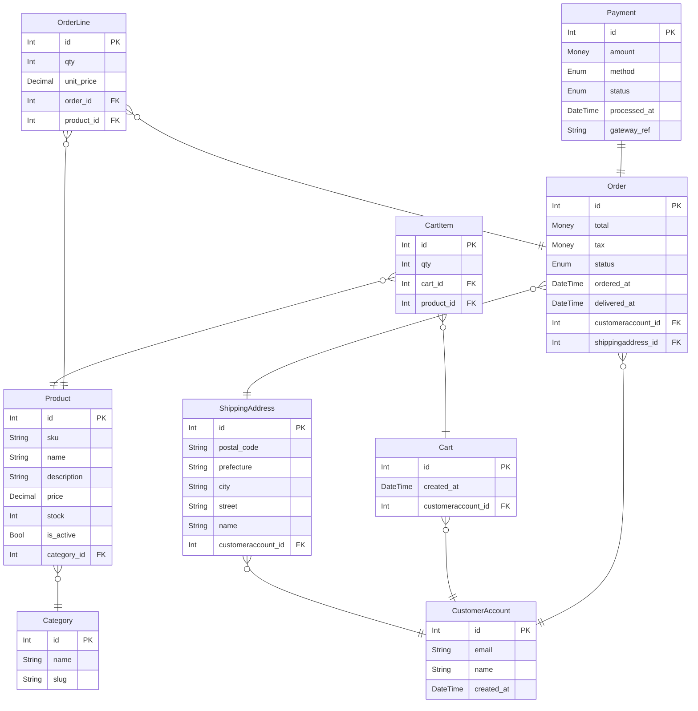
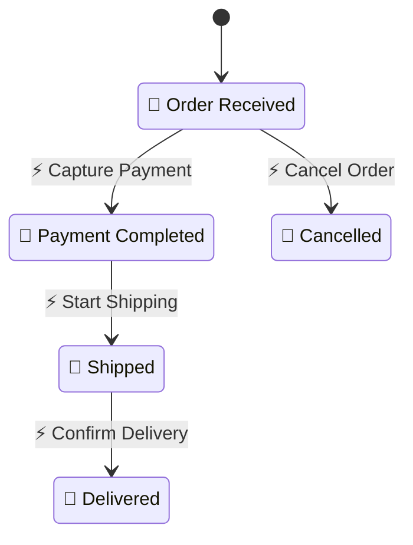
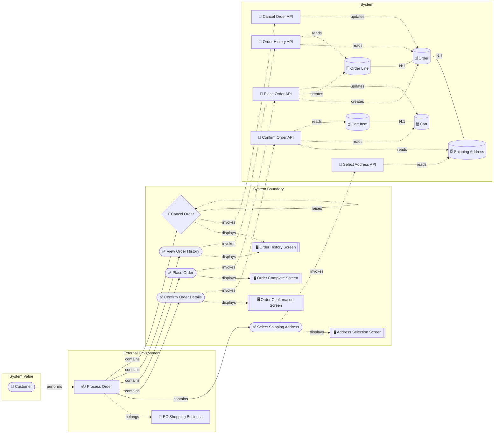
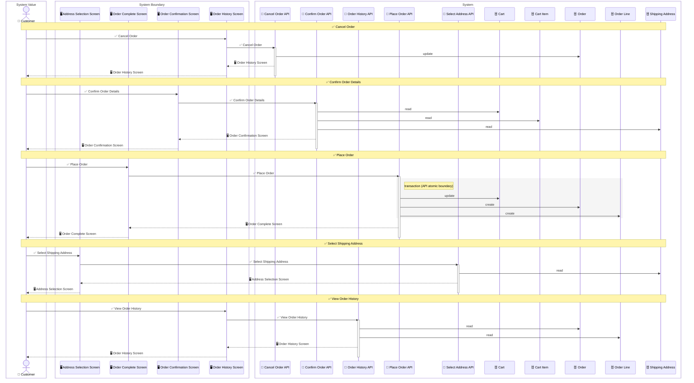

# rdra-ish-dsl

RDRA-ISH stands for **RDRA-inspired Implementation and System Heuristics**.
It is not a strict implementation of the original RDRA scope; it is an
RDRA-inspired framework for carrying requirements work forward into system
boundaries, API boundaries, domain modeling, and an implementation-oriented
design overview.

This repository provides a DSL and compiler for describing those RDRA-ISH models.
You declare actors, entities, use cases, and so on as typed instances, and express
relationships between them with predicate calls.
It treats a model as source code: the compiler type-checks relationships,
generates reviewable artifacts, and reports model gaps such as unreachable states or
violated state constraints. It generates PlantUML / Mermaid diagrams (ER, RDRA,
layered object graph, state machine, sequence, event-flow) and CSV (actor list,
entity list, CRUD matrix), and
derives **the reachable state patterns of each entity from BUC patterns**.
An `api` element lets you express the API layer between screens and entities — the sequence
diagram renders the full `Actor → Screen → API → Entity` lane automatically.

<!-- derived-from ./docs/incremental-modeling.md#api-boundary-rules -->
<!-- derived-from ./docs/language-reference.md#relationship-predicates -->
## Layer Positioning

RDRA-ISH keeps the original RDRA-style idea that the layers on the left explain
the reason the layers on the right exist. The difference is that RDRA-ISH does not
stop at business-oriented requirements organization: it adds implementation design
vocabulary where it can still fit naturally inside the RDRA world.


RDRA-ISH therefore treats a model as a bridge: `check`, `diagram`, `csv`, and
`states` let a developer refine requirements, system boundaries, API boundaries,
entity structure, and lifecycle constraints in one source model.

For the intended reading of BUCs, business flow, and use cases, see
[RDRA-ish Interpretation](./docs/rdra-ish-interpretation.md). It explains where
RDRA-ish deliberately differs from a stricter reading of the original RDRA artifacts.

<!-- derived-from ./docs/language-reference.md -->
<!-- derived-from ./docs/state-derivation.md -->
## What It Helps You Check

- **Relationship consistency**: predicate arguments are type-checked, duplicate
  definitions are reported, imports are resolved, and ambiguous references can be
  disambiguated with `kind::Id` syntax.
- **Use-case coverage**: BUC-scoped diagrams and CRUD matrices show which actors,
  use cases, screens, APIs, and entities are actually connected.
- **Access coverage**: screen constraints show which UC/API permission and medium
  requirements pass through each screen, permission-callable lists show what each
  permission enables, actor-permission audits infer missing/excess actor grants, and
  `check` warns when those assignments do not match modeled operation paths.
- **Entity state reachability**: `states` computes which Enum / Bool / nullable /
  comparison-proposition combinations can be reached through declared use cases and
  events.
- **Model gaps**: diagnostics call out unreachable enum variants, missing creation
  paths, forbidden reachable states, invariant violations, orphaned APIs, event-flow
  gaps, permission mismatches, cross-system coordination gaps, and FK-isolated writes
  in inferred transaction groups.
- **Review artifacts**: Mermaid is the lowest-friction default for text review, while
  PlantUML/SVG/PNG are available when a rendered asset is needed.

<!-- derived-from ./docs/language-reference.md#instance-declarations -->
<!-- derived-from ./docs/language-reference.md#access-constraints -->
<!-- derived-from ./docs/language-reference.md#belongs-context -->
<!-- derived-from ./docs/incremental-modeling.md#buc-context-and-access-rules -->
## Context and Access Modeling

RDRA-ISH keeps short labels for diagrams, but every instance can also carry a
longer `description`. Use it for review notes or domain explanation that should stay
in the source model without overcrowding generated diagrams:

```rdra
buc BucAppointmentScheduling "Appointment Scheduling" description "Booking, rescheduling, cancellation, and no-show handling."
api BookingApi "Booking API" description "Consistency boundary for appointment slot reservation."
```

Business-BUC mappings can describe the business context in which the BUC applies.
Use typed context values when the vocabulary should be reused, or string literals
when the context is still provisional:

```rdra
timing AppointmentRequested "Appointment Requested"
location FrontDesk "Front Desk"
medium StaffTerminal "Staff Terminal"

belongs(BucAppointmentScheduling, ClinicOps)
  .when(AppointmentRequested)
  .where(FrontDesk)
  .by(StaffTerminal)
```

- `.when(...)` records timing, trigger, or business situation.
- `.where(...)` records place, channel, organization point, or usage scene.
- `.by(...)` records the physical medium, device, terminal, or operating medium.

Permissions are modeled as vocabulary too. Actors receive permissions with
`has_permission`, and use cases or APIs declare what permission and medium they
require. Screens do not define those constraints directly; `csv --kind
screen-constraints` derives the screen paths from `displays(UC, Screen)` and
`invokes(UC, Api)`. `csv --kind permission-callables` and `list --kind
permission-callables` invert the same model so reviewers can see which use cases and
APIs each permission enables. `actor-permission-audit` projects those requirements back
onto actors and marks each actor/permission pair as `ok`, `missing`, or `excess`.

```rdra
actor Staff "Staff"
permission ScheduleWrite "Schedule Write"
medium StaffTerminal "Staff Terminal"

has_permission(Staff, ScheduleWrite)
requires_permission(BookAppointment, ScheduleWrite)
requires_medium(BookAppointment, StaffTerminal)
requires_permission(BookingApi, ScheduleWrite)
requires_medium(BookingApi, StaffTerminal)
```

## Installation

```sh
cargo install --path crates/rdra-ish-cli
```

<!-- derived-from ./docs/cli-reference.md -->
## Recommended Modeling Loop

<!-- derived-from ./docs/incremental-modeling.md -->
<!-- derived-from ./docs/incremental-modeling.md#stage-map -->

The modeling loop is intentionally staged. At each stage, ask only for the next
missing information, validate the current abstraction, then add the next level of
detail. Read the stages as a gradual shift from business concerns to technical
concerns: first name value, actors, use cases, BUC context, and access constraints;
then introduce data touchpoints, interaction/API boundaries, entity structure,
lifecycle, and enforceable rules.


1. Declare shared actors, businesses, and entities under a shared module.
2. Add one BUC file at a time with its use cases, context, screens, CRUD predicates, and events.
3. Run `rdra-ish check <model-root>` after each BUC to catch type and import mistakes.
4. Generate Mermaid diagrams for quick review:
   `rdra-ish diagram <model-root> --kind rdra --format mermaid --buc <BucId>`.
5. Run `rdra-ish csv <model-root> --kind matrix` to review use-case/entity CRUD coverage.
6. Run `rdra-ish csv <model-root> --kind screen-constraints` to review inferred
   permission and medium paths through screens, use cases, and APIs.
7. Run `rdra-ish csv <model-root> --kind permission-callables` to review the
   permission-to-UC/API map.
8. Run `rdra-ish csv <model-root> --kind actor-permission-audit` to review inferred
   missing and excess actor-side permission assignments.
9. Run `rdra-ish check <model-root>` to list whole-model consistency warnings across
   permissions, API/system boundaries, event-flow, transaction inference, and states.
10. Run `rdra-ish states <model-root>` to find unreachable states, missing creation
   paths, and state constraint violations.
11. Add `forbidden` / `invariant` constraints when the model needs to assert invalid or
   required state combinations.

For a slower abstract-to-concrete workflow, see
[Incremental Modeling Flow](./docs/incremental-modeling.md).
It also defines the recommended model directory layout and when to split shared files.

## Basic Usage

```sh
# Check only
rdra-ish check src/

# ER diagram (Mermaid text)
rdra-ish diagram src/ --kind er --format mermaid

# ER diagram (PlantUML SVG, requires plantuml.jar)
PLANTUML_JAR=/path/to/plantuml.jar rdra-ish diagram src/ --kind er --format svg

# RDRA diagram mapped onto the original RDRA-style layers
rdra-ish diagram src/ --kind rdra --format mermaid

# Boundaryless relationship graph for dense link inspection
rdra-ish diagram src/ --kind boundaryless-graph --format mermaid

# Per-BUC diagram (single BUC)
rdra-ish diagram src/ --kind rdra --buc BucOrder --format mermaid

# Per-BUC diagram (multiple BUCs — union of reachable nodes merged into one diagram)
rdra-ish diagram src/ --kind rdra --buc BucCart --buc BucOrder --format mermaid

# State machine diagram (whole / filtered by BUC)
rdra-ish diagram src/ --kind state --format mermaid
rdra-ish diagram src/ --kind state --buc BucOrder --format mermaid

# Sequence diagram of screen/API/entity interactions
rdra-ish diagram src/ --kind sequence --format mermaid
rdra-ish diagram src/ --kind sequence --buc BucOrder --format mermaid
rdra-ish diagram src/ --kind sequence --usecase PlaceOrder --format mermaid

# CSV output
rdra-ish csv src/ --kind entity
rdra-ish csv src/ --kind actor
rdra-ish csv src/ --kind matrix
rdra-ish csv src/ --kind api          # API list
rdra-ish csv src/ --kind api-matrix   # API × Entity CRUD matrix
rdra-ish csv src/ --kind screen-constraints # Screen × UC/API access constraints
rdra-ish csv src/ --kind permission-callables # Permission × callable UC/API list
rdra-ish csv src/ --kind actor-permission-audit # Actor permission assignment audit

# List output
rdra-ish list src/ --kind actor --format table
rdra-ish list src/ --kind system --format table
rdra-ish list src/ --kind permission-callables --format table
rdra-ish list src/ --kind actor-permission-audit --format table
rdra-ish list src/ --kind api   --format table
rdra-ish list src/ --kind buc   --format json

# State pattern derivation (reachable state combinations of each entity from BUC patterns)
rdra-ish states src/
rdra-ish states src/ --entity Order          # limit to one entity
rdra-ish states src/ --buc BucPayment        # BUC scope
rdra-ish states src/ --format csv            # CSV output
rdra-ish states src/ --format json           # JSON output
```

### `diagram` options

| Option | Default | Description |
|---|---|---|
| `--kind` | `rdra` | `rdra` / `boundaryless-graph` / `er` / `state` / `sequence` / `event-flow` |
| `--format` | `puml` | `puml` / `svg` / `png` / `mermaid` (`svg`/`png` require plantuml.jar) |
| `--buc <id>` | — (whole) | Filter by BUC id (repeatable). For `sequence`, only directly contained use cases are shown |
| `--usecase <id>` | — (whole) | Filter `sequence` diagrams by use case id (repeatable, cannot be combined with `--buc`) |
| `-o / --out` | `out` | Output file path (extension added automatically) |

### `csv` options

| Option | Default | Description |
|---|---|---|
| `--kind` | `entity` | `actor` / `entity` / `matrix` / `api` / `api-matrix` / `screen-constraints` / `permission-callables` / `actor-permission-audit` |
| `-o / --out` | `out` | Output file path. A default extension is added when omitted |

`screen-constraints` emits screen × use-case/API permission and medium paths.
`permission-callables` emits permission × callable UC/API rows derived from
`requires_permission`. `actor-permission-audit` emits actor × permission rows with
`assigned`, `required`, and `status` columns inferred from performer paths.

### `list` options

| Option | Default | Description |
|---|---|---|
| `--kind` | `actor` | `actor` / `entity` / `buc` / `usecase` / `system` / `api` / `permission-callables` / `actor-permission-audit` |
| `--format` | `table` | `table` / `json` / `csv` |

`permission-callables` lists the same permission-to-UC/API view in stdout-friendly
formats. `actor-permission-audit` lists inferred actor-side assignment gaps in the same
formats.

### `states` options

| Option | Default | Description |
|---|---|---|
| `--format` | `table` | `table` / `csv` / `json` |
| `--buc <id>` | — (whole) | Filter by BUC scope (repeatable) |
| `--entity <id>` | — (whole) | Output only a specific entity |
| `--max-patterns` | `256` | Per-entity pattern cap (sets the `truncated` flag when exceeded) |

### API Layer in the Sequence Diagram

When a use case invokes an API via `invokes(UseCase, Api)`, the sequence diagram
renders the interaction boundary explicitly:

```
Actor → Screen → API → Entity
```

The participant lanes are grouped into RDRA-style layer boxes so the vertical
lifelines also show the model boundary:

```
System Value: Actor
System Boundary: Screen / Client
System: API / System / Entity
```

Diagram labels include a small kind prefix such as `👤 actor`, `✅ usecase`,
`🖥️ screen`, `🔌 api`, `🗄️ entity`, `⚡ event`, and `🔄 state`. The DSL ids stay
unchanged, so relationships and generated file stability are preserved.

CRUD predicates (`creates`, `updates`, etc.) are attached to the `api` element; the
use case owns only `invokes` and `displays`. Keep CRUD directly on a `usecase` only
when the operation has no meaningful API or consistency boundary to model.

```
api OrderApi "Order API"
invokes(PlaceOrder, OrderApi)
creates(OrderApi, Order)
creates(OrderApi, OrderLine)
```

### API Atomic Boundary and Direct Write Inference (`--kind sequence`)

When generating `--kind sequence`, API CRUD is rendered as an explicit atomic
boundary. For direct use-case CRUD, the tool still analyzes FK connected components
and infers transaction-like groups so intentionally direct models remain reviewable.

#### Direct-write inference algorithm

1. Collect the set of written entities W from the `creates` / `updates` / `deletes` predicates
2. Build an undirected graph from FK edges induced over W (`1:1` / `1:N` / `N:1`, with both endpoints in W)
3. Detect connected components with BFS
4. Topologically sort each component with Kahn's algorithm (FK parent → child order)

#### Reflection in the sequence diagram

| Component kind | Sequence diagram rendering |
|---|---|
| API CRUD group | Wrapped in a `rect` block with `Note: transaction (API atomic boundary)` |
| Direct FK-connected group (≥ 2 entities) | Wrapped in a `rect` block with `Note: transaction (inferred from FK)` |
| FK-isolated (a direct group exists elsewhere) | `Note right: FK-isolated — separate transaction? model through an API boundary` |
| Isolated only (no TX group) | No TX rendering / no warning |

#### Diagnostic warning

When direct use-case CRUD mixes an FK-connected group with an isolated write, the
following warning is emitted to stderr on `--kind sequence`:

```
warning: usecase 'PlaceOrder' writes 'Cart' with no FK link to its other writes
  hint: this is inferred as a separate transaction; if it must be atomic with the others, model the operation through an API boundary
```

Prefer modeling an `api` and attaching the related CRUD predicates to that API when
the operation needs one consistency boundary.

---

## DSL Grammar

### Instance declarations

```
<kind> <Id> "Label"
```

Optional metadata:

```
<kind> <Id> "Label" description "Description text"
```

Descriptions are parsed and stored on all instance kinds. Current diagram emitters
continue to render labels only.

| kind | Meaning |
|---|---|
| `actor` | Human actor |
| `extsystem` | External system |
| `system` | Internal system boundary that groups APIs |
| `requirement` | Requirement |
| `business` | Business |
| `buc` | Business use case |
| `usagescene` | Usage scene |
| `usecase` | Use case |
| `screen` | Screen |
| `event` | Domain event |
| `entity` | Entity (DB table) |
| `state` | State (state machine node) |
| `condition` | Condition |
| `variation` | Variation |
| `api` | API layer endpoint invoked by a use case; operates entities. Appears in the RDRA layered graph and sequence diagram lane; omitted from the boundaryless graph. |
| `location` | Place, channel, organization point, or usage scene used by BUC context |
| `timing` | Timing, trigger, or business situation used by BUC context |
| `medium` | Physical medium, device, or terminal used by BUC context |
| `permission` | Permission or role-like authority assignable to actors |

### Entity column definitions

```
entity Order "Order" {
  id:           Int      @pk
  total:        Money
  ordered_at:   DateTime
  delivered_at: DateTime @null
  status:       Enum(pending, paid, shipped, delivered, cancelled) @default(pending)
  note:         String   @null
}
```

| Type | Description |
|---|---|
| `Int` `String` `Money` `DateTime` `Date` `Bool` `Decimal` | Primitive types |
| `Enum(a, b, c)` | Enumeration (can be linked to a state machine) |

| Annotation | Description |
|---|---|
| `@pk` | Primary key (basis for FK auto-generation) |
| `@pk(a, b)` | Composite primary key |
| `@unique` | Unique constraint |
| `@null` | Nullable |
| `@default(v)` | Default value |
| `@label("...")` | Display label |

### Relationship predicates

| Predicate | Signature | Meaning |
|---|---|---|
| `performs` | (Actor, UseCase\|Buc) | Actor performs a UC / BUC |
| `uses` | (Actor, ExtSystem) | Actor uses an external system |
| `invokes` | (UseCase, Api) | UseCase invokes an API layer |
| `reads`/`writes`/`creates`/`updates`/`deletes` | (UseCase\|Api, Entity) | CRUD |
| `displays` | (UseCase, Screen) | UC displays a screen |
| `shows` | (Screen, Entity) | Screen shows entity information |
| `raises` | (UseCase, Event) | UC raises a domain event |
| `triggers` | (Event, UseCase\|Buc) | Event triggers a concrete UC or starts a BUC boundary |
| `contains` | (Buc, UseCase) or (System, Api) | UC that composes a BUC, or API that belongs to a system boundary |
| `coordinates` | (UseCase, Entity, Entity) | Use case coordinates consistency for a relation crossing system boundaries |
| `belongs` | (Buc, Business) | BUC belongs to a business |
| `has_permission` | (Actor, Permission) | Actor has a permission type |
| `requires_permission` | (UseCase\|Api, Permission) | UC/API requires a permission |
| `requires_medium` | (UseCase\|Api, Medium) | UC/API requires an operation medium |
| `motivates` | (Requirement, Buc) | Requirement motivates a BUC |
| `relate` | (Entity, Entity, Card) | ER relationship (FK auto-generated) `"1:1"` / `"1:N"` / `"N:1"` / `"N:M"` |
| `transitions` | (Event, State, State) | State transition (from → to on an event) |
| `sets` | (UseCase\|Event, Entity, "col", "val") or (UseCase\|Event, Entity, \<expr\>, bool) | Explicit column effect (for state pattern derivation); second form drives a comparison-proposition truth value |

Access constraints can be declared on use cases and APIs, while screen constraints are
derived through `displays` and `invokes`:

```rdra
permission ScheduleWrite "Schedule Write"
medium StaffTerminal "Staff Terminal"

requires_permission(BookAppointment, ScheduleWrite)
requires_medium(BookAppointment, StaffTerminal)
```

Use `rdra-ish csv <model-root> --kind screen-constraints` to inspect screen × UC/API
constraint paths, and `rdra-ish csv <model-root> --kind permission-callables` to
inspect the inverse permission × callable UC/API view. Use
`rdra-ish csv <model-root> --kind actor-permission-audit` to inspect which
actor/permission assignments are inferred as missing or excess. `rdra-ish check` also
reports those gaps.

`belongs(Buc, Business)` may carry optional business-context metadata:

```rdra
timing PatientRequestsBooking "Patient requests a booking"
location FrontDesk "Front desk"
medium FrontDeskTerminal "Front desk terminal"

belongs(BucAppointmentScheduling, ClinicOps)
  .when(PatientRequestsBooking)
  .where(FrontDesk)
  .by(FrontDeskTerminal)
```

`.when(...)` records the timing, trigger, or business situation where the BUC applies.
`.where(...)` records the place, channel, or usage scene. `.by(...)` records the
physical medium or terminal used for the operation. Arguments may be string literals
or references to `timing`, `location`, and `medium` instances respectively.

### Value vocabulary for the `sets` predicate

```
// Enum column variant
sets(usecase::Capture, Payment, "status", "captured")

// Bool column
sets(usecase::Enable, Switch, "enabled", "true")

// Set a nullable column to non-null (without recording a type)
sets(usecase::Login, UserAccount, "last_login_at", "present")

// Set a nullable column to non-null (recording a PostgreSQL-specific type)
sets(usecase::Deliver, Order, "delivered_at", "timestamptz")
sets(usecase::Tag,     Doc,   "metadata",     "jsonb")

// Set a nullable column to null
sets(usecase::Logout, Session, "token", "null")

// Drive a comparison proposition to true/false
sets(Sell,   Stock, stock < selling, true)
sets(Refund, Stock, stock < selling, false)
```

| Value | Target column | Meaning |
|---|---|---|
| Enum variant name | `Enum` column | Set to the given variant |
| `"true"` / `"false"` | `Bool` column | Set the bool value |
| `"present"` | `@null` column | Make non-null (has a value) |
| `"null"` | `@null` column | Make null |
| PostgreSQL type name | `@null` column | Make non-null + record type info (`jsonb` / `uuid` / `timestamptz` / `inet`, etc.) |
| comparison expression + `true`/`false` | comparison column | Drive the comparison proposition's truth value |

### Entity State Constraints

Beyond declaring how columns change, you can assert which state combinations must
never occur, and which combinations must always hold together. Both constraints are
checked **after** BFS state-pattern derivation, against the set of reachable patterns.
A violation is reported only if the offending pattern is actually reachable.

#### `forbidden` — forbidden state combinations

`forbidden` uses a **variadic tuple** form. Each `(column, value)` tuple is a condition,
and the listed conditions are combined with **AND**: a pattern is forbidden only when
**all** of the tuple conditions hold simultaneously.

```
// Forbid status=cancelled from being reachable
forbidden(Order, (status, cancelled))

// Forbid the simultaneous combination status=delivered AND refunded=true
forbidden(Order, (status, delivered), (refunded, true))

// Comparison expressions are also valid conditions
forbidden(Stock, (status, on_sale), stock < selling)
forbidden(Coupon, expired_at < now)
```

The tuple form was chosen because a forbidden state is naturally a *point* in the
state space — an AND-combination of column values. Listing tuples directly mirrors
"this exact combination must not exist." If any reachable pattern matches all the
tuples, a `StateDiag::ForbiddenStateViolated` diagnostic is emitted.

#### `invariant` — required co-occurrence

`invariant` uses a **method-chain** form. The `.when(...)` guards and the `.then(...)`
requirements are each combined with **AND**. The semantics are an implication:
**whenever all `.when()` guards hold, all `.then()` requirements must also hold.**

```
invariant(Order)
  .when(status, delivered)
  .then(delivered_at, present)

invariant(Order)
  .when(status, delivered)
  .when(refunded, false)     // multiple .when() = AND
  .then(refund_id, null)

// Comparison expressions work in .when() and .then() too
invariant(Stock).when(status, on_sale).then(stock < selling)
invariant(Coupon).when(expired_at < now).then(status, expired)
```

The method-chain form was chosen because an invariant is a *rule with two sides* —
a guard (the antecedent) and a requirement (the consequent). The chain keeps the two
sides visually and structurally distinct, and lets each side accumulate multiple
AND-ed conditions without ambiguity. For every reachable pattern that satisfies all
the `.when()` guards but violates any `.then()` requirement, a
`StateDiag::InvariantViolated` diagnostic is emitted.

Column names and values inside `.when()` / `.then()` are bare identifiers (not quoted
strings). They use the same value vocabulary as `sets` (Enum variant names, `true`/`false`,
`present`/`null`, PostgreSQL type names). Comparison expressions (`stock < selling`,
`expired_at < now`) are treated as derived boolean proposition axes and can be driven
via `sets`. See `docs/language-reference.md` for the full list of supported operators.

### import / modules

```
module shared.actors

import shared.actors             // flat import
import shared.actors as a        // namespaced
import shared.actors.{Staff}     // selective import
import shared.actors.{Staff as S}
```

---

## Sample (ec-site)

### DSL — `shared/entities.rdra` (excerpt)

```
entity Order "Order" {
  id:           Int      @pk
  total:        Money
  tax:          Money
  status:       Enum(pending, paid, shipped, delivered, cancelled) @default(pending)
  ordered_at:   DateTime
  delivered_at: DateTime @null
}

entity Payment "Payment" {
  id:           Int      @pk
  amount:       Money
  method:       Enum(credit_card, bank_transfer, convenience) @default(credit_card)
  status:       Enum(pending, authorized, captured, failed, refunded) @default(pending)
  processed_at: DateTime @null
  gateway_ref:  String   @null @label("Payment Gateway Reference")
}

relate(Payment, Order, "1:1")

state Pending   "Order Received"
state Paid      "Payment Completed"
state Shipped   "Shipped"
state Delivered "Delivered"
state Cancelled "Cancelled"

event Capture "Capture Payment"
event Ship    "Start Shipping"
event Deliver "Confirm Delivery"
event Cancel  "Cancel Order"

transitions(event::Capture, Pending,  Paid)
transitions(event::Ship,    Paid,     Shipped)
transitions(event::Deliver, Shipped,  Delivered)
transitions(event::Cancel,  Pending,  Cancelled)
```

### DSL — `buc/buc_order.rdra` (excerpt)

```
buc BucOrder "Process Order"

usecase PlaceOrder "Place Order"
usecase Cancel     "Cancel Order"

performs(Customer, BucOrder)
belongs(BucOrder, EcShopping)
contains(BucOrder, PlaceOrder)
contains(BucOrder, usecase::Cancel)

creates(PlaceOrder, Order)
creates(PlaceOrder, OrderLine)
updates(usecase::Cancel, Order)
raises(usecase::Cancel, event::Cancel)
```

### DSL — `buc/buc_payment.rdra` (includes `sets`)

```
buc BucPayment "Make Payment"

usecase InputPaymentInfo "Enter Payment Information"
usecase Capture          "Capture Payment"
usecase RefundPayment    "Refund Payment"

performs(Customer, BucPayment)
contains(BucPayment, InputPaymentInfo)
contains(BucPayment, usecase::Capture)
contains(BucPayment, RefundPayment)

creates(InputPaymentInfo, Payment)
updates(usecase::Capture, Payment)
updates(usecase::Capture, Order)
raises(usecase::Capture, event::Capture)

// Payment.status has no state machine, so it is declared explicitly with sets
sets(InputPaymentInfo,   Payment, "status", "pending")
sets(usecase::Capture,   Payment, "status", "captured")
sets(RefundPayment,      Payment, "status", "refunded")

// processed_at is nullable — recorded as timestamptz at capture time
sets(usecase::Capture, Payment, "processed_at", "timestamptz")
```

---

### Generated examples

#### ER diagram (Mermaid)



#### State machine diagram (Mermaid)



#### Per-BUC layered object graph (BucOrder, Mermaid)



#### API boundary sequence diagram (Mermaid)

Generated with `rdra-ish diagram samples/ec-site/ --kind sequence --format mermaid --buc BucOrder`:



#### State pattern derivation (`rdra-ish states --entity Order`)

```
Entity: Order (Order)
  axes: status[pending|paid|shipped|delivered|cancelled], delivered_at[null|present:timestamptz]

  STATUS     DELIVERED_AT         INITIAL  TERMINAL  VIA
  ─────────  ───────────────────  ───────  ────────  ──────────────────────────────────
  pending    null                 yes      no        BucOrder/PlaceOrder
  paid       null                 no       no        BucPayment/Capture, BucOrder/PlaceOrder
  shipped    null                 no       no        BucOrder/PlaceOrder, BucPayment/Capture
  delivered  present:timestamptz  no       yes       BucOrder/PlaceOrder, ...
  cancelled  null                 no       yes       BucOrder/Cancel, BucOrder/PlaceOrder
```

Unreachable combinations such as `(status=pending, delivered_at=present)` are not emitted.
The `present` side of `delivered_at` carries the type info derived from
`sets(usecase::Deliver, Order, "delivered_at", "timestamptz")`.

---

## Larger Sample (clinic-ops)

`samples/clinic-ops/` is a larger clinic operations model for trying BUC-scoped
analysis on a more connected domain. It includes 9 BUCs, 60 use cases, 26 entities,
28 APIs, event-triggered BUC chaining, multiple state machines, and state constraints.
The review-oriented design document is
[samples/clinic-ops/design-sample.md](./samples/clinic-ops/design-sample.md).

Useful entry points:

```sh
rdra-ish check samples/clinic-ops
rdra-ish list samples/clinic-ops --kind buc --format table
rdra-ish diagram samples/clinic-ops --kind event-flow --format mermaid
rdra-ish diagram samples/clinic-ops --kind sequence --format mermaid --buc BucClinicalEncounter
rdra-ish diagram samples/clinic-ops --kind sequence --format mermaid --usecase SignEncounter
rdra-ish csv samples/clinic-ops --kind screen-constraints
rdra-ish csv samples/clinic-ops --kind actor-permission-audit
rdra-ish states samples/clinic-ops --entity Appointment
rdra-ish states samples/clinic-ops --entity Claim
```

---

## Project layout

```
crates/
  rdra-ish-syntax/   Lexer · Parser · AST
  rdra-ish-core/     Semantic model · type checking · state pattern derivation
  rdra-ish-emit/     PlantUML / Mermaid / CSV / state-pattern emitters
  rdra-ish-render/   plantuml.jar wrapper
  rdra-ish-cli/      `rdra-ish` CLI
samples/
  clinic-ops/    Larger clinic operations sample (9 BUCs · APIs · event flows · access constraints)
  ec-site/       E-commerce site sample (BUCs · entities · state transitions)
  personal-info/ Personal data management sample
```

## License

MIT
