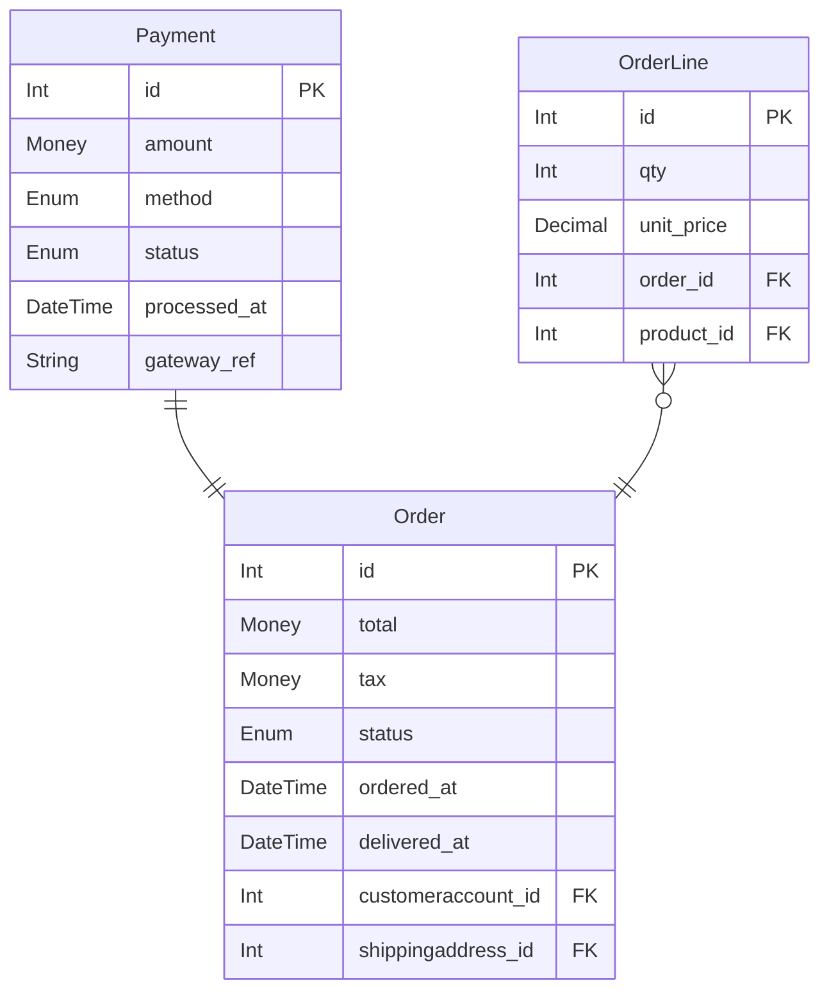
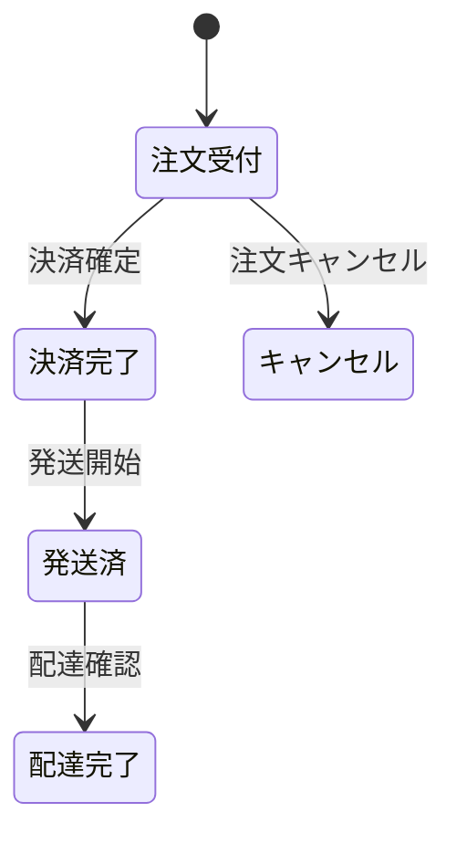
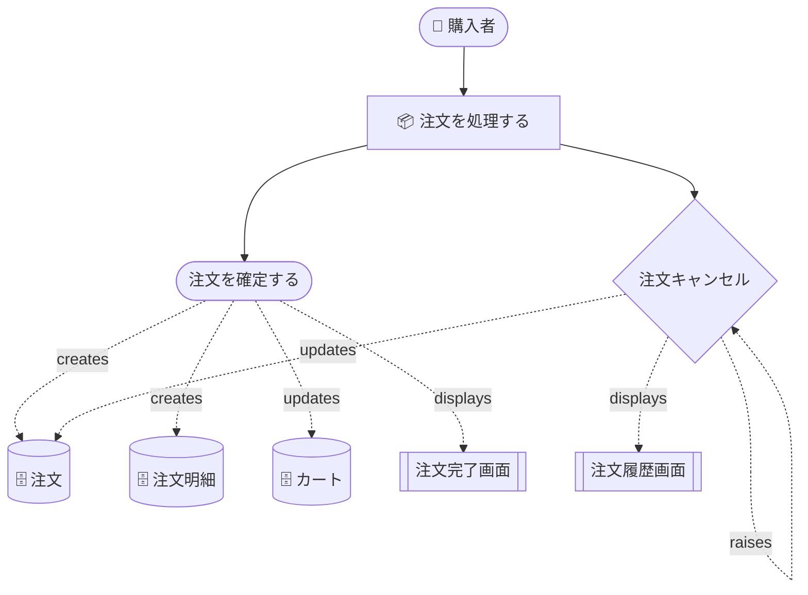
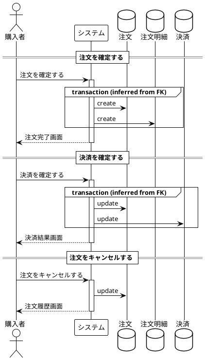

# rdra-dsl

RDRA（関係駆動要件分析）記述用 DSL とコンパイラ。  
アクター・エンティティ・ユースケース等を型付きインスタンスとして宣言し、述語関数で関係を表現する。  
PlantUML / Mermaid（ER図・RDRA図・状態遷移図・シーケンス図）とCSV（actor一覧・entity一覧・CRUDマトリクス）を生成し、  
**BUCパターンから各 entity の到達可能な状態パターン**を導出する。

## インストール

```sh
cargo install --path crates/rdra-cli
```

## 基本的な使い方

```sh
# 検証のみ
rdra check src/

# ER図（Mermaid テキスト）
rdra diagram src/ --kind er --format mermaid

# ER図（PlantUML SVG、要 plantuml.jar）
PLANTUML_JAR=/path/to/plantuml.jar rdra diagram src/ --kind er --format svg

# RDRA全体図
rdra diagram src/ --kind rdra --format mermaid

# BUC 別図（単一 BUC）
rdra diagram src/ --kind rdra --buc BucOrder --format mermaid

# BUC 別図（複数 BUC — 到達ノードの和集合を1図に統合）
rdra diagram src/ --kind rdra --buc BucCart --buc BucOrder --format mermaid

# 状態遷移図（全体 / BUC 絞り込み）
rdra diagram src/ --kind state --format mermaid
rdra diagram src/ --kind state --buc BucOrder --format mermaid

# 書き込み操作のシーケンス図
rdra diagram src/ --kind sequence --format puml

# CSV 出力
rdra csv src/ --kind entity
rdra csv src/ --kind actor
rdra csv src/ --kind matrix

# 一覧表示
rdra list src/ --kind actor --format table
rdra list src/ --kind buc   --format json

# 状態パターン導出（BUCパターンから各entityの取り得る状態組み合わせ）
rdra states src/
rdra states src/ --entity Order          # entity 限定
rdra states src/ --buc BucPayment        # BUC スコープ
rdra states src/ --format csv            # CSV 出力
rdra states src/ --format json           # JSON 出力
```

### `diagram` オプション一覧

| オプション | 既定値 | 説明 |
|---|---|---|
| `--kind` | `rdra` | `rdra` / `er` / `state` / `sequence` |
| `--format` | `puml` | `puml` / `svg` / `png` / `mermaid`（`svg`/`png` は plantuml.jar が必要） |
| `--buc <id>` | —（全体） | BUC id を指定して絞り込み（繰り返し可）。複数指定で和集合を1図に出力 |
| `-o / --out` | `out` | 出力ファイルパス（拡張子は自動付与） |

### `states` オプション一覧

| オプション | 既定値 | 説明 |
|---|---|---|
| `--format` | `table` | `table` / `csv` / `json` |
| `--buc <id>` | —（全体） | BUC スコープで絞り込み（繰り返し可） |
| `--entity <id>` | —（全体） | 特定 entity のみ出力 |
| `--max-patterns` | `256` | entity 単位のパターン数上限（超過時に `truncated` フラグ） |

---

## DSL 文法

### インスタンス宣言

```
<kind> <Id> "表示名"
```

| kind | 意味 |
|---|---|
| `actor` | 人間のアクター |
| `extsystem` | 外部システム |
| `requirement` | 要件 |
| `business` | 業務 |
| `buc` | ビジネスユースケース |
| `usagescene` | 利用シーン |
| `usecase` | ユースケース |
| `screen` | 画面 |
| `event` | ドメインイベント |
| `entity` | エンティティ（DBテーブル） |
| `state` | 状態（状態機械ノード） |
| `condition` | 条件 |
| `variation` | バリエーション |

### Entity カラム定義

```
entity Order "注文" {
  id:           Int      @pk
  total:        Money
  ordered_at:   DateTime
  delivered_at: DateTime @null
  status:       Enum(pending, paid, shipped, delivered, cancelled) @default(pending)
  note:         String   @null
}
```

| 型 | 説明 |
|---|---|
| `Int` `String` `Money` `DateTime` `Date` `Bool` `Decimal` | 基本型 |
| `Enum(a, b, c)` | 列挙型（状態機械と連動可） |

| アノテーション | 説明 |
|---|---|
| `@pk` | 主キー（FK自動生成の基準） |
| `@pk(a, b)` | 複合主キー |
| `@unique` | ユニーク制約 |
| `@null` | NULL 許容 |
| `@default(v)` | デフォルト値 |
| `@label("...")` | 表示名 |

### 関係述語

| 述語 | シグネチャ | 意味 |
|---|---|---|
| `performs` | (Actor, UseCase\|Buc) | アクターが UC / BUC を遂行 |
| `uses` | (Actor, ExtSystem) | アクターが外部システムを利用 |
| `reads`/`writes`/`creates`/`updates`/`deletes` | (UseCase, Entity) | CRUD |
| `displays` | (UseCase, Screen) | UC が画面を表示 |
| `shows` | (Screen, Entity) | 画面がエンティティ情報を表示 |
| `raises` | (UseCase, Event) | UC がドメインイベントを発火 |
| `triggers` | (Event, UseCase) | イベントが UC を起動 |
| `contains` | (Buc, UseCase) | BUC の構成 UC |
| `belongs` | (Buc, Business) | BUC が属する業務 |
| `motivates` | (Requirement, Buc) | 要件が BUC を動機づける |
| `relate` | (Entity, Entity, Card) | ER 関係（FK 自動生成）`"1:1"` / `"1:N"` / `"N:1"` / `"N:M"` |
| `transitions` | (Event, State, State) | 状態遷移（イベントで from → to） |
| `sets` | (UseCase\|Event, Entity, "col", "val") | カラム効果の明示（状態パターン導出用） |

### `sets` 述語の値語彙

```
// Enum カラムのバリアント
sets(usecase::Capture, Payment, "status", "captured")

// Bool カラム
sets(usecase::Enable, Switch, "enabled", "true")

// Nullable カラムを非null に（型を記録しない場合）
sets(usecase::Login, UserAccount, "last_login_at", "present")

// Nullable カラムを非null に（PostgreSQL 特殊型を記録）
sets(usecase::Deliver, Order, "delivered_at", "timestamptz")
sets(usecase::Tag,     Doc,   "metadata",     "jsonb")

// Nullable カラムを null に
sets(usecase::Logout, Session, "token", "null")
```

| 値 | 対象カラム | 意味 |
|---|---|---|
| Enum バリアント名 | `Enum` カラム | 指定バリアントに設定 |
| `"true"` / `"false"` | `Bool` カラム | bool 値を設定 |
| `"present"` | `@null` カラム | 非null（値あり）にする |
| `"null"` | `@null` カラム | null にする |
| PostgreSQL 型名 | `@null` カラム | 非null + 型情報を記録（`jsonb` / `uuid` / `timestamptz` / `inet` 等） |

### import / モジュール

```
module shared.actors

import shared.actors             // フラット import
import shared.actors as a        // 名前空間付き
import shared.actors.{Staff}     // 選択 import
import shared.actors.{Staff as S}
```

---

## サンプル（ec-site）

### DSL — `shared/entities.rdra`（抜粋）

```
entity Order "注文" {
  id:           Int      @pk
  total:        Money
  tax:          Money
  status:       Enum(pending, paid, shipped, delivered, cancelled) @default(pending)
  ordered_at:   DateTime
  delivered_at: DateTime @null
}

entity Payment "決済" {
  id:           Int      @pk
  amount:       Money
  method:       Enum(credit_card, bank_transfer, convenience) @default(credit_card)
  status:       Enum(pending, authorized, captured, failed, refunded) @default(pending)
  processed_at: DateTime @null
  gateway_ref:  String   @null @label("決済GW参照番号")
}

relate(Payment, Order, "1:1")

state Pending   "注文受付"
state Paid      "決済完了"
state Shipped   "発送済"
state Delivered "配達完了"
state Cancelled "キャンセル"

event Capture "決済確定"
event Ship    "発送開始"
event Deliver "配達確認"
event Cancel  "注文キャンセル"

transitions(event::Capture, Pending,  Paid)
transitions(event::Ship,    Paid,     Shipped)
transitions(event::Deliver, Shipped,  Delivered)
transitions(event::Cancel,  Pending,  Cancelled)
```

### DSL — `buc/buc_order.rdra`（抜粋）

```
buc BucOrder "注文を処理する"

usecase PlaceOrder "注文を確定する"
usecase Cancel     "注文をキャンセルする"

performs(Customer, BucOrder)
belongs(BucOrder, EcShopping)
contains(BucOrder, PlaceOrder)
contains(BucOrder, usecase::Cancel)

creates(PlaceOrder, Order)
creates(PlaceOrder, OrderLine)
updates(usecase::Cancel, Order)
raises(usecase::Cancel, event::Cancel)
```

### DSL — `buc/buc_payment.rdra`（`sets` を含む）

```
buc BucPayment "決済を行う"

usecase InputPaymentInfo "決済情報を入力する"
usecase Capture          "決済を確定する"
usecase RefundPayment    "返金する"

performs(Customer, BucPayment)
contains(BucPayment, InputPaymentInfo)
contains(BucPayment, usecase::Capture)
contains(BucPayment, RefundPayment)

creates(InputPaymentInfo, Payment)
updates(usecase::Capture, Payment)
updates(usecase::Capture, Order)
raises(usecase::Capture, event::Capture)

// Payment.status は状態機械を持たないため sets で明示
sets(InputPaymentInfo,   Payment, "status", "pending")
sets(usecase::Capture,   Payment, "status", "captured")
sets(RefundPayment,      Payment, "status", "refunded")

// processed_at は nullable — 決済確定時に timestamptz として記録
sets(usecase::Capture, Payment, "processed_at", "timestamptz")
```

---

### 生成例

#### ER図（Mermaid）



#### 状態遷移図（Mermaid）



#### BUC 別 RDRA図（BucOrder、Mermaid）



#### 書き込みシーケンス図（PlantUML）



#### 状態パターン導出（`rdra states --entity Order`）

```
Entity: Order (注文)
  axes: status[pending|paid|shipped|delivered|cancelled], delivered_at[null|present:timestamptz]

  STATUS     DELIVERED_AT         INITIAL  TERMINAL  VIA
  ─────────  ───────────────────  ───────  ────────  ──────────────────────────────────
  pending    null                 yes      no        BucOrder/PlaceOrder
  paid       null                 no       no        BucPayment/Capture, BucOrder/PlaceOrder
  shipped    null                 no       no        BucOrder/PlaceOrder, BucPayment/Capture
  delivered  present:timestamptz  no       yes       BucOrder/PlaceOrder, ...
  cancelled  null                 no       yes       BucOrder/Cancel, BucOrder/PlaceOrder
```

`(status=pending, delivered_at=present)` のような到達不能な組み合わせは出力されない。  
`delivered_at` の `present` 側には `sets(usecase::Deliver, Order, "delivered_at", "timestamptz")` 由来の型情報が付与される。

---

## プロジェクト構成

```
crates/
  rdra-syntax/   Lexer・Parser・AST
  rdra-core/     セマンティックモデル・型検査・状態パターン導出
  rdra-emit/     PlantUML / Mermaid / CSV / 状態パターン エミッタ
  rdra-render/   plantuml.jar 呼び出しラッパー
  rdra-cli/      `rdra` コマンド
samples/
  ec-site/       ECサイトのサンプル（BUC・entity・状態遷移）
  personal-info/ 個人情報管理のサンプル
```

## ライセンス

MIT
