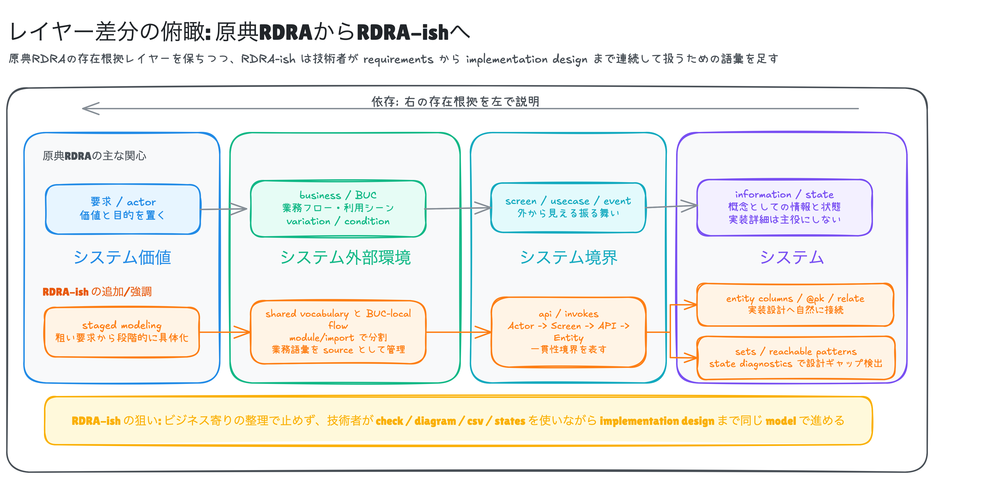
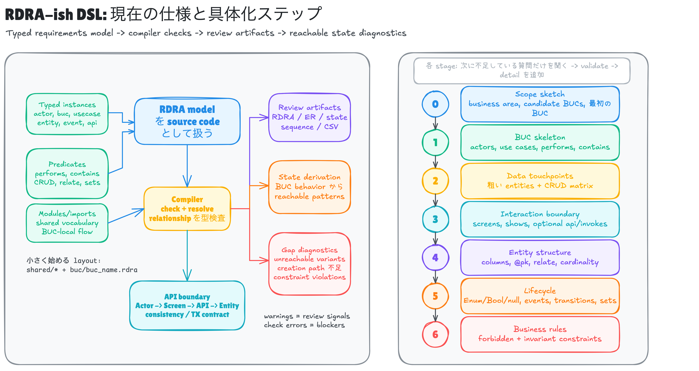
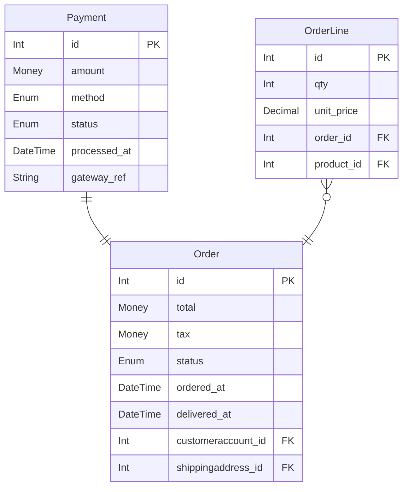
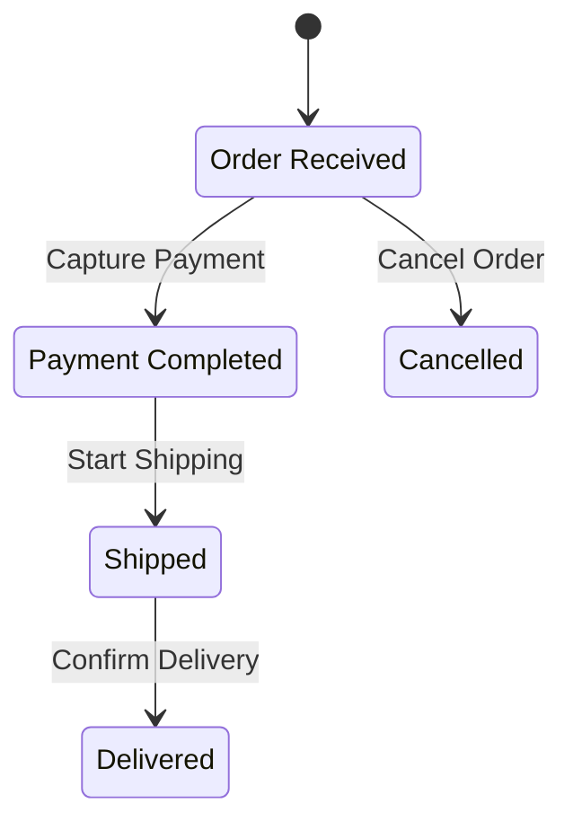
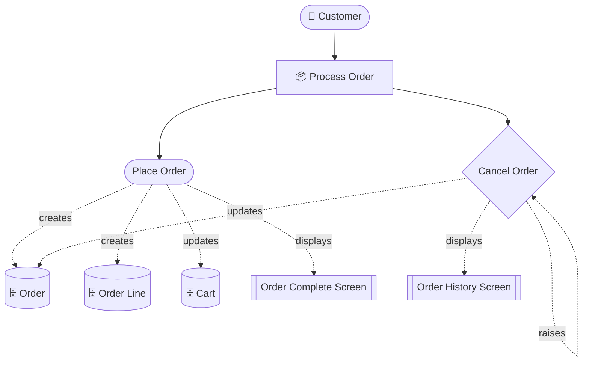
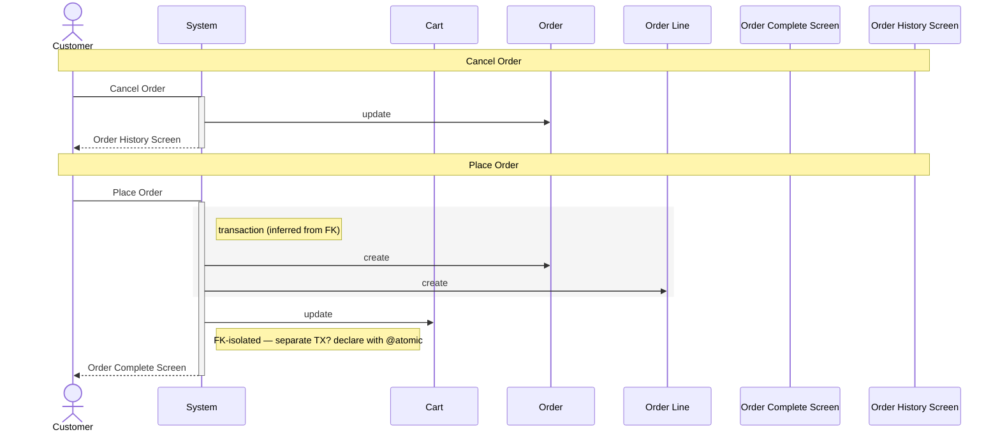

# rdra-ish-dsl

RDRA-ISH stands for **RDRA-inspired Implementation and System Heuristics**.
It is not a strict implementation of the original RDRA scope; it is an
RDRA-inspired framework for carrying requirements work forward into system
boundaries, API boundaries, domain modeling, and an implementation-oriented
design overview.

This repository provides a DSL and compiler for describing those RDRA-ISH models.
You declare actors, entities, use cases, and so on as typed instances, and express
relationships between them with predicate calls.
It treats a model as source code: the compiler type-checks relationships,
generates reviewable artifacts, and reports model gaps such as unreachable states or
violated state constraints. It generates PlantUML / Mermaid diagrams (ER, RDRA, state
machine, sequence, event-flow) and CSV (actor list, entity list, CRUD matrix), and
derives **the reachable state patterns of each entity from BUC patterns**.
An `api` element lets you express the API layer between screens and entities — the sequence
diagram renders the full `Actor → Screen → API → Entity` lane automatically.

<!-- derived-from ./docs/incremental-modeling.md#api-boundary-rules -->
<!-- derived-from ./docs/language-reference.md#relationship-predicates -->
## Layer Positioning

RDRA-ISH keeps the original RDRA-style idea that the layers on the left explain
the reason the layers on the right exist. The difference is that RDRA-ISH does not
stop at business-oriented requirements organization: it adds implementation design
vocabulary where it can still fit naturally inside the RDRA world.



RDRA-ISH therefore treats a model as a bridge: `check`, `diagram`, `csv`, and
`states` let a developer refine requirements, system boundaries, API boundaries,
entity structure, and lifecycle constraints in one source model.

<!-- derived-from ./docs/language-reference.md -->
<!-- derived-from ./docs/state-derivation.md -->
## What It Helps You Check

- **Relationship consistency**: predicate arguments are type-checked, duplicate
  definitions are reported, imports are resolved, and ambiguous references can be
  disambiguated with `kind::Id` syntax.
- **Use-case coverage**: BUC-scoped diagrams and CRUD matrices show which actors,
  use cases, screens, APIs, and entities are actually connected.
- **Entity state reachability**: `states` computes which Enum / Bool / nullable /
  comparison-proposition combinations can be reached through declared use cases and
  events.
- **Model gaps**: diagnostics call out unreachable enum variants, missing creation
  paths, forbidden reachable states, invariant violations, orphaned APIs, event-flow
  gaps, and FK-isolated writes in inferred transaction groups.
- **Review artifacts**: Mermaid is the lowest-friction default for text review, while
  PlantUML/SVG/PNG are available when a rendered asset is needed.

## Installation

```sh
cargo install --path crates/rdra-ish-cli
```

<!-- derived-from ./docs/cli-reference.md -->
## Recommended Modeling Loop

<!-- derived-from ./docs/incremental-modeling.md -->
<!-- derived-from ./docs/incremental-modeling.md#stage-map -->

The modeling loop is intentionally staged. At each stage, ask only for the next
missing information, validate the current abstraction, then add the next level of
detail.



1. Declare shared actors, businesses, and entities under a shared module.
2. Add one BUC file at a time with its use cases, screens, CRUD predicates, and events.
3. Run `rdra-ish check <model-root>` after each BUC to catch type and import mistakes.
4. Generate Mermaid diagrams for quick review:
   `rdra-ish diagram <model-root> --kind rdra --format mermaid --buc <BucId>`.
5. Run `rdra-ish csv <model-root> --kind matrix` to review use-case/entity CRUD coverage.
6. Run `rdra-ish states <model-root>` to find unreachable states, missing creation
   paths, and state constraint violations.
7. Add `forbidden` / `invariant` constraints when the model needs to assert invalid or
   required state combinations.

For a slower abstract-to-concrete workflow, see
[Incremental Modeling Flow](./docs/incremental-modeling.md).
It also defines the recommended model directory layout and when to split shared files.

## Basic Usage

```sh
# Check only
rdra-ish check src/

# ER diagram (Mermaid text)
rdra-ish diagram src/ --kind er --format mermaid

# ER diagram (PlantUML SVG, requires plantuml.jar)
PLANTUML_JAR=/path/to/plantuml.jar rdra-ish diagram src/ --kind er --format svg

# Full RDRA diagram
rdra-ish diagram src/ --kind rdra --format mermaid

# Per-BUC diagram (single BUC)
rdra-ish diagram src/ --kind rdra --buc BucOrder --format mermaid

# Per-BUC diagram (multiple BUCs — union of reachable nodes merged into one diagram)
rdra-ish diagram src/ --kind rdra --buc BucCart --buc BucOrder --format mermaid

# State machine diagram (whole / filtered by BUC)
rdra-ish diagram src/ --kind state --format mermaid
rdra-ish diagram src/ --kind state --buc BucOrder --format mermaid

# Sequence diagram of write operations (shows API layer when invokes() is used)
rdra-ish diagram src/ --kind sequence --format mermaid
rdra-ish diagram src/ --kind sequence --buc BucOrder --format mermaid
rdra-ish diagram src/ --kind sequence --usecase PlaceOrder --format mermaid

# CSV output
rdra-ish csv src/ --kind entity
rdra-ish csv src/ --kind actor
rdra-ish csv src/ --kind matrix
rdra-ish csv src/ --kind api          # API list
rdra-ish csv src/ --kind api-matrix   # API × Entity CRUD matrix

# List output
rdra-ish list src/ --kind actor --format table
rdra-ish list src/ --kind api   --format table
rdra-ish list src/ --kind buc   --format json

# State pattern derivation (reachable state combinations of each entity from BUC patterns)
rdra-ish states src/
rdra-ish states src/ --entity Order          # limit to one entity
rdra-ish states src/ --buc BucPayment        # BUC scope
rdra-ish states src/ --format csv            # CSV output
rdra-ish states src/ --format json           # JSON output
```

### `diagram` options

| Option | Default | Description |
|---|---|---|
| `--kind` | `rdra` | `rdra` / `er` / `state` / `sequence` / `event-flow` |
| `--format` | `puml` | `puml` / `svg` / `png` / `mermaid` (`svg`/`png` require plantuml.jar) |
| `--buc <id>` | — (whole) | Filter by BUC id (repeatable). For `sequence`, only directly contained use cases are shown |
| `--usecase <id>` | — (whole) | Filter `sequence` diagrams by use case id (repeatable, cannot be combined with `--buc`) |
| `-o / --out` | `out` | Output file path (extension added automatically) |

### `states` options

| Option | Default | Description |
|---|---|---|
| `--format` | `table` | `table` / `csv` / `json` |
| `--buc <id>` | — (whole) | Filter by BUC scope (repeatable) |
| `--entity <id>` | — (whole) | Output only a specific entity |
| `--max-patterns` | `256` | Per-entity pattern cap (sets the `truncated` flag when exceeded) |

### API Layer in the Sequence Diagram

When a use case invokes an API via `invokes(UseCase, Api)`, the sequence diagram
renders the full four-lane interaction:

```
Actor → Screen → API → Entity
```

CRUD predicates (`creates`, `updates`, etc.) are attached to the `api` element; the
use case owns only `invokes` and `displays`. Existing models that write directly from
a use case continue to work without change — they render the legacy `System` lane.

```
api OrderApi "Order API"
invokes(PlaceOrder, OrderApi)
creates(OrderApi, Order)
creates(OrderApi, OrderLine)
updates(PlaceOrder, Cart)   // direct write still allowed
```

### Transaction Boundary Inference (`--kind sequence`)

When generating `--kind sequence`, the tool analyzes FK connected components and
**automatically infers a transaction boundary per use case**.

#### Inference algorithm

1. Collect the set of written entities W from the `creates` / `updates` / `deletes` predicates
2. Build an undirected graph from FK edges induced over W (`1:1` / `1:N` / `N:1`, with both endpoints in W)
3. Detect connected components with BFS
4. Topologically sort each component with Kahn's algorithm (FK parent → child order)

#### Reflection in the sequence diagram

| Component kind | Sequence diagram rendering |
|---|---|
| FK-connected (≥ 2 entities) | Wrapped in a `rect` block with `Note: transaction (inferred from FK)` |
| FK-isolated (a TX group exists elsewhere) | `Note right: FK-isolated — separate TX? declare with @atomic` |
| Isolated only (no TX group) | No TX rendering / no warning |

#### Diagnostic warning

When an FK-connected group exists in a UC and an isolated write is detected, the following
warning is emitted to stderr on `--kind sequence`:

```
warning: usecase 'PlaceOrder' writes 'Cart' with no FK link to its other writes
  hint: this is inferred as a separate transaction; if it must be atomic with the others, add `@atomic` to the usecase (phase 2)
```

> Explicit TX boundary declaration via `@atomic` is planned for phase 2. For now only a
> warning hint is provided.

---

## DSL Grammar

### Instance declarations

```
<kind> <Id> "Label"
```

| kind | Meaning |
|---|---|
| `actor` | Human actor |
| `extsystem` | External system |
| `requirement` | Requirement |
| `business` | Business |
| `buc` | Business use case |
| `usagescene` | Usage scene |
| `usecase` | Use case |
| `screen` | Screen |
| `event` | Domain event |
| `entity` | Entity (DB table) |
| `state` | State (state machine node) |
| `condition` | Condition |
| `variation` | Variation |
| `api` | API layer endpoint invoked by a use case; operates entities. Appears in the sequence diagram lane; omitted from the RDRA overview. |

### Entity column definitions

```
entity Order "Order" {
  id:           Int      @pk
  total:        Money
  ordered_at:   DateTime
  delivered_at: DateTime @null
  status:       Enum(pending, paid, shipped, delivered, cancelled) @default(pending)
  note:         String   @null
}
```

| Type | Description |
|---|---|
| `Int` `String` `Money` `DateTime` `Date` `Bool` `Decimal` | Primitive types |
| `Enum(a, b, c)` | Enumeration (can be linked to a state machine) |

| Annotation | Description |
|---|---|
| `@pk` | Primary key (basis for FK auto-generation) |
| `@pk(a, b)` | Composite primary key |
| `@unique` | Unique constraint |
| `@null` | Nullable |
| `@default(v)` | Default value |
| `@label("...")` | Display label |

### Relationship predicates

| Predicate | Signature | Meaning |
|---|---|---|
| `performs` | (Actor, UseCase\|Buc) | Actor performs a UC / BUC |
| `uses` | (Actor, ExtSystem) | Actor uses an external system |
| `invokes` | (UseCase, Api) | UseCase invokes an API layer |
| `reads`/`writes`/`creates`/`updates`/`deletes` | (UseCase\|Api, Entity) | CRUD |
| `displays` | (UseCase, Screen) | UC displays a screen |
| `shows` | (Screen, Entity) | Screen shows entity information |
| `raises` | (UseCase, Event) | UC raises a domain event |
| `triggers` | (Event, UseCase) | Event triggers a UC |
| `contains` | (Buc, UseCase) | UC that composes a BUC |
| `belongs` | (Buc, Business) | BUC belongs to a business |
| `motivates` | (Requirement, Buc) | Requirement motivates a BUC |
| `relate` | (Entity, Entity, Card) | ER relationship (FK auto-generated) `"1:1"` / `"1:N"` / `"N:1"` / `"N:M"` |
| `transitions` | (Event, State, State) | State transition (from → to on an event) |
| `sets` | (UseCase\|Event, Entity, "col", "val") or (UseCase\|Event, Entity, \<expr\>, bool) | Explicit column effect (for state pattern derivation); second form drives a comparison-proposition truth value |

### Value vocabulary for the `sets` predicate

```
// Enum column variant
sets(usecase::Capture, Payment, "status", "captured")

// Bool column
sets(usecase::Enable, Switch, "enabled", "true")

// Set a nullable column to non-null (without recording a type)
sets(usecase::Login, UserAccount, "last_login_at", "present")

// Set a nullable column to non-null (recording a PostgreSQL-specific type)
sets(usecase::Deliver, Order, "delivered_at", "timestamptz")
sets(usecase::Tag,     Doc,   "metadata",     "jsonb")

// Set a nullable column to null
sets(usecase::Logout, Session, "token", "null")

// Drive a comparison proposition to true/false
sets(Sell,   Stock, stock < selling, true)
sets(Refund, Stock, stock < selling, false)
```

| Value | Target column | Meaning |
|---|---|---|
| Enum variant name | `Enum` column | Set to the given variant |
| `"true"` / `"false"` | `Bool` column | Set the bool value |
| `"present"` | `@null` column | Make non-null (has a value) |
| `"null"` | `@null` column | Make null |
| PostgreSQL type name | `@null` column | Make non-null + record type info (`jsonb` / `uuid` / `timestamptz` / `inet`, etc.) |
| comparison expression + `true`/`false` | comparison column | Drive the comparison proposition's truth value |

### Entity State Constraints

Beyond declaring how columns change, you can assert which state combinations must
never occur, and which combinations must always hold together. Both constraints are
checked **after** BFS state-pattern derivation, against the set of reachable patterns.
A violation is reported only if the offending pattern is actually reachable.

#### `forbidden` — forbidden state combinations

`forbidden` uses a **variadic tuple** form. Each `(column, value)` tuple is a condition,
and the listed conditions are combined with **AND**: a pattern is forbidden only when
**all** of the tuple conditions hold simultaneously.

```
// Forbid status=cancelled from being reachable
forbidden(Order, (status, cancelled))

// Forbid the simultaneous combination status=delivered AND refunded=true
forbidden(Order, (status, delivered), (refunded, true))

// Comparison expressions are also valid conditions
forbidden(Stock, (status, on_sale), stock < selling)
forbidden(Coupon, expired_at < now)
```

The tuple form was chosen because a forbidden state is naturally a *point* in the
state space — an AND-combination of column values. Listing tuples directly mirrors
"this exact combination must not exist." If any reachable pattern matches all the
tuples, a `StateDiag::ForbiddenStateViolated` diagnostic is emitted.

#### `invariant` — required co-occurrence

`invariant` uses a **method-chain** form. The `.when(...)` guards and the `.then(...)`
requirements are each combined with **AND**. The semantics are an implication:
**whenever all `.when()` guards hold, all `.then()` requirements must also hold.**

```
invariant(Order)
  .when(status, delivered)
  .then(delivered_at, present)

invariant(Order)
  .when(status, delivered)
  .when(refunded, false)     // multiple .when() = AND
  .then(refund_id, null)

// Comparison expressions work in .when() and .then() too
invariant(Stock).when(status, on_sale).then(stock < selling)
invariant(Coupon).when(expired_at < now).then(status, expired)
```

The method-chain form was chosen because an invariant is a *rule with two sides* —
a guard (the antecedent) and a requirement (the consequent). The chain keeps the two
sides visually and structurally distinct, and lets each side accumulate multiple
AND-ed conditions without ambiguity. For every reachable pattern that satisfies all
the `.when()` guards but violates any `.then()` requirement, a
`StateDiag::InvariantViolated` diagnostic is emitted.

Column names and values inside `.when()` / `.then()` are bare identifiers (not quoted
strings). They use the same value vocabulary as `sets` (Enum variant names, `true`/`false`,
`present`/`null`, PostgreSQL type names). Comparison expressions (`stock < selling`,
`expired_at < now`) are treated as derived boolean proposition axes and can be driven
via `sets`. See `docs/language-reference.md` for the full list of supported operators.

### import / modules

```
module shared.actors

import shared.actors             // flat import
import shared.actors as a        // namespaced
import shared.actors.{Staff}     // selective import
import shared.actors.{Staff as S}
```

---

## Sample (ec-site)

### DSL — `shared/entities.rdra` (excerpt)

```
entity Order "Order" {
  id:           Int      @pk
  total:        Money
  tax:          Money
  status:       Enum(pending, paid, shipped, delivered, cancelled) @default(pending)
  ordered_at:   DateTime
  delivered_at: DateTime @null
}

entity Payment "Payment" {
  id:           Int      @pk
  amount:       Money
  method:       Enum(credit_card, bank_transfer, convenience) @default(credit_card)
  status:       Enum(pending, authorized, captured, failed, refunded) @default(pending)
  processed_at: DateTime @null
  gateway_ref:  String   @null @label("Payment Gateway Reference")
}

relate(Payment, Order, "1:1")

state Pending   "Order Received"
state Paid      "Payment Completed"
state Shipped   "Shipped"
state Delivered "Delivered"
state Cancelled "Cancelled"

event Capture "Capture Payment"
event Ship    "Start Shipping"
event Deliver "Confirm Delivery"
event Cancel  "Cancel Order"

transitions(event::Capture, Pending,  Paid)
transitions(event::Ship,    Paid,     Shipped)
transitions(event::Deliver, Shipped,  Delivered)
transitions(event::Cancel,  Pending,  Cancelled)
```

### DSL — `buc/buc_order.rdra` (excerpt)

```
buc BucOrder "Process Order"

usecase PlaceOrder "Place Order"
usecase Cancel     "Cancel Order"

performs(Customer, BucOrder)
belongs(BucOrder, EcShopping)
contains(BucOrder, PlaceOrder)
contains(BucOrder, usecase::Cancel)

creates(PlaceOrder, Order)
creates(PlaceOrder, OrderLine)
updates(usecase::Cancel, Order)
raises(usecase::Cancel, event::Cancel)
```

### DSL — `buc/buc_payment.rdra` (includes `sets`)

```
buc BucPayment "Make Payment"

usecase InputPaymentInfo "Enter Payment Information"
usecase Capture          "Capture Payment"
usecase RefundPayment    "Refund Payment"

performs(Customer, BucPayment)
contains(BucPayment, InputPaymentInfo)
contains(BucPayment, usecase::Capture)
contains(BucPayment, RefundPayment)

creates(InputPaymentInfo, Payment)
updates(usecase::Capture, Payment)
updates(usecase::Capture, Order)
raises(usecase::Capture, event::Capture)

// Payment.status has no state machine, so it is declared explicitly with sets
sets(InputPaymentInfo,   Payment, "status", "pending")
sets(usecase::Capture,   Payment, "status", "captured")
sets(RefundPayment,      Payment, "status", "refunded")

// processed_at is nullable — recorded as timestamptz at capture time
sets(usecase::Capture, Payment, "processed_at", "timestamptz")
```

---

### Generated examples

#### ER diagram (Mermaid)



#### State machine diagram (Mermaid)



#### Per-BUC RDRA diagram (BucOrder, Mermaid)



#### Write sequence diagram (Mermaid)

Generated with `rdra-ish diagram samples/ec-site/ --kind sequence --format mermaid --buc BucOrder`:



#### State pattern derivation (`rdra-ish states --entity Order`)

```
Entity: Order (Order)
  axes: status[pending|paid|shipped|delivered|cancelled], delivered_at[null|present:timestamptz]

  STATUS     DELIVERED_AT         INITIAL  TERMINAL  VIA
  ─────────  ───────────────────  ───────  ────────  ──────────────────────────────────
  pending    null                 yes      no        BucOrder/PlaceOrder
  paid       null                 no       no        BucPayment/Capture, BucOrder/PlaceOrder
  shipped    null                 no       no        BucOrder/PlaceOrder, BucPayment/Capture
  delivered  present:timestamptz  no       yes       BucOrder/PlaceOrder, ...
  cancelled  null                 no       yes       BucOrder/Cancel, BucOrder/PlaceOrder
```

Unreachable combinations such as `(status=pending, delivered_at=present)` are not emitted.
The `present` side of `delivered_at` carries the type info derived from
`sets(usecase::Deliver, Order, "delivered_at", "timestamptz")`.

---

## Larger Sample (clinic-ops)

`samples/clinic-ops/` is a larger clinic operations model for trying BUC-scoped
analysis on a more connected domain. It includes 9 BUCs, 60 use cases, 26 entities,
28 APIs, event-triggered BUC chaining, multiple state machines, and state constraints.
The review-oriented design document is
[samples/clinic-ops/design-sample.md](./samples/clinic-ops/design-sample.md).

Useful entry points:

```sh
rdra-ish check samples/clinic-ops
rdra-ish list samples/clinic-ops --kind buc --format table
rdra-ish diagram samples/clinic-ops --kind event-flow --format mermaid
rdra-ish diagram samples/clinic-ops --kind sequence --format mermaid --buc BucClinicalEncounter
rdra-ish diagram samples/clinic-ops --kind sequence --format mermaid --usecase SignEncounter
rdra-ish states samples/clinic-ops --entity Appointment
rdra-ish states samples/clinic-ops --entity Claim
```

---

## Project layout

```
crates/
  rdra-ish-syntax/   Lexer · Parser · AST
  rdra-ish-core/     Semantic model · type checking · state pattern derivation
  rdra-ish-emit/     PlantUML / Mermaid / CSV / state-pattern emitters
  rdra-ish-render/   plantuml.jar wrapper
  rdra-ish-cli/      `rdra-ish` CLI
samples/
  clinic-ops/    Larger clinic operations sample (9 BUCs · APIs · event flows)
  ec-site/       E-commerce site sample (BUCs · entities · state transitions)
  personal-info/ Personal data management sample
```

## License

MIT
