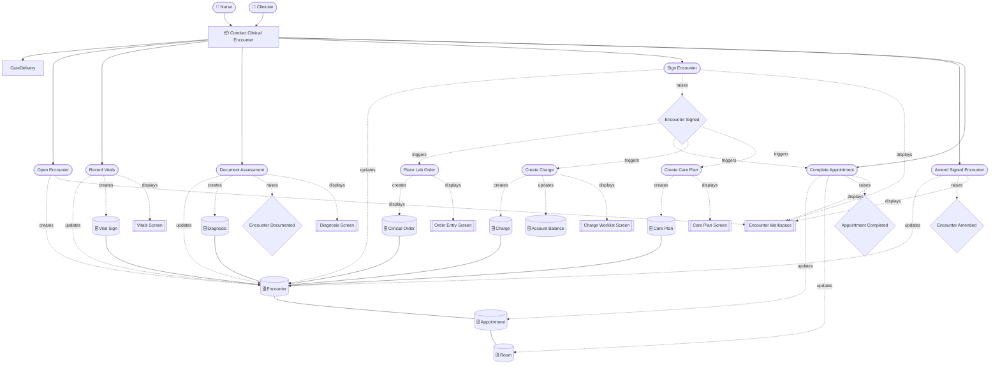
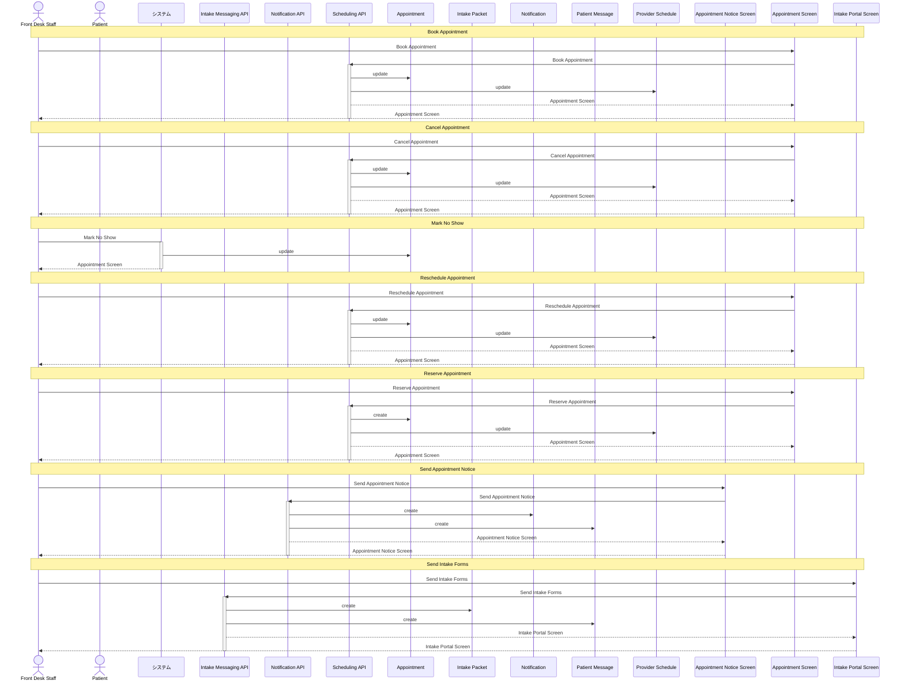
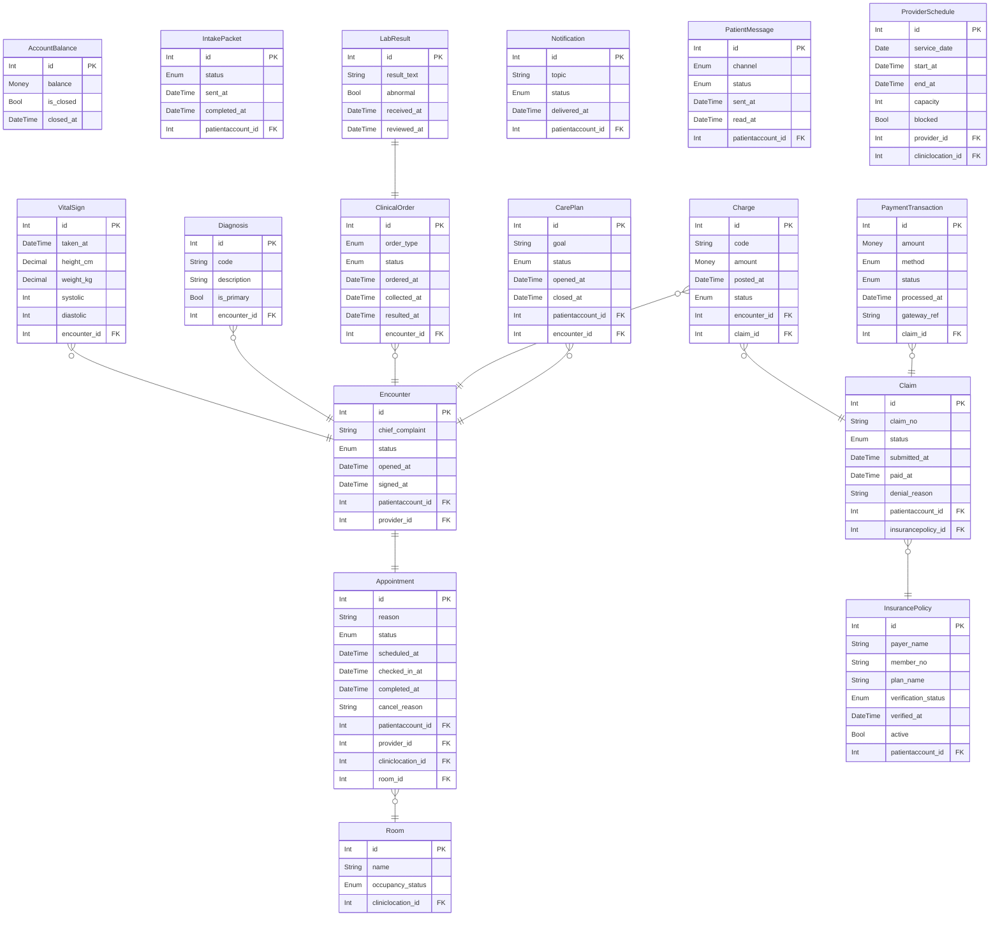

# Clinic Ops 設計書サンプル

<!-- derived-from ./language-reference.md -->
<!-- derived-from ./cli-reference.md -->
<!-- derived-from ./state-derivation.md -->

この文書は `samples/clinic-ops/` を題材に、要求整理から API 整理、データモデリング、状態検証までを 1 つの設計書としてまとめる例です。RDRA DSL のソースを唯一の入力として、BUC 図、イベントフロー図、シーケンス図、ER 図、状態図、状態到達パターンを生成し、それぞれを設計判断の根拠として取り込みます。

生成済み成果物は次の場所にあります。

| 種別 | 生成ファイル | 用途 |
|---|---|---|
| BUC/RDRA 図 | [rdra_buc_clinical_encounter.mmd](../samples/clinic-ops/out/rdra_buc_clinical_encounter.mmd) | 診療 BUC の要求スコープ確認 |
| イベントフロー図 | [event_flow.mmd](../samples/clinic-ops/out/event_flow.mmd) | BUC 間の後続処理、状態遷移の確認 |
| シーケンス図 | [sequence_buc_appointment_scheduling.mmd](../samples/clinic-ops/out/sequence_buc_appointment_scheduling.mmd) | 画面、API、エンティティ境界の確認 |
| ER 図 | [er_care_to_billing.mmd](../samples/clinic-ops/out/er_care_to_billing.mmd) | 診療から請求までのデータ関係確認 |
| 状態図 | [state_whole.mmd](../samples/clinic-ops/out/state_whole.mmd) | 主要ライフサイクルの全体確認 |
| API マトリクス | [api_matrix.csv](../samples/clinic-ops/out/api_matrix.csv) | API とエンティティ CRUD の棚卸し |
| 状態到達表 | [states_appointment.txt](../samples/clinic-ops/out/states_appointment.txt) | 予約状態の到達可能性確認 |
| 状態到達表 | [states_claim.txt](../samples/clinic-ops/out/states_claim.txt) | 請求状態の到達可能性確認 |

## Scope

対象は診療所運営の中核業務です。患者登録、予約、受付、診療、検査、処方、請求、フォローアップ、運営管理を 9 つの BUC として分け、業務単位ごとに `samples/clinic-ops/buc/` 配下へ配置しています。

| BUC | 目的 | 主な担当 |
|---|---|---|
| `BucPatientOnboarding` | 患者登録、保険確認、同意、問診 | 受付、患者 |
| `BucAppointmentScheduling` | 予約作成、変更、取消、通知 | 受付、患者 |
| `BucVisitCheckIn` | 来院確認、会計前受け、部屋割り | 受付、看護師 |
| `BucClinicalEncounter` | 診療記録、バイタル、診断、署名 | 看護師、臨床担当 |
| `BucOrdersResults` | 検査オーダー、検体、結果確認 | 臨床担当、看護師 |
| `BucPrescriptionFulfillment` | 処方作成、送信、調剤確認 | 臨床担当、看護師 |
| `BucBillingClaims` | チャージ、請求、入金、残高消込 | 請求担当 |
| `BucFollowupCare` | ケアプラン、フォロー通知、再診予約 | ケア調整担当、患者 |
| `BucStaffAdministration` | 予定枠、部屋、監査イベント管理 | 管理者 |

設計上の読み方は、まず BUC で要求範囲を確認し、次にイベントで BUC 間の連鎖を確認し、その後に API とデータを確定する流れです。

## Requirements

診療 BUC は、来院済みの予約をもとに診療記録を開始し、バイタル、診断、署名、予約完了を扱います。署名イベントを境に、検査オーダー、請求チャージ、ケアプラン作成が後続 BUC として動きます。



この図から、診療記録は単独で完結しないことが分かります。`EvEncounterSigned` が、予約完了、検査オーダー、請求チャージ、ケアプラン作成を起動するため、署名を業務上の確定点として扱います。

## Event Flow

イベントフロー図は、BUC 間の連鎖と状態遷移を同じ図で確認するための成果物です。ここでは全体図を取り込み、要求のつながりがどこで発生するかを示します。

```mermaid
flowchart LR
  ev__EvAppointmentCancelled{"Appointment Cancelled"}
  uc__CancelAppointment(["Cancel Appointment"])
  uc__CancelAppointment -.->|raises| ev__EvAppointmentCancelled
  uc__SendAppointmentNotice(["Send Appointment Notice"])
  ev__EvAppointmentCancelled -.->|triggers| uc__SendAppointmentNotice
  st__Apptscheduled("Appointment Scheduled")
  st__Apptcancelled("Appointment Cancelled")
  st__Apptscheduled -->|Appointment Cancelled| st__Apptcancelled
  ev__EvAppointmentCheckedIn{"Appointment Checked In"}
  uc__CheckInPatient(["Check In Patient"])
  uc__CheckInPatient -.->|raises| ev__EvAppointmentCheckedIn
  uc__OpenEncounter(["Open Encounter"])
  ev__EvAppointmentCheckedIn -.->|triggers| uc__OpenEncounter
  uc__PrepareEncounter(["Prepare Encounter"])
  ev__EvAppointmentCheckedIn -.->|triggers| uc__PrepareEncounter
  st__Apptcheckedin("Appointment Checked In")
  st__Apptscheduled -->|Appointment Checked In| st__Apptcheckedin
  ev__EvAppointmentCompleted{"Appointment Completed"}
  uc__CompleteAppointment(["Complete Appointment"])
  uc__CompleteAppointment -.->|raises| ev__EvAppointmentCompleted
  st__Apptcompleted("Appointment Completed")
  st__Apptcheckedin -->|Appointment Completed| st__Apptcompleted
  ev__EvAppointmentNoShow{"Appointment Marked No Show"}
  uc__MarkNoShow(["Mark No Show"])
  uc__MarkNoShow -.->|raises| ev__EvAppointmentNoShow
  st__Apptnoshow("Appointment No Show")
  st__Apptscheduled -->|Appointment Marked No Show| st__Apptnoshow
  ev__EvAppointmentRescheduled{"Appointment Rescheduled"}
  uc__RescheduleAppointment(["Reschedule Appointment"])
  uc__RescheduleAppointment -.->|raises| ev__EvAppointmentRescheduled
  ev__EvAppointmentRescheduled -.->|triggers| uc__SendAppointmentNotice
  st__Apptscheduled -->|Appointment Rescheduled| st__Apptscheduled
  ev__EvAppointmentScheduled{"Appointment Scheduled"}
  uc__BookAppointment(["Book Appointment"])
  uc__BookAppointment -.->|raises| ev__EvAppointmentScheduled
  uc__ScheduleFollowUpVisit(["Schedule Follow-Up Visit"])
  uc__ScheduleFollowUpVisit -.->|raises| ev__EvAppointmentScheduled
  ev__EvAppointmentScheduled -.->|triggers| uc__SendAppointmentNotice
  uc__SendIntakeForms(["Send Intake Forms"])
  ev__EvAppointmentScheduled -.->|triggers| uc__SendIntakeForms
  st__Apptrequested("Appointment Requested")
  st__Apptrequested -->|Appointment Scheduled| st__Apptscheduled
  ev__EvCarePlanClosed{"Care Plan Closed"}
  uc__CloseCarePlan(["Close Care Plan"])
  uc__CloseCarePlan -.->|raises| ev__EvCarePlanClosed
  st__Caremonitoring("Care Plan Monitoring")
  st__Careclosed("Care Plan Closed")
  st__Caremonitoring -->|Care Plan Closed| st__Careclosed
  ev__EvCarePlanMonitoring{"Care Plan Monitoring"}
  uc__ReviewPatientResponse(["Review Patient Response"])
  uc__ReviewPatientResponse -.->|raises| ev__EvCarePlanMonitoring
  st__Careopen("Care Plan Open")
  st__Careopen -->|Care Plan Monitoring| st__Caremonitoring
  ev__EvClaimAccepted{"Claim Accepted"}
  uc__ReceiveClaimAccepted(["Receive Claim Accepted"])
  uc__ReceiveClaimAccepted -.->|raises| ev__EvClaimAccepted
  st__Claimsubmitted("Claim Submitted")
  st__Claimaccepted("Claim Accepted")
  st__Claimsubmitted -->|Claim Accepted| st__Claimaccepted
  ev__EvClaimDenied{"Claim Denied"}
  uc__RecordClaimDenial(["Record Claim Denial"])
  uc__RecordClaimDenial -.->|raises| ev__EvClaimDenied
  st__Claimdenied("Claim Denied")
  st__Claimsubmitted -->|Claim Denied| st__Claimdenied
  ev__EvClaimPaid{"Claim Paid"}
  uc__PostPayment(["Post Payment"])
  uc__PostPayment -.->|raises| ev__EvClaimPaid
  st__Claimpaid("Claim Paid")
  st__Claimaccepted -->|Claim Paid| st__Claimpaid
  ev__EvClaimSubmitted{"Claim Submitted"}
  uc__SubmitClaim(["Submit Claim"])
  uc__SubmitClaim -.->|raises| ev__EvClaimSubmitted
  st__Claimdraft("Claim Draft")
  st__Claimdraft -->|Claim Submitted| st__Claimsubmitted
  ev__EvClinicalOrderCancelled{"Clinical Order Cancelled"}
  uc__CancelClinicalOrder(["Cancel Clinical Order"])
  uc__CancelClinicalOrder -.->|raises| ev__EvClinicalOrderCancelled
  st__Clordered("Clinical Order Placed")
  st__Clcancelled("Clinical Order Cancelled")
  st__Clordered -->|Clinical Order Cancelled| st__Clcancelled
  ev__EvClinicalOrderCollected{"Specimen Collected"}
  uc__CollectSpecimen(["Collect Specimen"])
  uc__CollectSpecimen -.->|raises| ev__EvClinicalOrderCollected
  st__Clcollected("Specimen Collected")
  st__Clordered -->|Specimen Collected| st__Clcollected
  ev__EvClinicalOrderResulted{"Clinical Result Received"}
  uc__ReceiveLabResult(["Receive Lab Result"])
  uc__ReceiveLabResult -.->|raises| ev__EvClinicalOrderResulted
  st__Clresulted("Result Received")
  st__Clcollected -->|Clinical Result Received| st__Clresulted
  ev__EvClinicalOrderReviewed{"Clinical Result Reviewed"}
  uc__ReviewLabResult(["Review Lab Result"])
  uc__ReviewLabResult -.->|raises| ev__EvClinicalOrderReviewed
  uc__NotifyCriticalResult(["Notify Critical Result"])
  ev__EvClinicalOrderReviewed -.->|triggers| uc__NotifyCriticalResult
  uc__NotifyPatientResult(["Notify Patient Result"])
  ev__EvClinicalOrderReviewed -.->|triggers| uc__NotifyPatientResult
  st__Clreviewed("Result Reviewed")
  st__Clresulted -->|Clinical Result Reviewed| st__Clreviewed
  ev__EvEncounterAmended{"Encounter Amended"}
  uc__AmendEncounter(["Amend Signed Encounter"])
  uc__AmendEncounter -.->|raises| ev__EvEncounterAmended
  st__Encsigned("Encounter Signed")
  st__Encamended("Encounter Amended")
  st__Encsigned -->|Encounter Amended| st__Encamended
  ev__EvEncounterDocumented{"Encounter Documented"}
  uc__DocumentAssessment(["Document Assessment"])
  uc__DocumentAssessment -.->|raises| ev__EvEncounterDocumented
  st__Encopen("Encounter Open")
  st__Encdocumented("Encounter Documented")
  st__Encopen -->|Encounter Documented| st__Encdocumented
  ev__EvEncounterSigned{"Encounter Signed"}
  uc__SignEncounter(["Sign Encounter"])
  uc__SignEncounter -.->|raises| ev__EvEncounterSigned
  ev__EvEncounterSigned -.->|triggers| uc__CompleteAppointment
  uc__CreateCarePlan(["Create Care Plan"])
  ev__EvEncounterSigned -.->|triggers| uc__CreateCarePlan
  uc__CreateCharge(["Create Charge"])
  ev__EvEncounterSigned -.->|triggers| uc__CreateCharge
  uc__PlaceLabOrder(["Place Lab Order"])
  ev__EvEncounterSigned -.->|triggers| uc__PlaceLabOrder
  st__Encdocumented -->|Encounter Signed| st__Encsigned
  ev__EvIntakeCompleted{"Intake Completed"}
  uc__CompleteIntakeForms(["Complete Intake Forms"])
  uc__CompleteIntakeForms -.->|raises| ev__EvIntakeCompleted
  st__Intakesent("Intake Sent")
  st__Intakecompleted("Intake Completed")
  st__Intakesent -->|Intake Completed| st__Intakecompleted
  ev__EvIntakeExpired{"Intake Expired"}
  uc__ExpireIntakeForms(["Expire Intake Forms"])
  uc__ExpireIntakeForms -.->|raises| ev__EvIntakeExpired
  st__Intakeexpired("Intake Expired")
  st__Intakesent -->|Intake Expired| st__Intakeexpired
  ev__EvPatientArchived{"Patient Archived"}
  uc__ArchivePatient(["Archive Patient"])
  uc__ArchivePatient -.->|raises| ev__EvPatientArchived
  st__Patientactive("Active Patient")
  st__Patientinactive("Inactive Patient")
  st__Patientactive -->|Patient Archived| st__Patientinactive
  ev__EvPatientMerged{"Patient Merged"}
  uc__MergeDuplicatePatient(["Merge Duplicate Patient"])
  uc__MergeDuplicatePatient -.->|raises| ev__EvPatientMerged
  st__Patientmerged("Merged Patient")
  st__Patientactive -->|Patient Merged| st__Patientmerged
  ev__EvPrescriptionCancelled{"Prescription Cancelled"}
  uc__CancelPrescription(["Cancel Prescription"])
  uc__CancelPrescription -.->|raises| ev__EvPrescriptionCancelled
  st__Rxdrafted("Prescription Drafted")
  st__Rxcancelled("Prescription Cancelled")
  st__Rxdrafted -->|Prescription Cancelled| st__Rxcancelled
  ev__EvPrescriptionDispensed{"Prescription Dispensed"}
  uc__ConfirmDispense(["Confirm Dispense"])
  uc__ConfirmDispense -.->|raises| ev__EvPrescriptionDispensed
  st__Rxsent("Prescription Sent")
  st__Rxdispensed("Prescription Dispensed")
  st__Rxsent -->|Prescription Dispensed| st__Rxdispensed
  ev__EvPrescriptionSent{"Prescription Sent"}
  uc__SendPrescription(["Send Prescription"])
  uc__SendPrescription -.->|raises| ev__EvPrescriptionSent
  st__Rxdrafted -->|Prescription Sent| st__Rxsent
```



設計レビューでは、イベントが未発火になっていないか、後続 use case がどの BUC に属しているか、状態遷移と業務イベントの名前がずれていないかを確認します。

## API

API 整理では、use case が直接エンティティを操作するのか、画面から API を呼び出して API がエンティティを操作するのかを明示します。予約 BUC では `SchedulingApi` が予約と予定枠を扱い、通知系は `NotificationApi` と `IntakeMessagingApi` に分けています。
この sequence 図は書き込み系の use case に絞るため、空き枠検索のような読み取り専用操作は表示されません。



API マトリクスでは、API がどのエンティティを `C` / `R` / `U` / `D` するかを棚卸しできます。設計書本文には代表例だけを載せ、全量は `api_matrix.csv` を参照します。

| API | 主な責務 | CRUD 対象 |
|---|---|---|
| `SchedulingApi` | 予約枠検索、予約作成、変更 | `Appointment`, `ProviderSchedule`, `Provider`, `ClinicLocation` |
| `NotificationApi` | 予約通知 | `Notification`, `PatientMessage` |
| `EncounterApi` | 診療記録開始、署名、修正 | `Encounter`, `Appointment` |
| `ClaimApi` | 請求生成、送信 | `Claim`, `InsurancePolicy` |
| `PaymentPostApi` | 入金登録 | `PaymentTransaction` |

## Data Model

データモデリングでは、診療から請求までの中心線を先に確定します。`Appointment` から `Encounter` が 1:1 で生まれ、`Encounter` に `VitalSign`、`Diagnosis`、`ClinicalOrder`、`Charge`、`CarePlan` がぶら下がります。請求側では `Charge` が `Claim` に集約され、`PaymentTransaction` によって入金が記録されます。



この ER 図は「診療完了後に請求を起票できるか」「検査結果はどのオーダーに紐づくか」「フォローアップは診療記録に戻れるか」を確認するための図です。DB 物理設計そのものではなく、要求と API の境界を支える概念データモデルとして扱います。

## State Model

状態モデルでは、予約、診療、検査、処方、請求などのライフサイクルを並べて見ます。状態は `Enum` カラムに対応し、イベントと `raises` によって到達可能な状態パターンが導出されます。

```mermaid
stateDiagram-v2
  [*] --> Apptrequested
  [*] --> Careopen
  [*] --> Claimdraft
  [*] --> Clordered
  [*] --> Encopen
  [*] --> Intakesent
  [*] --> Patientactive
  [*] --> Rxdrafted
  state "Appointment Checked In" as Apptcheckedin
  state "Appointment Completed" as Apptcompleted
  state "Appointment Requested" as Apptrequested
  state "Appointment Scheduled" as Apptscheduled
  state "Appointment Cancelled" as Apptcancelled
  state "Appointment No Show" as Apptnoshow
  state "Care Plan Monitoring" as Caremonitoring
  state "Care Plan Closed" as Careclosed
  state "Care Plan Open" as Careopen
  state "Claim Accepted" as Claimaccepted
  state "Claim Paid" as Claimpaid
  state "Claim Draft" as Claimdraft
  state "Claim Submitted" as Claimsubmitted
  state "Claim Denied" as Claimdenied
  state "Specimen Collected" as Clcollected
  state "Result Received" as Clresulted
  state "Clinical Order Placed" as Clordered
  state "Clinical Order Cancelled" as Clcancelled
  state "Result Reviewed" as Clreviewed
  state "Encounter Documented" as Encdocumented
  state "Encounter Signed" as Encsigned
  state "Encounter Open" as Encopen
  state "Encounter Amended" as Encamended
  state "Intake Sent" as Intakesent
  state "Intake Completed" as Intakecompleted
  state "Intake Expired" as Intakeexpired
  state "Active Patient" as Patientactive
  state "Inactive Patient" as Patientinactive
  state "Merged Patient" as Patientmerged
  state "Prescription Drafted" as Rxdrafted
  state "Prescription Cancelled" as Rxcancelled
  state "Prescription Sent" as Rxsent
  state "Prescription Dispensed" as Rxdispensed
  Apptcheckedin --> Apptcompleted : Appointment Completed
  Apptrequested --> Apptscheduled : Appointment Scheduled
  Apptscheduled --> Apptcancelled : Appointment Cancelled
  Apptscheduled --> Apptcheckedin : Appointment Checked In
  Apptscheduled --> Apptnoshow : Appointment Marked No Show
  Apptscheduled --> Apptscheduled : Appointment Rescheduled
  Caremonitoring --> Careclosed : Care Plan Closed
  Careopen --> Caremonitoring : Care Plan Monitoring
  Claimaccepted --> Claimpaid : Claim Paid
  Claimdraft --> Claimsubmitted : Claim Submitted
  Claimsubmitted --> Claimaccepted : Claim Accepted
  Claimsubmitted --> Claimdenied : Claim Denied
  Clcollected --> Clresulted : Clinical Result Received
  Clordered --> Clcancelled : Clinical Order Cancelled
  Clordered --> Clcollected : Specimen Collected
  Clresulted --> Clreviewed : Clinical Result Reviewed
  Encdocumented --> Encsigned : Encounter Signed
  Encopen --> Encdocumented : Encounter Documented
  Encsigned --> Encamended : Encounter Amended
  Intakesent --> Intakecompleted : Intake Completed
  Intakesent --> Intakeexpired : Intake Expired
  Patientactive --> Patientinactive : Patient Archived
  Patientactive --> Patientmerged : Patient Merged
  Rxdrafted --> Rxcancelled : Prescription Cancelled
  Rxdrafted --> Rxsent : Prescription Sent
  Rxsent --> Rxdispensed : Prescription Dispensed
```



状態到達表は、単なる状態遷移図よりも細かく、nullable カラムや Bool カラムを含めた到達可能な組み合わせを見ます。予約では 48 通りの理論上の組み合わせに対して、業務から到達できるのは 6 通りです。

```text
Entity: Appointment (Appointment)
  axes: status[apptrequested|apptscheduled|apptcheckedin|apptcompleted|apptcancelled|apptnoshow], checked_in_at[null|present:timestamptz], completed_at[null|present:timestamptz], cancel_reason[null|present]

  STATUS         CHECKED_IN_AT        COMPLETED_AT         CANCEL_REASON  INITIAL  TERMINAL
  apptrequested  null                 null                 null           yes      no
  apptscheduled  null                 null                 null           no       no
  apptcheckedin  present:timestamptz  null                 null           no       no
  apptcancelled  null                 null                 present        no       yes
  apptnoshow     null                 null                 null           no       yes
  apptcompleted  present:timestamptz  present:timestamptz  null           no       yes

  reachable: 6 / bound: 48
```

請求では 40 通りの理論上の組み合わせに対して、到達可能なのは 5 通りです。`claimpaid` と `denial_reason=present` の同時成立は `forbidden` で禁止しており、設計上の不整合として検出できる形にしています。

```text
Entity: Claim (Claim)
  axes: status[claimdraft|claimsubmitted|claimaccepted|claimdenied|claimpaid], submitted_at[null|present:timestamptz], paid_at[null|present:timestamptz], denial_reason[null|present]

  STATUS          SUBMITTED_AT         PAID_AT              DENIAL_REASON  INITIAL  TERMINAL
  claimdraft      null                 null                 null           yes      no
  claimsubmitted  present:timestamptz  null                 null           no       no
  claimaccepted   present:timestamptz  null                 null           no       no
  claimdenied     present:timestamptz  null                 present        no       yes
  claimpaid       present:timestamptz  present:timestamptz  null           no       yes

  reachable: 5 / bound: 40
```

## Review Checklist

この設計書サンプルをレビューするときは、次の順で見るとズレを見つけやすくなります。

1. BUC ごとに actor、use case、screen、entity が不足していないか。
2. BUC をまたぐ処理が `triggers` として表現され、後続 use case が別 BUC に所属しているか。
3. use case が API を呼ぶ場合、CRUD が use case ではなく API に寄せられているか。
4. ER 図で中心エンティティの所有関係が読み取れるか。
5. 状態図と状態到達表で、終了状態、nullable カラム、禁止状態が説明できるか。
6. API マトリクスで、読み取りだけの API と書き込み API が混ざりすぎていないか。

## Summary

<!-- derived-from #scope -->
<!-- derived-from #requirements -->
<!-- derived-from #event-flow -->
<!-- derived-from #api -->
<!-- derived-from #data-model -->
<!-- derived-from #state-model -->

`clinic-ops` サンプルは、BUC 単位で要求を切り出し、イベントで BUC 間の連鎖を定義し、API 境界で入出力を整理し、ER と状態到達表でデータモデルを検証する流れを 1 つのモデルにまとめています。設計書としては、文章だけで判断せず、生成図と CSV を同じレビュー単位に置くことで、要求、API、データの齟齬を早い段階で見つけることを狙います。
