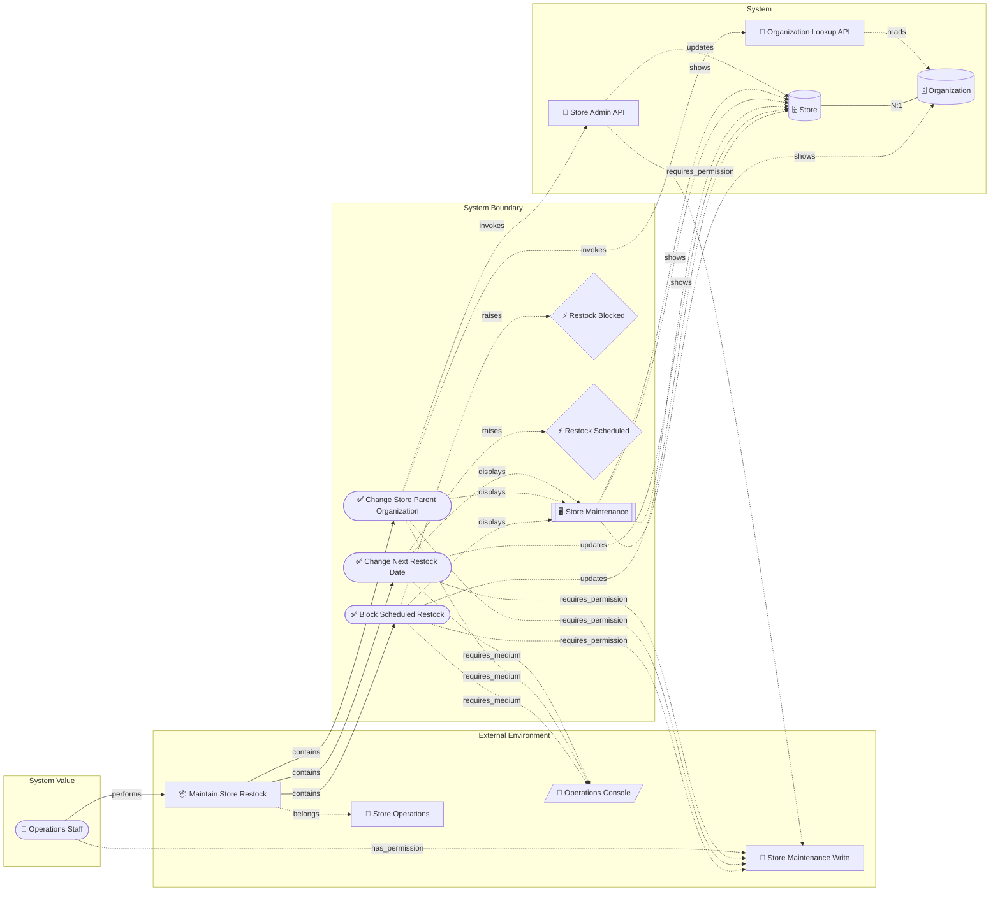
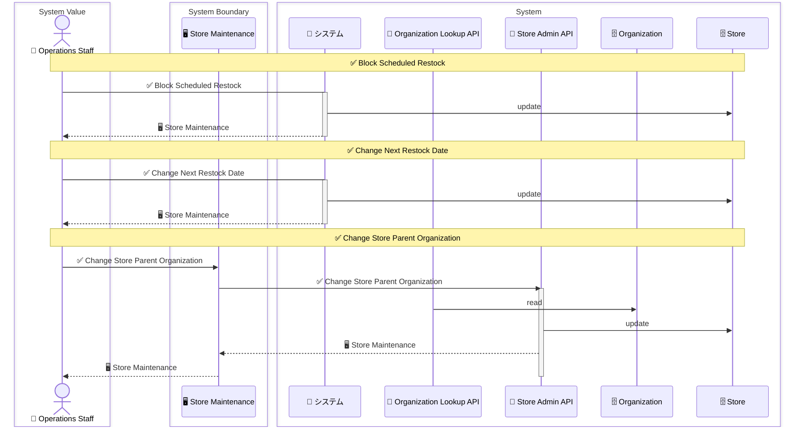
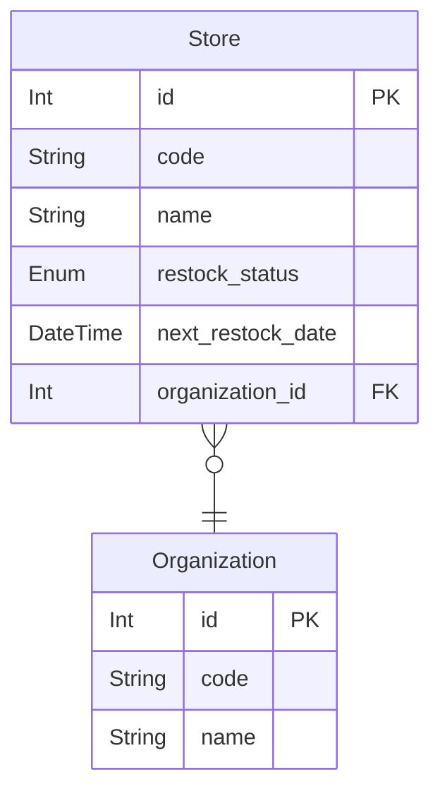
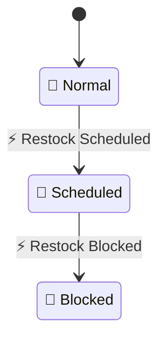

# Diagram Sample Review Guide

<!-- constrained-by ./cli-reference.md#diagram -->
<!-- constrained-by ./incremental-modeling.md -->
<!-- derived-from ../samples/incremental-order/step-6-business-rules/design.md -->

This guide embeds representative generated diagrams from the incremental order sample
and explains how to read each one during review. The examples use
`samples/incremental-order/step-6-business-rules`, a small model that still includes
business scope, permissions, UI, APIs, entities, lifecycle events, and state rules.

Regenerate the artifacts with:

```sh
bash scripts/check-sample-artifacts.sh
```

The same command runs in CI, so intentional emitter or DSL changes should appear as a
normal diff under `samples/incremental-order/step-6-business-rules/out/`.

CI snapshots the text-level diagram artifacts (`.mmd` and `.puml`) rather than rendered
PNG/SVG images. PNG/SVG rendering depends on external renderers such as Mermaid CLI or
`plantuml.jar`; keep those outputs as local review conveniences until the renderer
toolchain is pinned in CI.

## RDRA Layered Graph

<!-- derived-from #diagram-sample-review-guide -->

Generated from:

```sh
rdra-ish diagram samples/incremental-order/step-6-business-rules/src \
  --kind rdra \
  --format mermaid \
  --buc BucStoreRestock \
  --out samples/incremental-order/step-6-business-rules/out/object_graph_buc_store_restock
```



How to read it:

- Read left to right as intent, environment, boundary, and system detail.
- Start from the actor and BUC, then follow `contains` into concrete use cases.
- Treat permissions and media as review constraints on the use-case/API path, not as
  decorative labels.
- Use repeated `shows` edges as a prompt to inspect whether multiple screen fields map
  to the same entity.

Review points:

- Does every use case in the BUC still explain the BUC's business value?
- Are direct entity writes intentional, or should they move behind an API boundary?
- Does every required permission have a matching actor-side grant?
- Are event-raising use cases paired with downstream flow or state review?

## Sequence Diagram

<!-- derived-from #rdra-layered-graph -->

Generated from:

```sh
rdra-ish diagram samples/incremental-order/step-6-business-rules/src \
  --kind sequence \
  --format mermaid \
  --buc BucStoreRestock \
  --out samples/incremental-order/step-6-business-rules/out/sequence_buc_store_restock
```



How to read it:

- Each note marks a use-case slice; inspect one note at a time.
- A direct actor-to-system call means the use case has no modeled screen/API hop.
- API lanes show the transaction boundary implied by `invokes`.
- Entity arrows distinguish reads from writes and make write grouping visible.

Review points:

- Are direct system writes acceptable for this refinement stage?
- Does the use case that changes parent organization read the parent and update the
  store in the intended order?
- Should any read/write pair be split into a separate API or compensated flow?
- Do sequence warnings indicate isolated writes inside a use-case transaction?

## ER Diagram

<!-- derived-from #rdra-layered-graph -->

Generated from:

```sh
rdra-ish diagram samples/incremental-order/step-6-business-rules/src \
  --kind er \
  --format mermaid \
  --out samples/incremental-order/step-6-business-rules/out/er
```



How to read it:

- Treat `entity` as the logical data model, not the conceptual model.
- Cardinality comes from `relate`; generated FK columns show where the ownership of a
  reference lands.
- State axes such as `restock_status` are data columns and lifecycle review inputs.

Review points:

- Is `Store -> Organization` optionality correct for business operations?
- Are state columns explicit enough for state derivation and rule review?
- Do logical entities still match the conceptual vocabulary, or is a `concept` /
  `domain_object` mapping missing?
- Are indexes, uniqueness, tenant scope, history, or soft-delete annotations needed
  before this becomes a migration design?

## State Diagram

<!-- derived-from #er-diagram -->

Generated from:

```sh
rdra-ish diagram samples/incremental-order/step-6-business-rules/src \
  --kind state \
  --format mermaid \
  --out samples/incremental-order/step-6-business-rules/out/state
```



How to read it:

- The initial state comes from entity defaults.
- Transitions are event driven; look back to the RDRA graph for which use case raises
  each event.
- This diagram shows lifecycle topology. Use `rdra-ish states` for rule satisfaction,
  reachable combinations, and diagnostics.

Review points:

- Is there an intended path out of `Blocked`, or is it terminal by design?
- Are business rules such as `scheduled` requiring `next_restock_date` covered by
  state-pattern diagnostics?
- Do events represent domain facts rather than UI button clicks?
- Are event-triggered downstream BUCs or use cases missing from the model?

## Summary

<!-- derived-from #rdra-layered-graph -->
<!-- derived-from #sequence-diagram -->
<!-- derived-from #er-diagram -->
<!-- derived-from #state-diagram -->

Use the layered graph to confirm coverage, the sequence diagram to review interaction
and transaction shape, the ER diagram to review logical data structure, and the state
diagram to review lifecycle topology. A useful review usually walks them in that order:
business value first, then interaction boundary, then data shape, then lifecycle rules.
