# Clinic Ops 設計書サンプル

<!-- derived-from ../../docs/language-reference.md -->
<!-- derived-from ../../docs/cli-reference.md -->
<!-- derived-from ../../docs/state-derivation.md -->

この文書は `samples/clinic-ops/` を題材に、要求整理、BUC 分解、UC 分解、System/API 境界、データモデリング、状態検証をレビューできる粒度でまとめる設計書サンプルです。

図は外部リンクではなく本文に埋め込みます。レビューでは対象章だけを開き、BUC 単位、UC 単位、System/API 単位、データモデル単位の順に確認します。

## 1. 成果物一覧

| 種別 | 生成先 | 用途 |
|---|---|---|
| BUC 別 RDRA 図 | `out/buc/rdra_*.mmd` | 各 BUC の actor/usecase/entity/screen/event を確認する |
| BUC 別 sequence 図 | `out/buc/sequence_*.mmd` | BUC 内 UC の画面、API、Entity 操作を確認する |
| UC 別 sequence 図 | `out/uc/sequence_*.mmd` | 1 UC だけの actor/screen/API/entity を確認する |
| API マトリクス | `out/api_matrix.csv` | API と Entity CRUD の棚卸し |
| Event flow | `out/event_flow.mmd` | BUC 間イベント連鎖を確認する |
| ER 図 | `out/er_care_to_billing.mmd` | 診療から請求までのデータ関係を確認する |
| State 図 | `out/state_whole.mmd` | 主要状態遷移の全体像を確認する |
| 状態到達表 | `out/states_appointment.txt`, `out/states_claim.txt` | lifecycle の到達可能性を確認する |

生成コマンド例:

```sh
rdra-ish diagram samples/clinic-ops --kind rdra --format mermaid --buc BucClinicalEncounter --out samples/clinic-ops/out/buc/rdra_clinical_encounter
rdra-ish diagram samples/clinic-ops --kind sequence --format mermaid --buc BucClinicalEncounter --out samples/clinic-ops/out/buc/sequence_clinical_encounter
rdra-ish diagram samples/clinic-ops --kind sequence --format mermaid --usecase SignEncounter --out samples/clinic-ops/out/uc/sequence_sign_encounter
rdra-ish csv samples/clinic-ops --kind api-matrix --out samples/clinic-ops/out/api_matrix.csv
```

## 2. 業務スコープ

対象は診療所運営の中核業務です。患者登録、予約、受付、診療、検査、処方、請求、フォローアップ、運営管理を BUC として分け、業務担当者がレビューしやすい単位にしています。

| Business | BUC | 主な actor | 目的 |
|---|---|---|---|
| `PatientAccess` | `BucPatientOnboarding` | FrontDesk, Patient | 患者登録から問診送付までを扱う |
| `PatientAccess` | `BucAppointmentScheduling` | FrontDesk, Patient | 予約検索、仮押さえ、予約確定、変更、取消、通知を扱う |
| `PatientAccess` | `BucVisitCheckIn` | FrontDesk, Nurse | 来院確認から部屋割り、診療準備までを扱う |
| `CareDelivery` | `BucClinicalEncounter` | Nurse, Clinician | 診療記録を開き、バイタル、診断、署名、予約完了までを扱う |
| `CareDelivery` | `BucOrdersResults` | Clinician, Nurse | 検査オーダーから結果確認、重要結果通知までを扱う |
| `CareDelivery` | `BucPrescriptionFulfillment` | Clinician, Nurse | 処方作成、薬剤検索、薬局ネットワーク送信、調剤確認、取消、再処方を扱う |
| `RevenueCycle` | `BucBillingClaims` | BillingSpecialist | 診療署名後のチャージ作成、請求生成、請求送信、受理/否認、入金、残高消込を扱う |
| `PatientAccess` | `BucFollowupCare` | CareCoordinator, Patient | 診療後のケアプラン作成、患者連絡、患者応答確認、再診予約、ケアプラン終了を扱う |
| `ClinicAdministration` | `BucStaffAdministration` | ClinicAdmin | 診療所運営のマスタ・監査系業務を扱う |

レビューでは、まず BUC の責務境界を確認し、次に UC 単位で API/Entity 操作を確認します。最後に System/API マトリクスと ER/状態検証で横断的な整合性を見ます。

## 3. BUC 単位の設計レビュー

### 3.1 Patient Onboarding

| 項目 | 内容 |
|---|---|
| BUC | `BucPatientOnboarding` |
| Business | `PatientAccess` |
| 主な actor | FrontDesk, Patient |
| 主なデータ | `PatientAccount`, `PatientProfile`, `InsurancePolicy`, `EligibilityCheck`, `ConsentRecord`, `IntakePacket`, `PatientMessage` |

患者登録から問診送付までを扱う。患者マスタの新規作成、保険資格確認、同意取得、問診フォーム送付は同じ BUC にあるが、API 境界は UC ごとに分け、患者登録 API と外部資格確認 API の責務が混ざらないようにする。

レビュー観点:

- SearchPatient と RegisterPatient の境界が明確か。
- EligibilityApi が保険確認結果と保険ポリシー更新を同じ整合性境界で扱ってよいか。
- SendIntakeForms は予約イベントから起動されるため、予約 BUC 側の責務と混同しないか。

#### Patient Onboarding RDRA 図

生成コマンド:

```sh
rdra-ish diagram samples/clinic-ops --kind rdra --format mermaid --buc BucPatientOnboarding --out samples/clinic-ops/out/buc/rdra_patient_onboarding
```

```mermaid
graph TD
  FrontDesk(["👤 Front Desk Staff"])
  Patient(["👤 Patient"])
  ArchivePatient(["✅ Archive Patient"])
  CaptureConsent(["✅ Capture Consent"])
  CompleteIntakeForms(["✅ Complete Intake Forms"])
  ExpireIntakeForms(["✅ Expire Intake Forms"])
  MergeDuplicatePatient(["✅ Merge Duplicate Patient"])
  RegisterPatient(["✅ Register Patient"])
  SearchPatient(["✅ Search Patient"])
  SendIntakeForms(["✅ Send Intake Forms"])
  UpdateDemographics(["✅ Update Demographics"])
  VerifyInsurance(["✅ Verify Insurance"])
  BucPatientOnboarding["📦 Onboard and Maintain Patient"]
  ConsentRecord[("🗄️ Consent Record")]
  EligibilityCheck[("🗄️ Eligibility Check")]
  InsurancePolicy[("🗄️ Insurance Policy")]
  IntakePacket[("🗄️ Intake Packet")]
  PatientAccount[("🗄️ Patient Account")]
  PatientMessage[("🗄️ Patient Message")]
  PatientProfile[("🗄️ Patient Profile")]
  ConsentScreen[["🖥️ Consent Capture Screen"]]
  InsuranceScreen[["🖥️ Insurance Verification Screen"]]
  IntakePortalScreen[["🖥️ Intake Portal Screen"]]
  PatientProfileScreen[["🖥️ Patient Profile Screen"]]
  PatientSearchScreen[["🖥️ Patient Search Screen"]]
  EvIntakeCompleted{"⚡ Intake Completed"}
  EvIntakeExpired{"⚡ Intake Expired"}
  EvPatientArchived{"⚡ Patient Archived"}
  EvPatientMerged{"⚡ Patient Merged"}
  Patient --> BucPatientOnboarding
  Patient --> CaptureConsent
  Patient --> CompleteIntakeForms
  FrontDesk --> BucPatientOnboarding
  FrontDesk --> VerifyInsurance
  FrontDesk --> SendIntakeForms
  FrontDesk --> ExpireIntakeForms
  FrontDesk --> MergeDuplicatePatient
  FrontDesk --> ArchivePatient
  FrontDesk --> SearchPatient
  FrontDesk --> RegisterPatient
  FrontDesk --> UpdateDemographics
  BucPatientOnboarding --> PatientAccess
  BucPatientOnboarding --> VerifyInsurance
  BucPatientOnboarding --> CaptureConsent
  BucPatientOnboarding --> SendIntakeForms
  BucPatientOnboarding --> CompleteIntakeForms
  BucPatientOnboarding --> ExpireIntakeForms
  BucPatientOnboarding --> MergeDuplicatePatient
  BucPatientOnboarding --> ArchivePatient
  BucPatientOnboarding --> SearchPatient
  BucPatientOnboarding --> RegisterPatient
  BucPatientOnboarding --> UpdateDemographics
  PatientMessage --- PatientAccount
  PatientProfile --- PatientAccount
  InsurancePolicy --- PatientAccount
  EligibilityCheck --- InsurancePolicy
  ConsentRecord --- PatientAccount
  IntakePacket --- PatientAccount
  PatientSearchScreen -.->|shows| PatientAccount
  PatientProfileScreen -.->|shows| PatientProfile
  VerifyInsurance -.->|displays| InsuranceScreen
  CaptureConsent -.->|displays| ConsentScreen
  SendIntakeForms -.->|displays| IntakePortalScreen
  CompleteIntakeForms -.->|updates| IntakePacket
  CompleteIntakeForms -.->|raises| EvIntakeCompleted
  CompleteIntakeForms -.->|displays| IntakePortalScreen
  ExpireIntakeForms -.->|updates| IntakePacket
  ExpireIntakeForms -.->|raises| EvIntakeExpired
  ExpireIntakeForms -.->|displays| IntakePortalScreen
  MergeDuplicatePatient -.->|updates| PatientAccount
  MergeDuplicatePatient -.->|raises| EvPatientMerged
  MergeDuplicatePatient -.->|displays| PatientProfileScreen
  ArchivePatient -.->|updates| PatientAccount
  ArchivePatient -.->|raises| EvPatientArchived
  ArchivePatient -.->|displays| PatientProfileScreen
  SearchPatient -.->|displays| PatientSearchScreen
  RegisterPatient -.->|displays| PatientProfileScreen
  UpdateDemographics -.->|displays| PatientProfileScreen
```

#### Patient Onboarding sequence 図

生成コマンド:

```sh
rdra-ish diagram samples/clinic-ops --kind sequence --format mermaid --buc BucPatientOnboarding --out samples/clinic-ops/out/buc/sequence_patient_onboarding
```

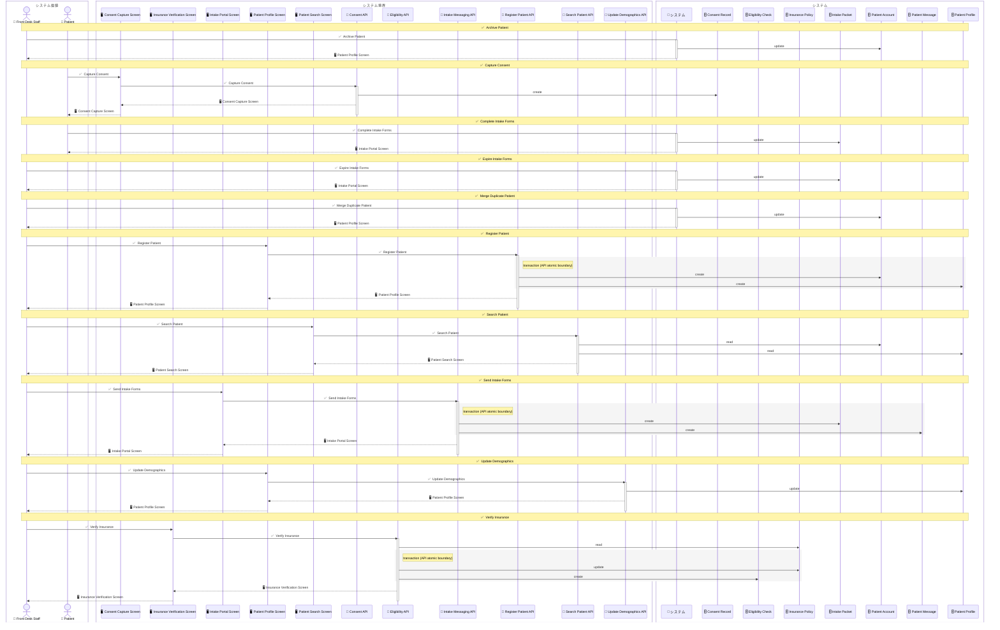

### 3.2 Appointment Scheduling

| 項目 | 内容 |
|---|---|
| BUC | `BucAppointmentScheduling` |
| Business | `PatientAccess` |
| 主な actor | FrontDesk, Patient |
| 主なデータ | `Appointment`, `ProviderSchedule`, `Notification`, `PatientMessage` |

予約検索、仮押さえ、予約確定、変更、取消、通知を扱う。予約枠と予約レコードを同時に更新する UC は専用 API を持ち、予約通知は AppointmentNoticeApi に分ける。

レビュー観点:

- ReserveAppointment と BookAppointment の差が業務上必要か。
- CancelAppointment が Appointment と ProviderSchedule を同じ API 境界で更新することが妥当か。
- MarkNoShow は direct CRUD のままでよいか。

#### Appointment Scheduling RDRA 図

生成コマンド:

```sh
rdra-ish diagram samples/clinic-ops --kind rdra --format mermaid --buc BucAppointmentScheduling --out samples/clinic-ops/out/buc/rdra_appointment_scheduling
```

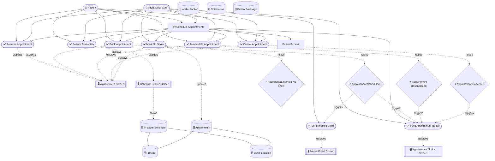

#### Appointment Scheduling sequence 図

生成コマンド:

```sh
rdra-ish diagram samples/clinic-ops --kind sequence --format mermaid --buc BucAppointmentScheduling --out samples/clinic-ops/out/buc/sequence_appointment_scheduling
```

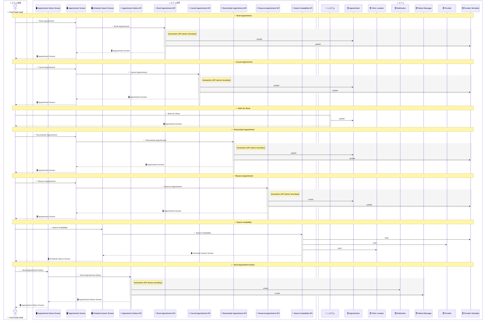

### 3.3 Visit Check-In

| 項目 | 内容 |
|---|---|
| BUC | `BucVisitCheckIn` |
| Business | `PatientAccess` |
| 主な actor | FrontDesk, Nurse |
| 主なデータ | `Appointment`, `PatientAccount`, `InsurancePolicy`, `PaymentTransaction`, `AccountBalance`, `Room`, `PatientProfile` |

来院確認から部屋割り、診療準備までを扱う。受付業務と看護師業務が同じ BUC に含まれるため、UC 単位 sequence で担当境界を確認する。

レビュー観点:

- VerifyArrival は read-only API として十分か。
- CheckInPatient は予約と患者アカウントを同時更新する必要があるか。
- AssignRoom は Room と Appointment を同じ API 境界で更新することでよいか。

#### Visit Check-In RDRA 図

生成コマンド:

```sh
rdra-ish diagram samples/clinic-ops --kind rdra --format mermaid --buc BucVisitCheckIn --out samples/clinic-ops/out/buc/rdra_visit_check_in
```

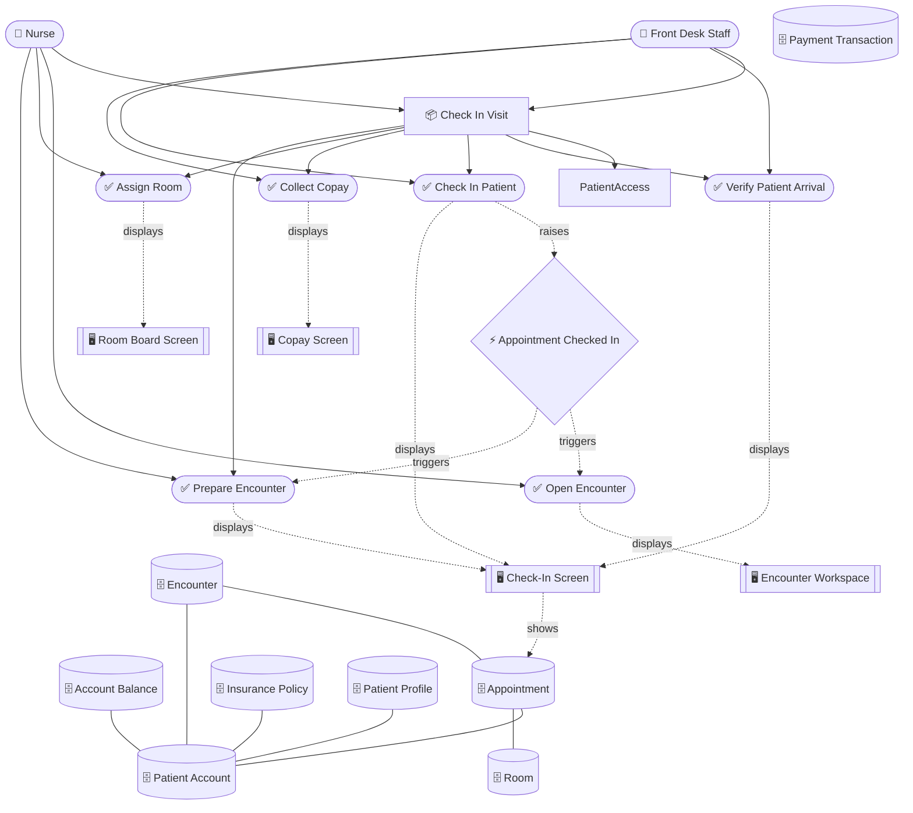

#### Visit Check-In sequence 図

生成コマンド:

```sh
rdra-ish diagram samples/clinic-ops --kind sequence --format mermaid --buc BucVisitCheckIn --out samples/clinic-ops/out/buc/sequence_visit_check_in
```

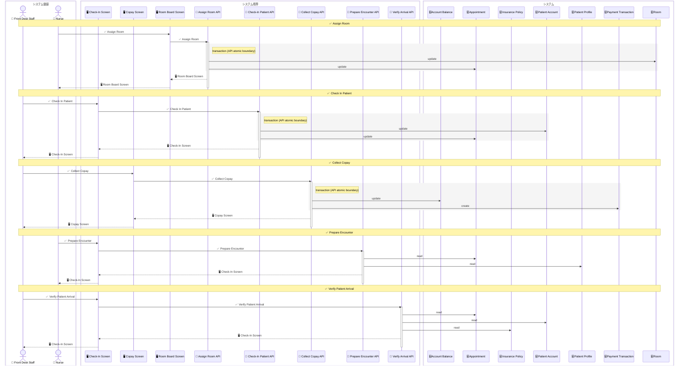

### 3.4 Clinical Encounter

| 項目 | 内容 |
|---|---|
| BUC | `BucClinicalEncounter` |
| Business | `CareDelivery` |
| 主な actor | Nurse, Clinician |
| 主なデータ | `Encounter`, `Appointment`, `VitalSign`, `Diagnosis`, `Room` |

診療記録を開き、バイタル、診断、署名、予約完了までを扱う。EvEncounterSigned は検査、請求、ケアプラン作成を起動する重要なイベントであり、署名前後の編集可能範囲が状態検証の中心になる。

レビュー観点:

- SignEncounter を後続 BUC の起点イベントとして扱ってよいか。
- CompleteAppointment は診療署名イベントから自動的に起動される業務か。
- AmendEncounter が署名済み記録の修正として十分な粒度か。

#### Clinical Encounter RDRA 図

生成コマンド:

```sh
rdra-ish diagram samples/clinic-ops --kind rdra --format mermaid --buc BucClinicalEncounter --out samples/clinic-ops/out/buc/rdra_clinical_encounter
```

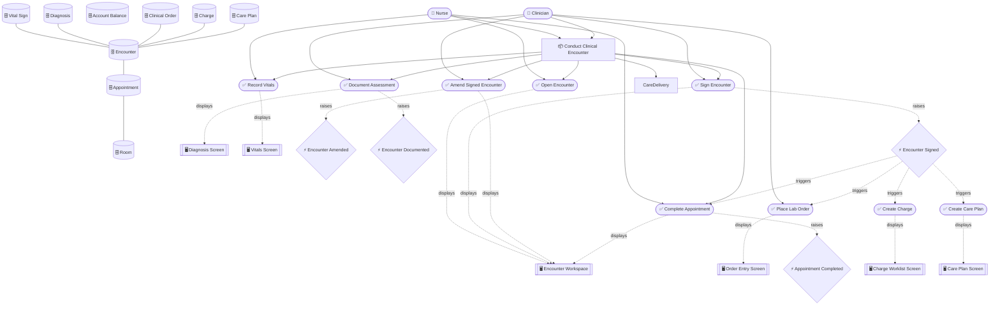

#### Clinical Encounter sequence 図

生成コマンド:

```sh
rdra-ish diagram samples/clinic-ops --kind sequence --format mermaid --buc BucClinicalEncounter --out samples/clinic-ops/out/buc/sequence_clinical_encounter
```

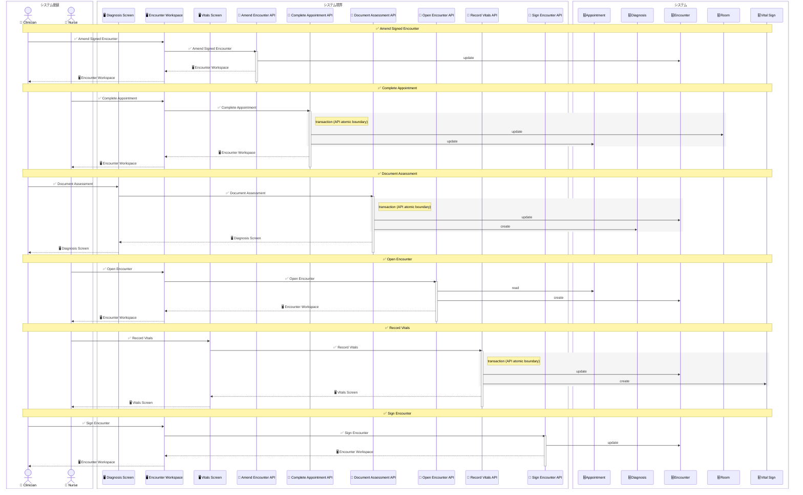

### 3.5 Orders and Results

| 項目 | 内容 |
|---|---|
| BUC | `BucOrdersResults` |
| Business | `CareDelivery` |
| 主な actor | Clinician, Nurse |
| 主なデータ | `ClinicalOrder`, `LabResult`, `Notification`, `PatientMessage` |

検査オーダーから結果確認、重要結果通知までを扱う。検査システム連携は external system として扱い、内部 DSL では API と Entity の境界を確認する。

レビュー観点:

- ReceiveLabResult で LabResult 作成と ClinicalOrder 更新を同じ境界にしてよいか。
- NotifyCriticalResult は結果確認イベントから起動されるため、手動 UC と自動 UC の違いをレビューできるか。
- CancelClinicalOrder は direct CRUD のままでよいか。

#### Orders and Results RDRA 図

生成コマンド:

```sh
rdra-ish diagram samples/clinic-ops --kind rdra --format mermaid --buc BucOrdersResults --out samples/clinic-ops/out/buc/rdra_orders_results
```

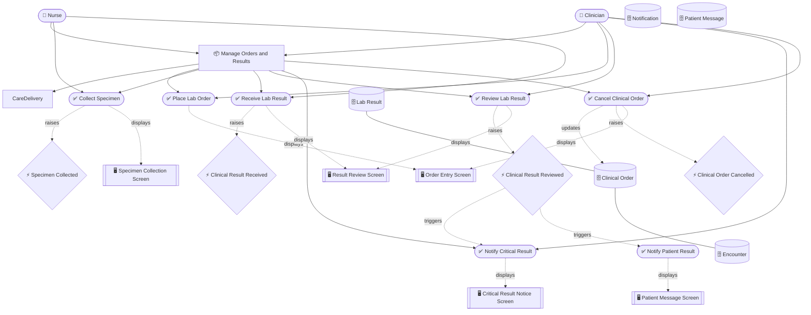

#### Orders and Results sequence 図

生成コマンド:

```sh
rdra-ish diagram samples/clinic-ops --kind sequence --format mermaid --buc BucOrdersResults --out samples/clinic-ops/out/buc/sequence_orders_results
```

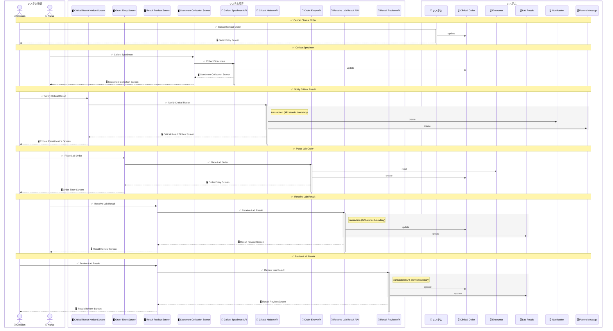

### 3.6 Prescription Fulfillment

| 項目 | 内容 |
|---|---|
| BUC | `BucPrescriptionFulfillment` |
| Business | `CareDelivery` |
| 主な actor | Clinician, Nurse |
| 主なデータ | `Medication`, `Encounter`, `Prescription` |

処方作成、薬剤検索、薬局ネットワーク送信、調剤確認、取消、再処方を扱う。外部薬局ネットワークは uses で表し、内部 API 境界は UC ごとに分ける。

レビュー観点:

- DraftPrescription と SendPrescription の間に承認 UC が必要か。
- RefillPrescription が新しい Prescription を作成する設計でよいか。
- ConfirmDispense は外部通知イベントとして扱うべきか。

#### Prescription Fulfillment RDRA 図

生成コマンド:

```sh
rdra-ish diagram samples/clinic-ops --kind rdra --format mermaid --buc BucPrescriptionFulfillment --out samples/clinic-ops/out/buc/rdra_prescription_fulfillment
```

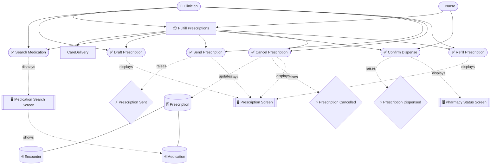

#### Prescription Fulfillment sequence 図

生成コマンド:

```sh
rdra-ish diagram samples/clinic-ops --kind sequence --format mermaid --buc BucPrescriptionFulfillment --out samples/clinic-ops/out/buc/sequence_prescription_fulfillment
```

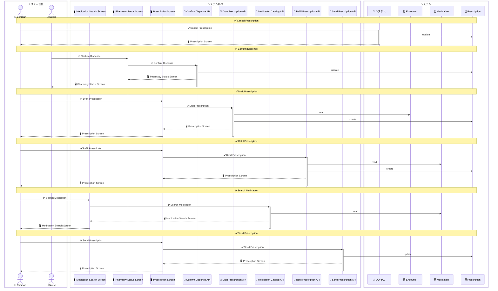

### 3.7 Billing Claims

| 項目 | 内容 |
|---|---|
| BUC | `BucBillingClaims` |
| Business | `RevenueCycle` |
| 主な actor | BillingSpecialist |
| 主なデータ | `Charge`, `Claim`, `InsurancePolicy`, `PaymentTransaction`, `AccountBalance` |

診療署名後のチャージ作成、請求生成、請求送信、受理/否認、入金、残高消込を扱う。Revenue Cycle の状態検証では Claim が中心になる。

レビュー観点:

- CreateCharge が AccountBalance も更新する境界でよいか。
- GenerateClaim と SubmitClaim を分ける必要があるか。
- PostPayment と ReconcileBalance の責務境界が明確か。

#### Billing Claims RDRA 図

生成コマンド:

```sh
rdra-ish diagram samples/clinic-ops --kind rdra --format mermaid --buc BucBillingClaims --out samples/clinic-ops/out/buc/rdra_billing_claims
```

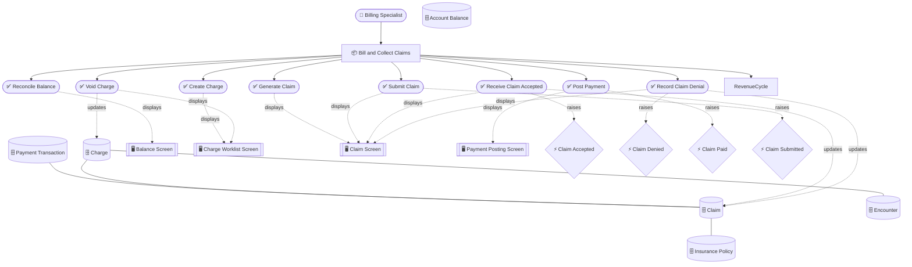

#### Billing Claims sequence 図

生成コマンド:

```sh
rdra-ish diagram samples/clinic-ops --kind sequence --format mermaid --buc BucBillingClaims --out samples/clinic-ops/out/buc/sequence_billing_claims
```

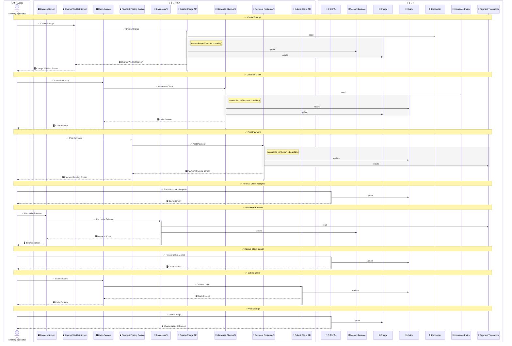

### 3.8 Follow-Up Care

| 項目 | 内容 |
|---|---|
| BUC | `BucFollowupCare` |
| Business | `PatientAccess` |
| 主な actor | CareCoordinator, Patient |
| 主なデータ | `CarePlan`, `Encounter`, `PatientMessage`, `Appointment`, `ProviderSchedule`, `Notification` |

診療後のケアプラン作成、患者連絡、患者応答確認、再診予約、ケアプラン終了を扱う。診療署名イベントと検査結果確認イベントを受けるため、イベントフロー上は複数 BUC と接続する。

レビュー観点:

- CreateCarePlan が EvEncounterSigned から起動される設計でよいか。
- ScheduleFollowUpVisit は予約 BUC に移すべきか、フォローアップ BUC に置くべきか。
- 患者応答を PatientMessage の状態として扱うだけで足りるか。

#### Follow-Up Care RDRA 図

生成コマンド:

```sh
rdra-ish diagram samples/clinic-ops --kind rdra --format mermaid --buc BucFollowupCare --out samples/clinic-ops/out/buc/rdra_followup_care
```

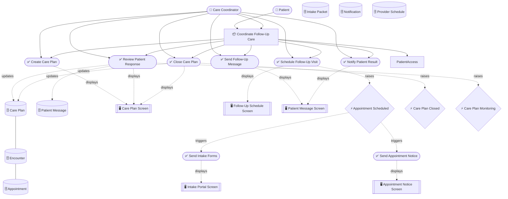

#### Follow-Up Care sequence 図

生成コマンド:

```sh
rdra-ish diagram samples/clinic-ops --kind sequence --format mermaid --buc BucFollowupCare --out samples/clinic-ops/out/buc/sequence_followup_care
```

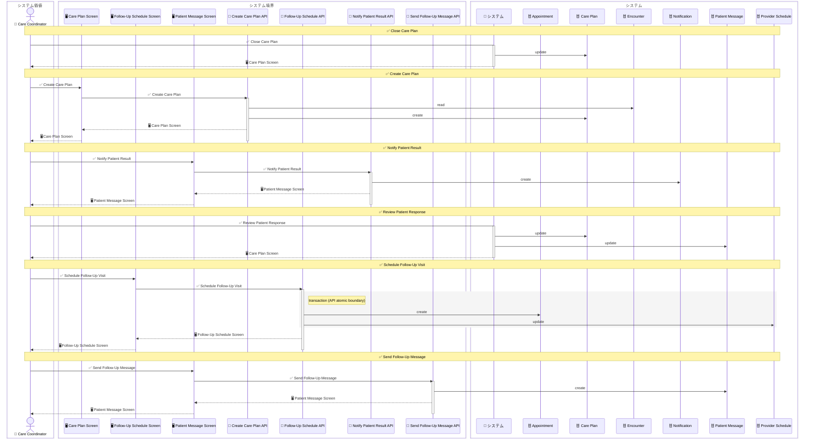

### 3.9 Staff Administration

| 項目 | 内容 |
|---|---|
| BUC | `BucStaffAdministration` |
| Business | `ClinicAdministration` |
| 主な actor | ClinicAdmin |
| 主なデータ | `ProviderSchedule`, `Provider`, `Room`, `AuditEvent`, `PatientAccount` |

診療所運営のマスタ・監査系業務を扱う。患者アクセスや診療とは別 Business に分けることで、通常業務と管理業務の責務を分ける。

レビュー観点:

- ManageProviderSchedule と BlockScheduleSlot の粒度が適切か。
- ReviewAuditEvents は read-only API として十分か。
- ResolveAuditFinding は direct CRUD のままでよいか。

#### Staff Administration RDRA 図

生成コマンド:

```sh
rdra-ish diagram samples/clinic-ops --kind rdra --format mermaid --buc BucStaffAdministration --out samples/clinic-ops/out/buc/rdra_staff_administration
```

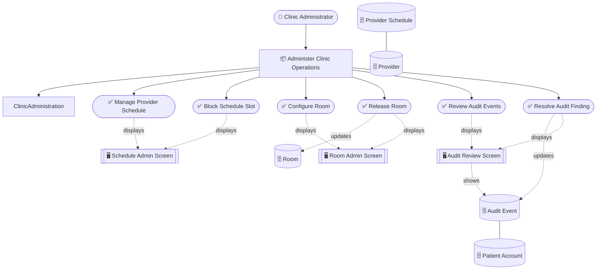

#### Staff Administration sequence 図

生成コマンド:

```sh
rdra-ish diagram samples/clinic-ops --kind sequence --format mermaid --buc BucStaffAdministration --out samples/clinic-ops/out/buc/sequence_staff_administration
```

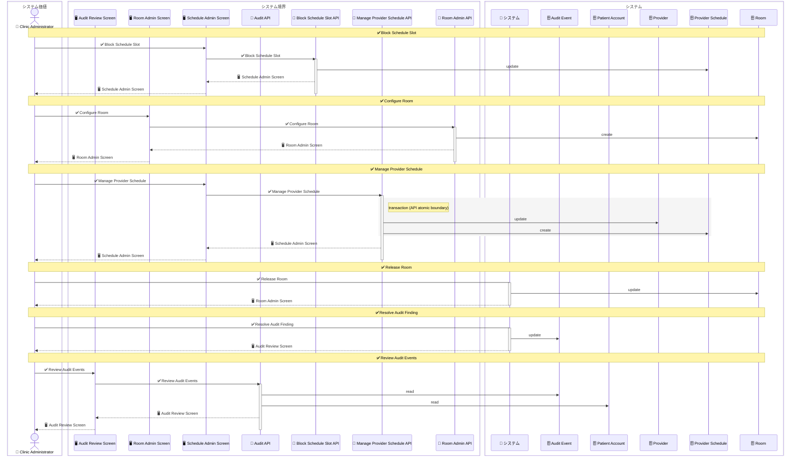

## 4. UC 単位のレビュー

UC 単位の sequence は、1 UC の actor、screen、API、Entity 操作だけを本文に埋め込みます。BUC 図で責務境界を見たあと、論点のある UC だけを個別に確認します。

actor は `performs(Actor, UseCase)` があれば UC 直結の actor を優先します。BUC には複数 actor がいても、UC sequence にはその UC の代表 actor だけを出し、主担当が未確定の UC だけ `performs(Actor, Buc)` へ fallback します。

### 4.1 Patient Onboarding UC

| UC | 主な確認点 |
|---|---|
| `SearchPatient` | 患者検索が read-only API として表現され、患者作成と混ざらないこと |
| `RegisterPatient` | PatientAccount と PatientProfile を同時作成する境界 |
| `UpdateDemographics` | 患者属性更新の API 境界 |
| `VerifyInsurance` | 保険参照、資格確認作成、保険状態更新 |
| `CaptureConsent` | 同意記録作成と nullable/Bool effect |
| `SendIntakeForms` | 問診パケットとメッセージ作成 |
| `CompleteIntakeForms` | 問診完了イベント |
| `ExpireIntakeForms` | 問診期限切れイベント |
| `MergeDuplicatePatient` | 患者統合状態 |
| `ArchivePatient` | 患者アーカイブ状態 |

#### SearchPatient

患者検索が read-only API として表現され、患者作成と混ざらないこと

生成コマンド:

```sh
rdra-ish diagram samples/clinic-ops --kind sequence --format mermaid --usecase SearchPatient --out samples/clinic-ops/out/uc/sequence_search_patient
```

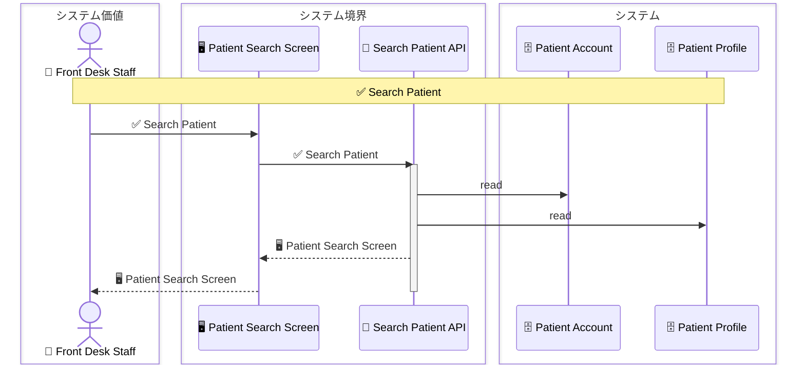

#### RegisterPatient

PatientAccount と PatientProfile を同時作成する境界

生成コマンド:

```sh
rdra-ish diagram samples/clinic-ops --kind sequence --format mermaid --usecase RegisterPatient --out samples/clinic-ops/out/uc/sequence_register_patient
```

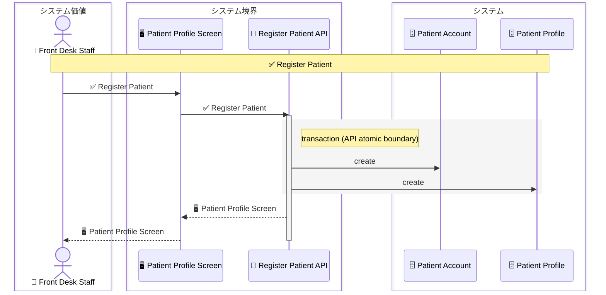

#### UpdateDemographics

患者属性更新の API 境界

生成コマンド:

```sh
rdra-ish diagram samples/clinic-ops --kind sequence --format mermaid --usecase UpdateDemographics --out samples/clinic-ops/out/uc/sequence_update_demographics
```

```mermaid
sequenceDiagram
  box システム価値
    actor FrontDesk as 👤 Front Desk Staff
  end
  box システム境界
    participant PatientProfileScreen as 🖥️ Patient Profile Screen
    participant UpdateDemographicsApi as 🔌 Update Demographics API
  end
  box システム
    participant PatientProfile as 🗄️ Patient Profile
  end

  Note over FrontDesk,PatientProfile: ✅ Update Demographics
  FrontDesk->>PatientProfileScreen: ✅ Update Demographics
  PatientProfileScreen->>UpdateDemographicsApi: ✅ Update Demographics
  activate UpdateDemographicsApi
  UpdateDemographicsApi->>PatientProfile: update
  UpdateDemographicsApi-->>PatientProfileScreen: 🖥️ Patient Profile Screen
  PatientProfileScreen-->>FrontDesk: 🖥️ Patient Profile Screen
  deactivate UpdateDemographicsApi
```

#### VerifyInsurance

保険参照、資格確認作成、保険状態更新

生成コマンド:

```sh
rdra-ish diagram samples/clinic-ops --kind sequence --format mermaid --usecase VerifyInsurance --out samples/clinic-ops/out/uc/sequence_verify_insurance
```

```mermaid
sequenceDiagram
  box システム価値
    actor FrontDesk as 👤 Front Desk Staff
  end
  box システム境界
    participant InsuranceScreen as 🖥️ Insurance Verification Screen
    participant EligibilityApi as 🔌 Eligibility API
  end
  box システム
    participant EligibilityCheck as 🗄️ Eligibility Check
    participant InsurancePolicy as 🗄️ Insurance Policy
  end

  Note over FrontDesk,InsurancePolicy: ✅ Verify Insurance
  FrontDesk->>InsuranceScreen: ✅ Verify Insurance
  InsuranceScreen->>EligibilityApi: ✅ Verify Insurance
  activate EligibilityApi
  EligibilityApi->>InsurancePolicy: read
  rect rgb(245,245,245)
    Note right of EligibilityApi: transaction (API atomic boundary)
    EligibilityApi->>InsurancePolicy: update
    EligibilityApi->>EligibilityCheck: create
  end
  EligibilityApi-->>InsuranceScreen: 🖥️ Insurance Verification Screen
  InsuranceScreen-->>FrontDesk: 🖥️ Insurance Verification Screen
  deactivate EligibilityApi
```

#### CaptureConsent

同意記録作成と nullable/Bool effect

生成コマンド:

```sh
rdra-ish diagram samples/clinic-ops --kind sequence --format mermaid --usecase CaptureConsent --out samples/clinic-ops/out/uc/sequence_capture_consent
```

```mermaid
sequenceDiagram
  box システム価値
    actor Patient as 👤 Patient
  end
  box システム境界
    participant ConsentScreen as 🖥️ Consent Capture Screen
    participant ConsentApi as 🔌 Consent API
  end
  box システム
    participant ConsentRecord as 🗄️ Consent Record
  end

  Note over Patient,ConsentRecord: ✅ Capture Consent
  Patient->>ConsentScreen: ✅ Capture Consent
  ConsentScreen->>ConsentApi: ✅ Capture Consent
  activate ConsentApi
  ConsentApi->>ConsentRecord: create
  ConsentApi-->>ConsentScreen: 🖥️ Consent Capture Screen
  ConsentScreen-->>Patient: 🖥️ Consent Capture Screen
  deactivate ConsentApi
```

#### SendIntakeForms

問診パケットとメッセージ作成

生成コマンド:

```sh
rdra-ish diagram samples/clinic-ops --kind sequence --format mermaid --usecase SendIntakeForms --out samples/clinic-ops/out/uc/sequence_send_intake_forms
```

```mermaid
sequenceDiagram
  box システム価値
    actor FrontDesk as 👤 Front Desk Staff
  end
  box システム境界
    participant IntakePortalScreen as 🖥️ Intake Portal Screen
    participant IntakeMessagingApi as 🔌 Intake Messaging API
  end
  box システム
    participant IntakePacket as 🗄️ Intake Packet
    participant PatientMessage as 🗄️ Patient Message
  end

  Note over FrontDesk,PatientMessage: ✅ Send Intake Forms
  FrontDesk->>IntakePortalScreen: ✅ Send Intake Forms
  IntakePortalScreen->>IntakeMessagingApi: ✅ Send Intake Forms
  activate IntakeMessagingApi
  rect rgb(245,245,245)
    Note right of IntakeMessagingApi: transaction (API atomic boundary)
    IntakeMessagingApi->>IntakePacket: create
    IntakeMessagingApi->>PatientMessage: create
  end
  IntakeMessagingApi-->>IntakePortalScreen: 🖥️ Intake Portal Screen
  IntakePortalScreen-->>FrontDesk: 🖥️ Intake Portal Screen
  deactivate IntakeMessagingApi
```

#### CompleteIntakeForms

問診完了イベント

生成コマンド:

```sh
rdra-ish diagram samples/clinic-ops --kind sequence --format mermaid --usecase CompleteIntakeForms --out samples/clinic-ops/out/uc/sequence_complete_intake_forms
```

```mermaid
sequenceDiagram
  box システム価値
    actor Patient as 👤 Patient
  end
  box システム境界
    participant IntakePortalScreen as 🖥️ Intake Portal Screen
  end
  box システム
    participant System as 🧩 システム
    participant IntakePacket as 🗄️ Intake Packet
  end

  Note over Patient,IntakePacket: ✅ Complete Intake Forms
  Patient->System: ✅ Complete Intake Forms
  activate System
  System->>IntakePacket: update
  System-->>Patient: 🖥️ Intake Portal Screen
  deactivate System
```

#### ExpireIntakeForms

問診期限切れイベント

生成コマンド:

```sh
rdra-ish diagram samples/clinic-ops --kind sequence --format mermaid --usecase ExpireIntakeForms --out samples/clinic-ops/out/uc/sequence_expire_intake_forms
```

```mermaid
sequenceDiagram
  box システム価値
    actor FrontDesk as 👤 Front Desk Staff
  end
  box システム境界
    participant IntakePortalScreen as 🖥️ Intake Portal Screen
  end
  box システム
    participant System as 🧩 システム
    participant IntakePacket as 🗄️ Intake Packet
  end

  Note over FrontDesk,IntakePacket: ✅ Expire Intake Forms
  FrontDesk->System: ✅ Expire Intake Forms
  activate System
  System->>IntakePacket: update
  System-->>FrontDesk: 🖥️ Intake Portal Screen
  deactivate System
```

#### MergeDuplicatePatient

患者統合状態

生成コマンド:

```sh
rdra-ish diagram samples/clinic-ops --kind sequence --format mermaid --usecase MergeDuplicatePatient --out samples/clinic-ops/out/uc/sequence_merge_duplicate_patient
```

```mermaid
sequenceDiagram
  box システム価値
    actor FrontDesk as 👤 Front Desk Staff
  end
  box システム境界
    participant PatientProfileScreen as 🖥️ Patient Profile Screen
  end
  box システム
    participant System as 🧩 システム
    participant PatientAccount as 🗄️ Patient Account
  end

  Note over FrontDesk,PatientAccount: ✅ Merge Duplicate Patient
  FrontDesk->System: ✅ Merge Duplicate Patient
  activate System
  System->>PatientAccount: update
  System-->>FrontDesk: 🖥️ Patient Profile Screen
  deactivate System
```

#### ArchivePatient

患者アーカイブ状態

生成コマンド:

```sh
rdra-ish diagram samples/clinic-ops --kind sequence --format mermaid --usecase ArchivePatient --out samples/clinic-ops/out/uc/sequence_archive_patient
```

```mermaid
sequenceDiagram
  box システム価値
    actor FrontDesk as 👤 Front Desk Staff
  end
  box システム境界
    participant PatientProfileScreen as 🖥️ Patient Profile Screen
  end
  box システム
    participant System as 🧩 システム
    participant PatientAccount as 🗄️ Patient Account
  end

  Note over FrontDesk,PatientAccount: ✅ Archive Patient
  FrontDesk->System: ✅ Archive Patient
  activate System
  System->>PatientAccount: update
  System-->>FrontDesk: 🖥️ Patient Profile Screen
  deactivate System
```

### 4.2 Appointment Scheduling UC

| UC | 主な確認点 |
|---|---|
| `SearchAvailability` | 予定枠検索の read-only 境界 |
| `ReserveAppointment` | 予約作成と予定枠更新 |
| `BookAppointment` | 予約確定と予定枠更新 |
| `RescheduleAppointment` | 予約変更と予定枠更新 |
| `CancelAppointment` | 予約取消と予定枠更新 |
| `MarkNoShow` | no-show 状態への直接更新 |
| `SendAppointmentNotice` | 通知と患者メッセージ作成 |

#### SearchAvailability

予定枠検索の read-only 境界

生成コマンド:

```sh
rdra-ish diagram samples/clinic-ops --kind sequence --format mermaid --usecase SearchAvailability --out samples/clinic-ops/out/uc/sequence_search_availability
```

```mermaid
sequenceDiagram
  box システム価値
    actor FrontDesk as 👤 Front Desk Staff
  end
  box システム境界
    participant ScheduleSearchScreen as 🖥️ Schedule Search Screen
    participant SearchAvailabilityApi as 🔌 Search Availability API
  end
  box システム
    participant ClinicLocation as 🗄️ Clinic Location
    participant Provider as 🗄️ Provider
    participant ProviderSchedule as 🗄️ Provider Schedule
  end

  Note over FrontDesk,ProviderSchedule: ✅ Search Availability
  FrontDesk->>ScheduleSearchScreen: ✅ Search Availability
  ScheduleSearchScreen->>SearchAvailabilityApi: ✅ Search Availability
  activate SearchAvailabilityApi
  SearchAvailabilityApi->>ProviderSchedule: read
  SearchAvailabilityApi->>Provider: read
  SearchAvailabilityApi->>ClinicLocation: read
  SearchAvailabilityApi-->>ScheduleSearchScreen: 🖥️ Schedule Search Screen
  ScheduleSearchScreen-->>FrontDesk: 🖥️ Schedule Search Screen
  deactivate SearchAvailabilityApi
```

#### ReserveAppointment

予約作成と予定枠更新

生成コマンド:

```sh
rdra-ish diagram samples/clinic-ops --kind sequence --format mermaid --usecase ReserveAppointment --out samples/clinic-ops/out/uc/sequence_reserve_appointment
```

```mermaid
sequenceDiagram
  box システム価値
    actor FrontDesk as 👤 Front Desk Staff
  end
  box システム境界
    participant AppointmentScreen as 🖥️ Appointment Screen
    participant ReserveAppointmentApi as 🔌 Reserve Appointment API
  end
  box システム
    participant Appointment as 🗄️ Appointment
    participant ProviderSchedule as 🗄️ Provider Schedule
  end

  Note over FrontDesk,ProviderSchedule: ✅ Reserve Appointment
  FrontDesk->>AppointmentScreen: ✅ Reserve Appointment
  AppointmentScreen->>ReserveAppointmentApi: ✅ Reserve Appointment
  activate ReserveAppointmentApi
  rect rgb(245,245,245)
    Note right of ReserveAppointmentApi: transaction (API atomic boundary)
    ReserveAppointmentApi->>Appointment: create
    ReserveAppointmentApi->>ProviderSchedule: update
  end
  ReserveAppointmentApi-->>AppointmentScreen: 🖥️ Appointment Screen
  AppointmentScreen-->>FrontDesk: 🖥️ Appointment Screen
  deactivate ReserveAppointmentApi
```

#### BookAppointment

予約確定と予定枠更新

生成コマンド:

```sh
rdra-ish diagram samples/clinic-ops --kind sequence --format mermaid --usecase BookAppointment --out samples/clinic-ops/out/uc/sequence_book_appointment
```

```mermaid
sequenceDiagram
  box システム価値
    actor FrontDesk as 👤 Front Desk Staff
  end
  box システム境界
    participant AppointmentScreen as 🖥️ Appointment Screen
    participant BookAppointmentApi as 🔌 Book Appointment API
  end
  box システム
    participant Appointment as 🗄️ Appointment
    participant ProviderSchedule as 🗄️ Provider Schedule
  end

  Note over FrontDesk,ProviderSchedule: ✅ Book Appointment
  FrontDesk->>AppointmentScreen: ✅ Book Appointment
  AppointmentScreen->>BookAppointmentApi: ✅ Book Appointment
  activate BookAppointmentApi
  rect rgb(245,245,245)
    Note right of BookAppointmentApi: transaction (API atomic boundary)
    BookAppointmentApi->>Appointment: update
    BookAppointmentApi->>ProviderSchedule: update
  end
  BookAppointmentApi-->>AppointmentScreen: 🖥️ Appointment Screen
  AppointmentScreen-->>FrontDesk: 🖥️ Appointment Screen
  deactivate BookAppointmentApi
```

#### RescheduleAppointment

予約変更と予定枠更新

生成コマンド:

```sh
rdra-ish diagram samples/clinic-ops --kind sequence --format mermaid --usecase RescheduleAppointment --out samples/clinic-ops/out/uc/sequence_reschedule_appointment
```

```mermaid
sequenceDiagram
  box システム価値
    actor FrontDesk as 👤 Front Desk Staff
  end
  box システム境界
    participant AppointmentScreen as 🖥️ Appointment Screen
    participant RescheduleAppointmentApi as 🔌 Reschedule Appointment API
  end
  box システム
    participant Appointment as 🗄️ Appointment
    participant ProviderSchedule as 🗄️ Provider Schedule
  end

  Note over FrontDesk,ProviderSchedule: ✅ Reschedule Appointment
  FrontDesk->>AppointmentScreen: ✅ Reschedule Appointment
  AppointmentScreen->>RescheduleAppointmentApi: ✅ Reschedule Appointment
  activate RescheduleAppointmentApi
  rect rgb(245,245,245)
    Note right of RescheduleAppointmentApi: transaction (API atomic boundary)
    RescheduleAppointmentApi->>Appointment: update
    RescheduleAppointmentApi->>ProviderSchedule: update
  end
  RescheduleAppointmentApi-->>AppointmentScreen: 🖥️ Appointment Screen
  AppointmentScreen-->>FrontDesk: 🖥️ Appointment Screen
  deactivate RescheduleAppointmentApi
```

#### CancelAppointment

予約取消と予定枠更新

生成コマンド:

```sh
rdra-ish diagram samples/clinic-ops --kind sequence --format mermaid --usecase CancelAppointment --out samples/clinic-ops/out/uc/sequence_cancel_appointment
```

```mermaid
sequenceDiagram
  box システム価値
    actor FrontDesk as 👤 Front Desk Staff
  end
  box システム境界
    participant AppointmentScreen as 🖥️ Appointment Screen
    participant CancelAppointmentApi as 🔌 Cancel Appointment API
  end
  box システム
    participant Appointment as 🗄️ Appointment
    participant ProviderSchedule as 🗄️ Provider Schedule
  end

  Note over FrontDesk,ProviderSchedule: ✅ Cancel Appointment
  FrontDesk->>AppointmentScreen: ✅ Cancel Appointment
  AppointmentScreen->>CancelAppointmentApi: ✅ Cancel Appointment
  activate CancelAppointmentApi
  rect rgb(245,245,245)
    Note right of CancelAppointmentApi: transaction (API atomic boundary)
    CancelAppointmentApi->>Appointment: update
    CancelAppointmentApi->>ProviderSchedule: update
  end
  CancelAppointmentApi-->>AppointmentScreen: 🖥️ Appointment Screen
  AppointmentScreen-->>FrontDesk: 🖥️ Appointment Screen
  deactivate CancelAppointmentApi
```

#### MarkNoShow

no-show 状態への直接更新

生成コマンド:

```sh
rdra-ish diagram samples/clinic-ops --kind sequence --format mermaid --usecase MarkNoShow --out samples/clinic-ops/out/uc/sequence_mark_no_show
```

```mermaid
sequenceDiagram
  box システム価値
    actor FrontDesk as 👤 Front Desk Staff
  end
  box システム境界
    participant AppointmentScreen as 🖥️ Appointment Screen
  end
  box システム
    participant System as 🧩 システム
    participant Appointment as 🗄️ Appointment
  end

  Note over FrontDesk,Appointment: ✅ Mark No Show
  FrontDesk->System: ✅ Mark No Show
  activate System
  System->>Appointment: update
  System-->>FrontDesk: 🖥️ Appointment Screen
  deactivate System
```

#### SendAppointmentNotice

通知と患者メッセージ作成

生成コマンド:

```sh
rdra-ish diagram samples/clinic-ops --kind sequence --format mermaid --usecase SendAppointmentNotice --out samples/clinic-ops/out/uc/sequence_send_appointment_notice
```

```mermaid
sequenceDiagram
  box システム価値
    actor FrontDesk as 👤 Front Desk Staff
  end
  box システム境界
    participant AppointmentNoticeScreen as 🖥️ Appointment Notice Screen
    participant AppointmentNoticeApi as 🔌 Appointment Notice API
  end
  box システム
    participant Notification as 🗄️ Notification
    participant PatientMessage as 🗄️ Patient Message
  end

  Note over FrontDesk,PatientMessage: ✅ Send Appointment Notice
  FrontDesk->>AppointmentNoticeScreen: ✅ Send Appointment Notice
  AppointmentNoticeScreen->>AppointmentNoticeApi: ✅ Send Appointment Notice
  activate AppointmentNoticeApi
  rect rgb(245,245,245)
    Note right of AppointmentNoticeApi: transaction (API atomic boundary)
    AppointmentNoticeApi->>Notification: create
    AppointmentNoticeApi->>PatientMessage: create
  end
  AppointmentNoticeApi-->>AppointmentNoticeScreen: 🖥️ Appointment Notice Screen
  AppointmentNoticeScreen-->>FrontDesk: 🖥️ Appointment Notice Screen
  deactivate AppointmentNoticeApi
```

### 4.3 Visit Check-In UC

| UC | 主な確認点 |
|---|---|
| `VerifyArrival` | 受付時の参照情報 |
| `CheckInPatient` | 予約と患者アカウント更新 |
| `CollectCopay` | 会計取引と残高更新 |
| `AssignRoom` | 部屋と予約の同期更新 |
| `PrepareEncounter` | 診療準備の参照情報 |

#### VerifyArrival

受付時の参照情報

生成コマンド:

```sh
rdra-ish diagram samples/clinic-ops --kind sequence --format mermaid --usecase VerifyArrival --out samples/clinic-ops/out/uc/sequence_verify_arrival
```

```mermaid
sequenceDiagram
  box システム価値
    actor FrontDesk as 👤 Front Desk Staff
  end
  box システム境界
    participant CheckInScreen as 🖥️ Check-In Screen
    participant VerifyArrivalApi as 🔌 Verify Arrival API
  end
  box システム
    participant Appointment as 🗄️ Appointment
    participant InsurancePolicy as 🗄️ Insurance Policy
    participant PatientAccount as 🗄️ Patient Account
  end

  Note over FrontDesk,PatientAccount: ✅ Verify Patient Arrival
  FrontDesk->>CheckInScreen: ✅ Verify Patient Arrival
  CheckInScreen->>VerifyArrivalApi: ✅ Verify Patient Arrival
  activate VerifyArrivalApi
  VerifyArrivalApi->>Appointment: read
  VerifyArrivalApi->>PatientAccount: read
  VerifyArrivalApi->>InsurancePolicy: read
  VerifyArrivalApi-->>CheckInScreen: 🖥️ Check-In Screen
  CheckInScreen-->>FrontDesk: 🖥️ Check-In Screen
  deactivate VerifyArrivalApi
```

#### CheckInPatient

予約と患者アカウント更新

生成コマンド:

```sh
rdra-ish diagram samples/clinic-ops --kind sequence --format mermaid --usecase CheckInPatient --out samples/clinic-ops/out/uc/sequence_check_in_patient
```

```mermaid
sequenceDiagram
  box システム価値
    actor FrontDesk as 👤 Front Desk Staff
  end
  box システム境界
    participant CheckInScreen as 🖥️ Check-In Screen
    participant CheckInPatientApi as 🔌 Check-In Patient API
  end
  box システム
    participant Appointment as 🗄️ Appointment
    participant PatientAccount as 🗄️ Patient Account
  end

  Note over FrontDesk,PatientAccount: ✅ Check In Patient
  FrontDesk->>CheckInScreen: ✅ Check In Patient
  CheckInScreen->>CheckInPatientApi: ✅ Check In Patient
  activate CheckInPatientApi
  rect rgb(245,245,245)
    Note right of CheckInPatientApi: transaction (API atomic boundary)
    CheckInPatientApi->>PatientAccount: update
    CheckInPatientApi->>Appointment: update
  end
  CheckInPatientApi-->>CheckInScreen: 🖥️ Check-In Screen
  CheckInScreen-->>FrontDesk: 🖥️ Check-In Screen
  deactivate CheckInPatientApi
```

#### CollectCopay

会計取引と残高更新

生成コマンド:

```sh
rdra-ish diagram samples/clinic-ops --kind sequence --format mermaid --usecase CollectCopay --out samples/clinic-ops/out/uc/sequence_collect_copay
```

```mermaid
sequenceDiagram
  box システム価値
    actor FrontDesk as 👤 Front Desk Staff
  end
  box システム境界
    participant CopayScreen as 🖥️ Copay Screen
    participant CollectCopayApi as 🔌 Collect Copay API
  end
  box システム
    participant AccountBalance as 🗄️ Account Balance
    participant PaymentTransaction as 🗄️ Payment Transaction
  end

  Note over FrontDesk,PaymentTransaction: ✅ Collect Copay
  FrontDesk->>CopayScreen: ✅ Collect Copay
  CopayScreen->>CollectCopayApi: ✅ Collect Copay
  activate CollectCopayApi
  rect rgb(245,245,245)
    Note right of CollectCopayApi: transaction (API atomic boundary)
    CollectCopayApi->>AccountBalance: update
    CollectCopayApi->>PaymentTransaction: create
  end
  CollectCopayApi-->>CopayScreen: 🖥️ Copay Screen
  CopayScreen-->>FrontDesk: 🖥️ Copay Screen
  deactivate CollectCopayApi
```

#### AssignRoom

部屋と予約の同期更新

生成コマンド:

```sh
rdra-ish diagram samples/clinic-ops --kind sequence --format mermaid --usecase AssignRoom --out samples/clinic-ops/out/uc/sequence_assign_room
```

```mermaid
sequenceDiagram
  box システム価値
    actor Nurse as 👤 Nurse
  end
  box システム境界
    participant RoomBoardScreen as 🖥️ Room Board Screen
    participant AssignRoomApi as 🔌 Assign Room API
  end
  box システム
    participant Appointment as 🗄️ Appointment
    participant Room as 🗄️ Room
  end

  Note over Nurse,Room: ✅ Assign Room
  Nurse->>RoomBoardScreen: ✅ Assign Room
  RoomBoardScreen->>AssignRoomApi: ✅ Assign Room
  activate AssignRoomApi
  rect rgb(245,245,245)
    Note right of AssignRoomApi: transaction (API atomic boundary)
    AssignRoomApi->>Room: update
    AssignRoomApi->>Appointment: update
  end
  AssignRoomApi-->>RoomBoardScreen: 🖥️ Room Board Screen
  RoomBoardScreen-->>Nurse: 🖥️ Room Board Screen
  deactivate AssignRoomApi
```

#### PrepareEncounter

診療準備の参照情報

生成コマンド:

```sh
rdra-ish diagram samples/clinic-ops --kind sequence --format mermaid --usecase PrepareEncounter --out samples/clinic-ops/out/uc/sequence_prepare_encounter
```

```mermaid
sequenceDiagram
  box システム価値
    actor Nurse as 👤 Nurse
  end
  box システム境界
    participant CheckInScreen as 🖥️ Check-In Screen
    participant PrepareEncounterApi as 🔌 Prepare Encounter API
  end
  box システム
    participant Appointment as 🗄️ Appointment
    participant PatientProfile as 🗄️ Patient Profile
  end

  Note over Nurse,PatientProfile: ✅ Prepare Encounter
  Nurse->>CheckInScreen: ✅ Prepare Encounter
  CheckInScreen->>PrepareEncounterApi: ✅ Prepare Encounter
  activate PrepareEncounterApi
  PrepareEncounterApi->>Appointment: read
  PrepareEncounterApi->>PatientProfile: read
  PrepareEncounterApi-->>CheckInScreen: 🖥️ Check-In Screen
  CheckInScreen-->>Nurse: 🖥️ Check-In Screen
  deactivate PrepareEncounterApi
```

### 4.4 Clinical Encounter UC

| UC | 主な確認点 |
|---|---|
| `OpenEncounter` | 予約から診療記録を開始する |
| `RecordVitals` | バイタル作成と診療記録更新 |
| `DocumentAssessment` | 診断作成と診療記録更新 |
| `SignEncounter` | 診療署名イベント |
| `AmendEncounter` | 署名後修正 |
| `CompleteAppointment` | 予約完了と部屋清掃状態 |

#### OpenEncounter

予約から診療記録を開始する

生成コマンド:

```sh
rdra-ish diagram samples/clinic-ops --kind sequence --format mermaid --usecase OpenEncounter --out samples/clinic-ops/out/uc/sequence_open_encounter
```

```mermaid
sequenceDiagram
  box システム価値
    actor Nurse as 👤 Nurse
  end
  box システム境界
    participant EncounterWorkspaceScreen as 🖥️ Encounter Workspace
    participant OpenEncounterApi as 🔌 Open Encounter API
  end
  box システム
    participant Appointment as 🗄️ Appointment
    participant Encounter as 🗄️ Encounter
  end

  Note over Nurse,Encounter: ✅ Open Encounter
  Nurse->>EncounterWorkspaceScreen: ✅ Open Encounter
  EncounterWorkspaceScreen->>OpenEncounterApi: ✅ Open Encounter
  activate OpenEncounterApi
  OpenEncounterApi->>Appointment: read
  OpenEncounterApi->>Encounter: create
  OpenEncounterApi-->>EncounterWorkspaceScreen: 🖥️ Encounter Workspace
  EncounterWorkspaceScreen-->>Nurse: 🖥️ Encounter Workspace
  deactivate OpenEncounterApi
```

#### RecordVitals

バイタル作成と診療記録更新

生成コマンド:

```sh
rdra-ish diagram samples/clinic-ops --kind sequence --format mermaid --usecase RecordVitals --out samples/clinic-ops/out/uc/sequence_record_vitals
```

```mermaid
sequenceDiagram
  box システム価値
    actor Nurse as 👤 Nurse
  end
  box システム境界
    participant VitalsScreen as 🖥️ Vitals Screen
    participant RecordVitalsApi as 🔌 Record Vitals API
  end
  box システム
    participant Encounter as 🗄️ Encounter
    participant VitalSign as 🗄️ Vital Sign
  end

  Note over Nurse,VitalSign: ✅ Record Vitals
  Nurse->>VitalsScreen: ✅ Record Vitals
  VitalsScreen->>RecordVitalsApi: ✅ Record Vitals
  activate RecordVitalsApi
  rect rgb(245,245,245)
    Note right of RecordVitalsApi: transaction (API atomic boundary)
    RecordVitalsApi->>Encounter: update
    RecordVitalsApi->>VitalSign: create
  end
  RecordVitalsApi-->>VitalsScreen: 🖥️ Vitals Screen
  VitalsScreen-->>Nurse: 🖥️ Vitals Screen
  deactivate RecordVitalsApi
```

#### DocumentAssessment

診断作成と診療記録更新

生成コマンド:

```sh
rdra-ish diagram samples/clinic-ops --kind sequence --format mermaid --usecase DocumentAssessment --out samples/clinic-ops/out/uc/sequence_document_assessment
```

```mermaid
sequenceDiagram
  box システム価値
    actor Clinician as 👤 Clinician
  end
  box システム境界
    participant DiagnosisScreen as 🖥️ Diagnosis Screen
    participant DocumentAssessmentApi as 🔌 Document Assessment API
  end
  box システム
    participant Diagnosis as 🗄️ Diagnosis
    participant Encounter as 🗄️ Encounter
  end

  Note over Clinician,Encounter: ✅ Document Assessment
  Clinician->>DiagnosisScreen: ✅ Document Assessment
  DiagnosisScreen->>DocumentAssessmentApi: ✅ Document Assessment
  activate DocumentAssessmentApi
  rect rgb(245,245,245)
    Note right of DocumentAssessmentApi: transaction (API atomic boundary)
    DocumentAssessmentApi->>Encounter: update
    DocumentAssessmentApi->>Diagnosis: create
  end
  DocumentAssessmentApi-->>DiagnosisScreen: 🖥️ Diagnosis Screen
  DiagnosisScreen-->>Clinician: 🖥️ Diagnosis Screen
  deactivate DocumentAssessmentApi
```

#### SignEncounter

診療署名イベント

生成コマンド:

```sh
rdra-ish diagram samples/clinic-ops --kind sequence --format mermaid --usecase SignEncounter --out samples/clinic-ops/out/uc/sequence_sign_encounter
```

```mermaid
sequenceDiagram
  box システム価値
    actor Clinician as 👤 Clinician
  end
  box システム境界
    participant EncounterWorkspaceScreen as 🖥️ Encounter Workspace
    participant SignEncounterApi as 🔌 Sign Encounter API
  end
  box システム
    participant Encounter as 🗄️ Encounter
  end

  Note over Clinician,Encounter: ✅ Sign Encounter
  Clinician->>EncounterWorkspaceScreen: ✅ Sign Encounter
  EncounterWorkspaceScreen->>SignEncounterApi: ✅ Sign Encounter
  activate SignEncounterApi
  SignEncounterApi->>Encounter: update
  SignEncounterApi-->>EncounterWorkspaceScreen: 🖥️ Encounter Workspace
  EncounterWorkspaceScreen-->>Clinician: 🖥️ Encounter Workspace
  deactivate SignEncounterApi
```

#### AmendEncounter

署名後修正

生成コマンド:

```sh
rdra-ish diagram samples/clinic-ops --kind sequence --format mermaid --usecase AmendEncounter --out samples/clinic-ops/out/uc/sequence_amend_encounter
```

```mermaid
sequenceDiagram
  box システム価値
    actor Clinician as 👤 Clinician
  end
  box システム境界
    participant EncounterWorkspaceScreen as 🖥️ Encounter Workspace
    participant AmendEncounterApi as 🔌 Amend Encounter API
  end
  box システム
    participant Encounter as 🗄️ Encounter
  end

  Note over Clinician,Encounter: ✅ Amend Signed Encounter
  Clinician->>EncounterWorkspaceScreen: ✅ Amend Signed Encounter
  EncounterWorkspaceScreen->>AmendEncounterApi: ✅ Amend Signed Encounter
  activate AmendEncounterApi
  AmendEncounterApi->>Encounter: update
  AmendEncounterApi-->>EncounterWorkspaceScreen: 🖥️ Encounter Workspace
  EncounterWorkspaceScreen-->>Clinician: 🖥️ Encounter Workspace
  deactivate AmendEncounterApi
```

#### CompleteAppointment

予約完了と部屋清掃状態

生成コマンド:

```sh
rdra-ish diagram samples/clinic-ops --kind sequence --format mermaid --usecase CompleteAppointment --out samples/clinic-ops/out/uc/sequence_complete_appointment
```

```mermaid
sequenceDiagram
  box システム価値
    actor Nurse as 👤 Nurse
  end
  box システム境界
    participant EncounterWorkspaceScreen as 🖥️ Encounter Workspace
    participant CompleteAppointmentApi as 🔌 Complete Appointment API
  end
  box システム
    participant Appointment as 🗄️ Appointment
    participant Room as 🗄️ Room
  end

  Note over Nurse,Room: ✅ Complete Appointment
  Nurse->>EncounterWorkspaceScreen: ✅ Complete Appointment
  EncounterWorkspaceScreen->>CompleteAppointmentApi: ✅ Complete Appointment
  activate CompleteAppointmentApi
  rect rgb(245,245,245)
    Note right of CompleteAppointmentApi: transaction (API atomic boundary)
    CompleteAppointmentApi->>Room: update
    CompleteAppointmentApi->>Appointment: update
  end
  CompleteAppointmentApi-->>EncounterWorkspaceScreen: 🖥️ Encounter Workspace
  EncounterWorkspaceScreen-->>Nurse: 🖥️ Encounter Workspace
  deactivate CompleteAppointmentApi
```

### 4.5 Orders and Results UC

| UC | 主な確認点 |
|---|---|
| `PlaceLabOrder` | 検査オーダー作成 |
| `CollectSpecimen` | 検体採取状態 |
| `ReceiveLabResult` | 検査結果受領 |
| `ReviewLabResult` | 結果確認イベント |
| `NotifyCriticalResult` | 重要結果通知 |
| `CancelClinicalOrder` | 検査オーダー取消 |

#### PlaceLabOrder

検査オーダー作成

生成コマンド:

```sh
rdra-ish diagram samples/clinic-ops --kind sequence --format mermaid --usecase PlaceLabOrder --out samples/clinic-ops/out/uc/sequence_place_lab_order
```

```mermaid
sequenceDiagram
  box システム価値
    actor Clinician as 👤 Clinician
  end
  box システム境界
    participant OrderEntryScreen as 🖥️ Order Entry Screen
    participant OrderEntryApi as 🔌 Order Entry API
  end
  box システム
    participant ClinicalOrder as 🗄️ Clinical Order
    participant Encounter as 🗄️ Encounter
  end

  Note over Clinician,Encounter: ✅ Place Lab Order
  Clinician->>OrderEntryScreen: ✅ Place Lab Order
  OrderEntryScreen->>OrderEntryApi: ✅ Place Lab Order
  activate OrderEntryApi
  OrderEntryApi->>Encounter: read
  OrderEntryApi->>ClinicalOrder: create
  OrderEntryApi-->>OrderEntryScreen: 🖥️ Order Entry Screen
  OrderEntryScreen-->>Clinician: 🖥️ Order Entry Screen
  deactivate OrderEntryApi
```

#### CollectSpecimen

検体採取状態

生成コマンド:

```sh
rdra-ish diagram samples/clinic-ops --kind sequence --format mermaid --usecase CollectSpecimen --out samples/clinic-ops/out/uc/sequence_collect_specimen
```

```mermaid
sequenceDiagram
  box システム価値
    actor Nurse as 👤 Nurse
  end
  box システム境界
    participant SpecimenScreen as 🖥️ Specimen Collection Screen
    participant CollectSpecimenApi as 🔌 Collect Specimen API
  end
  box システム
    participant ClinicalOrder as 🗄️ Clinical Order
  end

  Note over Nurse,ClinicalOrder: ✅ Collect Specimen
  Nurse->>SpecimenScreen: ✅ Collect Specimen
  SpecimenScreen->>CollectSpecimenApi: ✅ Collect Specimen
  activate CollectSpecimenApi
  CollectSpecimenApi->>ClinicalOrder: update
  CollectSpecimenApi-->>SpecimenScreen: 🖥️ Specimen Collection Screen
  SpecimenScreen-->>Nurse: 🖥️ Specimen Collection Screen
  deactivate CollectSpecimenApi
```

#### ReceiveLabResult

検査結果受領

生成コマンド:

```sh
rdra-ish diagram samples/clinic-ops --kind sequence --format mermaid --usecase ReceiveLabResult --out samples/clinic-ops/out/uc/sequence_receive_lab_result
```

```mermaid
sequenceDiagram
  box システム価値
    actor Nurse as 👤 Nurse
  end
  box システム境界
    participant ResultReviewScreen as 🖥️ Result Review Screen
    participant ReceiveLabResultApi as 🔌 Receive Lab Result API
  end
  box システム
    participant ClinicalOrder as 🗄️ Clinical Order
    participant LabResult as 🗄️ Lab Result
  end

  Note over Nurse,LabResult: ✅ Receive Lab Result
  Nurse->>ResultReviewScreen: ✅ Receive Lab Result
  ResultReviewScreen->>ReceiveLabResultApi: ✅ Receive Lab Result
  activate ReceiveLabResultApi
  rect rgb(245,245,245)
    Note right of ReceiveLabResultApi: transaction (API atomic boundary)
    ReceiveLabResultApi->>ClinicalOrder: update
    ReceiveLabResultApi->>LabResult: create
  end
  ReceiveLabResultApi-->>ResultReviewScreen: 🖥️ Result Review Screen
  ResultReviewScreen-->>Nurse: 🖥️ Result Review Screen
  deactivate ReceiveLabResultApi
```

#### ReviewLabResult

結果確認イベント

生成コマンド:

```sh
rdra-ish diagram samples/clinic-ops --kind sequence --format mermaid --usecase ReviewLabResult --out samples/clinic-ops/out/uc/sequence_review_lab_result
```

```mermaid
sequenceDiagram
  box システム価値
    actor Clinician as 👤 Clinician
  end
  box システム境界
    participant ResultReviewScreen as 🖥️ Result Review Screen
    participant ResultReviewApi as 🔌 Result Review API
  end
  box システム
    participant ClinicalOrder as 🗄️ Clinical Order
    participant LabResult as 🗄️ Lab Result
  end

  Note over Clinician,LabResult: ✅ Review Lab Result
  Clinician->>ResultReviewScreen: ✅ Review Lab Result
  ResultReviewScreen->>ResultReviewApi: ✅ Review Lab Result
  activate ResultReviewApi
  rect rgb(245,245,245)
    Note right of ResultReviewApi: transaction (API atomic boundary)
    ResultReviewApi->>ClinicalOrder: update
    ResultReviewApi->>LabResult: update
  end
  ResultReviewApi-->>ResultReviewScreen: 🖥️ Result Review Screen
  ResultReviewScreen-->>Clinician: 🖥️ Result Review Screen
  deactivate ResultReviewApi
```

#### NotifyCriticalResult

重要結果通知

生成コマンド:

```sh
rdra-ish diagram samples/clinic-ops --kind sequence --format mermaid --usecase NotifyCriticalResult --out samples/clinic-ops/out/uc/sequence_notify_critical_result
```

```mermaid
sequenceDiagram
  box システム価値
    actor Clinician as 👤 Clinician
  end
  box システム境界
    participant CriticalNoticeScreen as 🖥️ Critical Result Notice Screen
    participant CriticalNoticeApi as 🔌 Critical Notice API
  end
  box システム
    participant Notification as 🗄️ Notification
    participant PatientMessage as 🗄️ Patient Message
  end

  Note over Clinician,PatientMessage: ✅ Notify Critical Result
  Clinician->>CriticalNoticeScreen: ✅ Notify Critical Result
  CriticalNoticeScreen->>CriticalNoticeApi: ✅ Notify Critical Result
  activate CriticalNoticeApi
  rect rgb(245,245,245)
    Note right of CriticalNoticeApi: transaction (API atomic boundary)
    CriticalNoticeApi->>Notification: create
    CriticalNoticeApi->>PatientMessage: create
  end
  CriticalNoticeApi-->>CriticalNoticeScreen: 🖥️ Critical Result Notice Screen
  CriticalNoticeScreen-->>Clinician: 🖥️ Critical Result Notice Screen
  deactivate CriticalNoticeApi
```

#### CancelClinicalOrder

検査オーダー取消

生成コマンド:

```sh
rdra-ish diagram samples/clinic-ops --kind sequence --format mermaid --usecase CancelClinicalOrder --out samples/clinic-ops/out/uc/sequence_cancel_clinical_order
```

```mermaid
sequenceDiagram
  box システム価値
    actor Clinician as 👤 Clinician
  end
  box システム境界
    participant OrderEntryScreen as 🖥️ Order Entry Screen
  end
  box システム
    participant System as 🧩 システム
    participant ClinicalOrder as 🗄️ Clinical Order
  end

  Note over Clinician,ClinicalOrder: ✅ Cancel Clinical Order
  Clinician->System: ✅ Cancel Clinical Order
  activate System
  System->>ClinicalOrder: update
  System-->>Clinician: 🖥️ Order Entry Screen
  deactivate System
```

### 4.6 Prescription Fulfillment UC

| UC | 主な確認点 |
|---|---|
| `SearchMedication` | 薬剤カタログ参照 |
| `DraftPrescription` | 処方下書き |
| `SendPrescription` | 薬局ネットワーク送信 |
| `ConfirmDispense` | 調剤確認 |
| `CancelPrescription` | 処方取消 |
| `RefillPrescription` | 再処方作成 |

#### SearchMedication

薬剤カタログ参照

生成コマンド:

```sh
rdra-ish diagram samples/clinic-ops --kind sequence --format mermaid --usecase SearchMedication --out samples/clinic-ops/out/uc/sequence_search_medication
```

```mermaid
sequenceDiagram
  box システム価値
    actor Clinician as 👤 Clinician
  end
  box システム境界
    participant MedicationSearchScreen as 🖥️ Medication Search Screen
    participant MedicationCatalogApi as 🔌 Medication Catalog API
  end
  box システム
    participant Medication as 🗄️ Medication
  end

  Note over Clinician,Medication: ✅ Search Medication
  Clinician->>MedicationSearchScreen: ✅ Search Medication
  MedicationSearchScreen->>MedicationCatalogApi: ✅ Search Medication
  activate MedicationCatalogApi
  MedicationCatalogApi->>Medication: read
  MedicationCatalogApi-->>MedicationSearchScreen: 🖥️ Medication Search Screen
  MedicationSearchScreen-->>Clinician: 🖥️ Medication Search Screen
  deactivate MedicationCatalogApi
```

#### DraftPrescription

処方下書き

生成コマンド:

```sh
rdra-ish diagram samples/clinic-ops --kind sequence --format mermaid --usecase DraftPrescription --out samples/clinic-ops/out/uc/sequence_draft_prescription
```

```mermaid
sequenceDiagram
  box システム価値
    actor Clinician as 👤 Clinician
  end
  box システム境界
    participant PrescriptionScreen as 🖥️ Prescription Screen
    participant DraftPrescriptionApi as 🔌 Draft Prescription API
  end
  box システム
    participant Encounter as 🗄️ Encounter
    participant Prescription as 🗄️ Prescription
  end

  Note over Clinician,Prescription: ✅ Draft Prescription
  Clinician->>PrescriptionScreen: ✅ Draft Prescription
  PrescriptionScreen->>DraftPrescriptionApi: ✅ Draft Prescription
  activate DraftPrescriptionApi
  DraftPrescriptionApi->>Encounter: read
  DraftPrescriptionApi->>Prescription: create
  DraftPrescriptionApi-->>PrescriptionScreen: 🖥️ Prescription Screen
  PrescriptionScreen-->>Clinician: 🖥️ Prescription Screen
  deactivate DraftPrescriptionApi
```

#### SendPrescription

薬局ネットワーク送信

生成コマンド:

```sh
rdra-ish diagram samples/clinic-ops --kind sequence --format mermaid --usecase SendPrescription --out samples/clinic-ops/out/uc/sequence_send_prescription
```

```mermaid
sequenceDiagram
  box システム価値
    actor Clinician as 👤 Clinician
  end
  box システム境界
    participant PrescriptionScreen as 🖥️ Prescription Screen
    participant SendPrescriptionApi as 🔌 Send Prescription API
  end
  box システム
    participant Prescription as 🗄️ Prescription
  end

  Note over Clinician,Prescription: ✅ Send Prescription
  Clinician->>PrescriptionScreen: ✅ Send Prescription
  PrescriptionScreen->>SendPrescriptionApi: ✅ Send Prescription
  activate SendPrescriptionApi
  SendPrescriptionApi->>Prescription: update
  SendPrescriptionApi-->>PrescriptionScreen: 🖥️ Prescription Screen
  PrescriptionScreen-->>Clinician: 🖥️ Prescription Screen
  deactivate SendPrescriptionApi
```

#### ConfirmDispense

調剤確認

生成コマンド:

```sh
rdra-ish diagram samples/clinic-ops --kind sequence --format mermaid --usecase ConfirmDispense --out samples/clinic-ops/out/uc/sequence_confirm_dispense
```

```mermaid
sequenceDiagram
  box システム価値
    actor Nurse as 👤 Nurse
  end
  box システム境界
    participant PharmacyStatusScreen as 🖥️ Pharmacy Status Screen
    participant ConfirmDispenseApi as 🔌 Confirm Dispense API
  end
  box システム
    participant Prescription as 🗄️ Prescription
  end

  Note over Nurse,Prescription: ✅ Confirm Dispense
  Nurse->>PharmacyStatusScreen: ✅ Confirm Dispense
  PharmacyStatusScreen->>ConfirmDispenseApi: ✅ Confirm Dispense
  activate ConfirmDispenseApi
  ConfirmDispenseApi->>Prescription: update
  ConfirmDispenseApi-->>PharmacyStatusScreen: 🖥️ Pharmacy Status Screen
  PharmacyStatusScreen-->>Nurse: 🖥️ Pharmacy Status Screen
  deactivate ConfirmDispenseApi
```

#### CancelPrescription

処方取消

生成コマンド:

```sh
rdra-ish diagram samples/clinic-ops --kind sequence --format mermaid --usecase CancelPrescription --out samples/clinic-ops/out/uc/sequence_cancel_prescription
```

```mermaid
sequenceDiagram
  box システム価値
    actor Clinician as 👤 Clinician
  end
  box システム境界
    participant PrescriptionScreen as 🖥️ Prescription Screen
  end
  box システム
    participant System as 🧩 システム
    participant Prescription as 🗄️ Prescription
  end

  Note over Clinician,Prescription: ✅ Cancel Prescription
  Clinician->System: ✅ Cancel Prescription
  activate System
  System->>Prescription: update
  System-->>Clinician: 🖥️ Prescription Screen
  deactivate System
```

#### RefillPrescription

再処方作成

生成コマンド:

```sh
rdra-ish diagram samples/clinic-ops --kind sequence --format mermaid --usecase RefillPrescription --out samples/clinic-ops/out/uc/sequence_refill_prescription
```

```mermaid
sequenceDiagram
  box システム価値
    actor Clinician as 👤 Clinician
  end
  box システム境界
    participant PrescriptionScreen as 🖥️ Prescription Screen
    participant RefillPrescriptionApi as 🔌 Refill Prescription API
  end
  box システム
    participant Medication as 🗄️ Medication
    participant Prescription as 🗄️ Prescription
  end

  Note over Clinician,Prescription: ✅ Refill Prescription
  Clinician->>PrescriptionScreen: ✅ Refill Prescription
  PrescriptionScreen->>RefillPrescriptionApi: ✅ Refill Prescription
  activate RefillPrescriptionApi
  RefillPrescriptionApi->>Medication: read
  RefillPrescriptionApi->>Prescription: create
  RefillPrescriptionApi-->>PrescriptionScreen: 🖥️ Prescription Screen
  PrescriptionScreen-->>Clinician: 🖥️ Prescription Screen
  deactivate RefillPrescriptionApi
```

### 4.7 Billing Claims UC

| UC | 主な確認点 |
|---|---|
| `CreateCharge` | チャージ作成と残高更新 |
| `GenerateClaim` | 請求生成 |
| `SubmitClaim` | 請求送信 |
| `ReceiveClaimAccepted` | 請求受理 |
| `RecordClaimDenial` | 請求否認 |
| `PostPayment` | 入金登録 |
| `ReconcileBalance` | 残高消込 |
| `VoidCharge` | チャージ取消 |

#### CreateCharge

チャージ作成と残高更新

生成コマンド:

```sh
rdra-ish diagram samples/clinic-ops --kind sequence --format mermaid --usecase CreateCharge --out samples/clinic-ops/out/uc/sequence_create_charge
```

```mermaid
sequenceDiagram
  box システム価値
    actor BillingSpecialist as 👤 Billing Specialist
  end
  box システム境界
    participant ChargeWorklistScreen as 🖥️ Charge Worklist Screen
    participant CreateChargeApi as 🔌 Create Charge API
  end
  box システム
    participant AccountBalance as 🗄️ Account Balance
    participant Charge as 🗄️ Charge
    participant Encounter as 🗄️ Encounter
  end

  Note over BillingSpecialist,Encounter: ✅ Create Charge
  BillingSpecialist->>ChargeWorklistScreen: ✅ Create Charge
  ChargeWorklistScreen->>CreateChargeApi: ✅ Create Charge
  activate CreateChargeApi
  CreateChargeApi->>Encounter: read
  rect rgb(245,245,245)
    Note right of CreateChargeApi: transaction (API atomic boundary)
    CreateChargeApi->>AccountBalance: update
    CreateChargeApi->>Charge: create
  end
  CreateChargeApi-->>ChargeWorklistScreen: 🖥️ Charge Worklist Screen
  ChargeWorklistScreen-->>BillingSpecialist: 🖥️ Charge Worklist Screen
  deactivate CreateChargeApi
```

#### GenerateClaim

請求生成

生成コマンド:

```sh
rdra-ish diagram samples/clinic-ops --kind sequence --format mermaid --usecase GenerateClaim --out samples/clinic-ops/out/uc/sequence_generate_claim
```

```mermaid
sequenceDiagram
  box システム価値
    actor BillingSpecialist as 👤 Billing Specialist
  end
  box システム境界
    participant ClaimScreen as 🖥️ Claim Screen
    participant GenerateClaimApi as 🔌 Generate Claim API
  end
  box システム
    participant Charge as 🗄️ Charge
    participant Claim as 🗄️ Claim
    participant InsurancePolicy as 🗄️ Insurance Policy
  end

  Note over BillingSpecialist,InsurancePolicy: ✅ Generate Claim
  BillingSpecialist->>ClaimScreen: ✅ Generate Claim
  ClaimScreen->>GenerateClaimApi: ✅ Generate Claim
  activate GenerateClaimApi
  GenerateClaimApi->>InsurancePolicy: read
  rect rgb(245,245,245)
    Note right of GenerateClaimApi: transaction (API atomic boundary)
    GenerateClaimApi->>Claim: create
    GenerateClaimApi->>Charge: update
  end
  GenerateClaimApi-->>ClaimScreen: 🖥️ Claim Screen
  ClaimScreen-->>BillingSpecialist: 🖥️ Claim Screen
  deactivate GenerateClaimApi
```

#### SubmitClaim

請求送信

生成コマンド:

```sh
rdra-ish diagram samples/clinic-ops --kind sequence --format mermaid --usecase SubmitClaim --out samples/clinic-ops/out/uc/sequence_submit_claim
```

```mermaid
sequenceDiagram
  box システム価値
    actor BillingSpecialist as 👤 Billing Specialist
  end
  box システム境界
    participant ClaimScreen as 🖥️ Claim Screen
    participant SubmitClaimApi as 🔌 Submit Claim API
  end
  box システム
    participant Claim as 🗄️ Claim
  end

  Note over BillingSpecialist,Claim: ✅ Submit Claim
  BillingSpecialist->>ClaimScreen: ✅ Submit Claim
  ClaimScreen->>SubmitClaimApi: ✅ Submit Claim
  activate SubmitClaimApi
  SubmitClaimApi->>Claim: update
  SubmitClaimApi-->>ClaimScreen: 🖥️ Claim Screen
  ClaimScreen-->>BillingSpecialist: 🖥️ Claim Screen
  deactivate SubmitClaimApi
```

#### ReceiveClaimAccepted

請求受理

生成コマンド:

```sh
rdra-ish diagram samples/clinic-ops --kind sequence --format mermaid --usecase ReceiveClaimAccepted --out samples/clinic-ops/out/uc/sequence_receive_claim_accepted
```

```mermaid
sequenceDiagram
  box システム価値
    actor BillingSpecialist as 👤 Billing Specialist
  end
  box システム境界
    participant ClaimScreen as 🖥️ Claim Screen
  end
  box システム
    participant System as 🧩 システム
    participant Claim as 🗄️ Claim
  end

  Note over BillingSpecialist,Claim: ✅ Receive Claim Accepted
  BillingSpecialist->System: ✅ Receive Claim Accepted
  activate System
  System->>Claim: update
  System-->>BillingSpecialist: 🖥️ Claim Screen
  deactivate System
```

#### RecordClaimDenial

請求否認

生成コマンド:

```sh
rdra-ish diagram samples/clinic-ops --kind sequence --format mermaid --usecase RecordClaimDenial --out samples/clinic-ops/out/uc/sequence_record_claim_denial
```

```mermaid
sequenceDiagram
  box システム価値
    actor BillingSpecialist as 👤 Billing Specialist
  end
  box システム境界
    participant ClaimScreen as 🖥️ Claim Screen
  end
  box システム
    participant System as 🧩 システム
    participant Claim as 🗄️ Claim
  end

  Note over BillingSpecialist,Claim: ✅ Record Claim Denial
  BillingSpecialist->System: ✅ Record Claim Denial
  activate System
  System->>Claim: update
  System-->>BillingSpecialist: 🖥️ Claim Screen
  deactivate System
```

#### PostPayment

入金登録

生成コマンド:

```sh
rdra-ish diagram samples/clinic-ops --kind sequence --format mermaid --usecase PostPayment --out samples/clinic-ops/out/uc/sequence_post_payment
```

```mermaid
sequenceDiagram
  box システム価値
    actor BillingSpecialist as 👤 Billing Specialist
  end
  box システム境界
    participant PaymentPostingScreen as 🖥️ Payment Posting Screen
    participant PaymentPostApi as 🔌 Payment Posting API
  end
  box システム
    participant Claim as 🗄️ Claim
    participant PaymentTransaction as 🗄️ Payment Transaction
  end

  Note over BillingSpecialist,PaymentTransaction: ✅ Post Payment
  BillingSpecialist->>PaymentPostingScreen: ✅ Post Payment
  PaymentPostingScreen->>PaymentPostApi: ✅ Post Payment
  activate PaymentPostApi
  rect rgb(245,245,245)
    Note right of PaymentPostApi: transaction (API atomic boundary)
    PaymentPostApi->>Claim: update
    PaymentPostApi->>PaymentTransaction: create
  end
  PaymentPostApi-->>PaymentPostingScreen: 🖥️ Payment Posting Screen
  PaymentPostingScreen-->>BillingSpecialist: 🖥️ Payment Posting Screen
  deactivate PaymentPostApi
```

#### ReconcileBalance

残高消込

生成コマンド:

```sh
rdra-ish diagram samples/clinic-ops --kind sequence --format mermaid --usecase ReconcileBalance --out samples/clinic-ops/out/uc/sequence_reconcile_balance
```

```mermaid
sequenceDiagram
  box システム価値
    actor BillingSpecialist as 👤 Billing Specialist
  end
  box システム境界
    participant BalanceScreen as 🖥️ Balance Screen
    participant BalanceApi as 🔌 Balance API
  end
  box システム
    participant AccountBalance as 🗄️ Account Balance
    participant PaymentTransaction as 🗄️ Payment Transaction
  end

  Note over BillingSpecialist,PaymentTransaction: ✅ Reconcile Balance
  BillingSpecialist->>BalanceScreen: ✅ Reconcile Balance
  BalanceScreen->>BalanceApi: ✅ Reconcile Balance
  activate BalanceApi
  BalanceApi->>PaymentTransaction: read
  BalanceApi->>AccountBalance: update
  BalanceApi-->>BalanceScreen: 🖥️ Balance Screen
  BalanceScreen-->>BillingSpecialist: 🖥️ Balance Screen
  deactivate BalanceApi
```

#### VoidCharge

チャージ取消

生成コマンド:

```sh
rdra-ish diagram samples/clinic-ops --kind sequence --format mermaid --usecase VoidCharge --out samples/clinic-ops/out/uc/sequence_void_charge
```

```mermaid
sequenceDiagram
  box システム価値
    actor BillingSpecialist as 👤 Billing Specialist
  end
  box システム境界
    participant ChargeWorklistScreen as 🖥️ Charge Worklist Screen
  end
  box システム
    participant System as 🧩 システム
    participant Charge as 🗄️ Charge
  end

  Note over BillingSpecialist,Charge: ✅ Void Charge
  BillingSpecialist->System: ✅ Void Charge
  activate System
  System->>Charge: update
  System-->>BillingSpecialist: 🖥️ Charge Worklist Screen
  deactivate System
```

### 4.8 Follow-Up Care UC

| UC | 主な確認点 |
|---|---|
| `CreateCarePlan` | ケアプラン作成 |
| `SendFollowUpMessage` | 患者フォロー連絡 |
| `ReviewPatientResponse` | 患者応答確認 |
| `ScheduleFollowUpVisit` | 再診予約 |
| `CloseCarePlan` | ケアプラン終了 |
| `NotifyPatientResult` | 患者結果通知 |

#### CreateCarePlan

ケアプラン作成

生成コマンド:

```sh
rdra-ish diagram samples/clinic-ops --kind sequence --format mermaid --usecase CreateCarePlan --out samples/clinic-ops/out/uc/sequence_create_care_plan
```

```mermaid
sequenceDiagram
  box システム価値
    actor CareCoordinator as 👤 Care Coordinator
  end
  box システム境界
    participant CarePlanScreen as 🖥️ Care Plan Screen
    participant CreateCarePlanApi as 🔌 Create Care Plan API
  end
  box システム
    participant CarePlan as 🗄️ Care Plan
    participant Encounter as 🗄️ Encounter
  end

  Note over CareCoordinator,Encounter: ✅ Create Care Plan
  CareCoordinator->>CarePlanScreen: ✅ Create Care Plan
  CarePlanScreen->>CreateCarePlanApi: ✅ Create Care Plan
  activate CreateCarePlanApi
  CreateCarePlanApi->>Encounter: read
  CreateCarePlanApi->>CarePlan: create
  CreateCarePlanApi-->>CarePlanScreen: 🖥️ Care Plan Screen
  CarePlanScreen-->>CareCoordinator: 🖥️ Care Plan Screen
  deactivate CreateCarePlanApi
```

#### SendFollowUpMessage

患者フォロー連絡

生成コマンド:

```sh
rdra-ish diagram samples/clinic-ops --kind sequence --format mermaid --usecase SendFollowUpMessage --out samples/clinic-ops/out/uc/sequence_send_follow_up_message
```

```mermaid
sequenceDiagram
  box システム価値
    actor CareCoordinator as 👤 Care Coordinator
  end
  box システム境界
    participant PatientMessageScreen as 🖥️ Patient Message Screen
    participant SendFollowUpMessageApi as 🔌 Send Follow-Up Message API
  end
  box システム
    participant PatientMessage as 🗄️ Patient Message
  end

  Note over CareCoordinator,PatientMessage: ✅ Send Follow-Up Message
  CareCoordinator->>PatientMessageScreen: ✅ Send Follow-Up Message
  PatientMessageScreen->>SendFollowUpMessageApi: ✅ Send Follow-Up Message
  activate SendFollowUpMessageApi
  SendFollowUpMessageApi->>PatientMessage: create
  SendFollowUpMessageApi-->>PatientMessageScreen: 🖥️ Patient Message Screen
  PatientMessageScreen-->>CareCoordinator: 🖥️ Patient Message Screen
  deactivate SendFollowUpMessageApi
```

#### ReviewPatientResponse

患者応答確認

生成コマンド:

```sh
rdra-ish diagram samples/clinic-ops --kind sequence --format mermaid --usecase ReviewPatientResponse --out samples/clinic-ops/out/uc/sequence_review_patient_response
```

```mermaid
sequenceDiagram
  box システム価値
    actor CareCoordinator as 👤 Care Coordinator
  end
  box システム境界
    participant CarePlanScreen as 🖥️ Care Plan Screen
  end
  box システム
    participant System as 🧩 システム
    participant CarePlan as 🗄️ Care Plan
    participant PatientMessage as 🗄️ Patient Message
  end

  Note over CareCoordinator,PatientMessage: ✅ Review Patient Response
  CareCoordinator->System: ✅ Review Patient Response
  activate System
  System->>CarePlan: update
  System->>PatientMessage: update
  System-->>CareCoordinator: 🖥️ Care Plan Screen
  deactivate System
```

#### ScheduleFollowUpVisit

再診予約

生成コマンド:

```sh
rdra-ish diagram samples/clinic-ops --kind sequence --format mermaid --usecase ScheduleFollowUpVisit --out samples/clinic-ops/out/uc/sequence_schedule_follow_up_visit
```

```mermaid
sequenceDiagram
  box システム価値
    actor CareCoordinator as 👤 Care Coordinator
  end
  box システム境界
    participant FollowUpScheduleScreen as 🖥️ Follow-Up Schedule Screen
    participant FollowUpScheduleApi as 🔌 Follow-Up Schedule API
  end
  box システム
    participant Appointment as 🗄️ Appointment
    participant ProviderSchedule as 🗄️ Provider Schedule
  end

  Note over CareCoordinator,ProviderSchedule: ✅ Schedule Follow-Up Visit
  CareCoordinator->>FollowUpScheduleScreen: ✅ Schedule Follow-Up Visit
  FollowUpScheduleScreen->>FollowUpScheduleApi: ✅ Schedule Follow-Up Visit
  activate FollowUpScheduleApi
  rect rgb(245,245,245)
    Note right of FollowUpScheduleApi: transaction (API atomic boundary)
    FollowUpScheduleApi->>Appointment: create
    FollowUpScheduleApi->>ProviderSchedule: update
  end
  FollowUpScheduleApi-->>FollowUpScheduleScreen: 🖥️ Follow-Up Schedule Screen
  FollowUpScheduleScreen-->>CareCoordinator: 🖥️ Follow-Up Schedule Screen
  deactivate FollowUpScheduleApi
```

#### CloseCarePlan

ケアプラン終了

生成コマンド:

```sh
rdra-ish diagram samples/clinic-ops --kind sequence --format mermaid --usecase CloseCarePlan --out samples/clinic-ops/out/uc/sequence_close_care_plan
```

```mermaid
sequenceDiagram
  box システム価値
    actor CareCoordinator as 👤 Care Coordinator
  end
  box システム境界
    participant CarePlanScreen as 🖥️ Care Plan Screen
  end
  box システム
    participant System as 🧩 システム
    participant CarePlan as 🗄️ Care Plan
  end

  Note over CareCoordinator,CarePlan: ✅ Close Care Plan
  CareCoordinator->System: ✅ Close Care Plan
  activate System
  System->>CarePlan: update
  System-->>CareCoordinator: 🖥️ Care Plan Screen
  deactivate System
```

#### NotifyPatientResult

患者結果通知

生成コマンド:

```sh
rdra-ish diagram samples/clinic-ops --kind sequence --format mermaid --usecase NotifyPatientResult --out samples/clinic-ops/out/uc/sequence_notify_patient_result
```

```mermaid
sequenceDiagram
  box システム価値
    actor CareCoordinator as 👤 Care Coordinator
  end
  box システム境界
    participant PatientMessageScreen as 🖥️ Patient Message Screen
    participant NotifyPatientResultApi as 🔌 Notify Patient Result API
  end
  box システム
    participant Notification as 🗄️ Notification
  end

  Note over CareCoordinator,Notification: ✅ Notify Patient Result
  CareCoordinator->>PatientMessageScreen: ✅ Notify Patient Result
  PatientMessageScreen->>NotifyPatientResultApi: ✅ Notify Patient Result
  activate NotifyPatientResultApi
  NotifyPatientResultApi->>Notification: create
  NotifyPatientResultApi-->>PatientMessageScreen: 🖥️ Patient Message Screen
  PatientMessageScreen-->>CareCoordinator: 🖥️ Patient Message Screen
  deactivate NotifyPatientResultApi
```

### 4.9 Staff Administration UC

| UC | 主な確認点 |
|---|---|
| `ManageProviderSchedule` | 医師予定管理 |
| `BlockScheduleSlot` | 予定枠ブロック |
| `ConfigureRoom` | 部屋設定 |
| `ReleaseRoom` | 部屋解放 |
| `ReviewAuditEvents` | 監査イベント参照 |
| `ResolveAuditFinding` | 監査指摘解決 |

#### ManageProviderSchedule

医師予定管理

生成コマンド:

```sh
rdra-ish diagram samples/clinic-ops --kind sequence --format mermaid --usecase ManageProviderSchedule --out samples/clinic-ops/out/uc/sequence_manage_provider_schedule
```

```mermaid
sequenceDiagram
  box システム価値
    actor ClinicAdmin as 👤 Clinic Administrator
  end
  box システム境界
    participant ScheduleAdminScreen as 🖥️ Schedule Admin Screen
    participant ManageProviderScheduleApi as 🔌 Manage Provider Schedule API
  end
  box システム
    participant Provider as 🗄️ Provider
    participant ProviderSchedule as 🗄️ Provider Schedule
  end

  Note over ClinicAdmin,ProviderSchedule: ✅ Manage Provider Schedule
  ClinicAdmin->>ScheduleAdminScreen: ✅ Manage Provider Schedule
  ScheduleAdminScreen->>ManageProviderScheduleApi: ✅ Manage Provider Schedule
  activate ManageProviderScheduleApi
  rect rgb(245,245,245)
    Note right of ManageProviderScheduleApi: transaction (API atomic boundary)
    ManageProviderScheduleApi->>Provider: update
    ManageProviderScheduleApi->>ProviderSchedule: create
  end
  ManageProviderScheduleApi-->>ScheduleAdminScreen: 🖥️ Schedule Admin Screen
  ScheduleAdminScreen-->>ClinicAdmin: 🖥️ Schedule Admin Screen
  deactivate ManageProviderScheduleApi
```

#### BlockScheduleSlot

予定枠ブロック

生成コマンド:

```sh
rdra-ish diagram samples/clinic-ops --kind sequence --format mermaid --usecase BlockScheduleSlot --out samples/clinic-ops/out/uc/sequence_block_schedule_slot
```

```mermaid
sequenceDiagram
  box システム価値
    actor ClinicAdmin as 👤 Clinic Administrator
  end
  box システム境界
    participant ScheduleAdminScreen as 🖥️ Schedule Admin Screen
    participant BlockScheduleSlotApi as 🔌 Block Schedule Slot API
  end
  box システム
    participant ProviderSchedule as 🗄️ Provider Schedule
  end

  Note over ClinicAdmin,ProviderSchedule: ✅ Block Schedule Slot
  ClinicAdmin->>ScheduleAdminScreen: ✅ Block Schedule Slot
  ScheduleAdminScreen->>BlockScheduleSlotApi: ✅ Block Schedule Slot
  activate BlockScheduleSlotApi
  BlockScheduleSlotApi->>ProviderSchedule: update
  BlockScheduleSlotApi-->>ScheduleAdminScreen: 🖥️ Schedule Admin Screen
  ScheduleAdminScreen-->>ClinicAdmin: 🖥️ Schedule Admin Screen
  deactivate BlockScheduleSlotApi
```

#### ConfigureRoom

部屋設定

生成コマンド:

```sh
rdra-ish diagram samples/clinic-ops --kind sequence --format mermaid --usecase ConfigureRoom --out samples/clinic-ops/out/uc/sequence_configure_room
```

```mermaid
sequenceDiagram
  box システム価値
    actor ClinicAdmin as 👤 Clinic Administrator
  end
  box システム境界
    participant RoomAdminScreen as 🖥️ Room Admin Screen
    participant RoomAdminApi as 🔌 Room Admin API
  end
  box システム
    participant Room as 🗄️ Room
  end

  Note over ClinicAdmin,Room: ✅ Configure Room
  ClinicAdmin->>RoomAdminScreen: ✅ Configure Room
  RoomAdminScreen->>RoomAdminApi: ✅ Configure Room
  activate RoomAdminApi
  RoomAdminApi->>Room: create
  RoomAdminApi-->>RoomAdminScreen: 🖥️ Room Admin Screen
  RoomAdminScreen-->>ClinicAdmin: 🖥️ Room Admin Screen
  deactivate RoomAdminApi
```

#### ReleaseRoom

部屋解放

生成コマンド:

```sh
rdra-ish diagram samples/clinic-ops --kind sequence --format mermaid --usecase ReleaseRoom --out samples/clinic-ops/out/uc/sequence_release_room
```

```mermaid
sequenceDiagram
  box システム価値
    actor ClinicAdmin as 👤 Clinic Administrator
  end
  box システム境界
    participant RoomAdminScreen as 🖥️ Room Admin Screen
  end
  box システム
    participant System as 🧩 システム
    participant Room as 🗄️ Room
  end

  Note over ClinicAdmin,Room: ✅ Release Room
  ClinicAdmin->System: ✅ Release Room
  activate System
  System->>Room: update
  System-->>ClinicAdmin: 🖥️ Room Admin Screen
  deactivate System
```

#### ReviewAuditEvents

監査イベント参照

生成コマンド:

```sh
rdra-ish diagram samples/clinic-ops --kind sequence --format mermaid --usecase ReviewAuditEvents --out samples/clinic-ops/out/uc/sequence_review_audit_events
```

```mermaid
sequenceDiagram
  box システム価値
    actor ClinicAdmin as 👤 Clinic Administrator
  end
  box システム境界
    participant AuditReviewScreen as 🖥️ Audit Review Screen
    participant AuditApi as 🔌 Audit API
  end
  box システム
    participant AuditEvent as 🗄️ Audit Event
    participant PatientAccount as 🗄️ Patient Account
  end

  Note over ClinicAdmin,PatientAccount: ✅ Review Audit Events
  ClinicAdmin->>AuditReviewScreen: ✅ Review Audit Events
  AuditReviewScreen->>AuditApi: ✅ Review Audit Events
  activate AuditApi
  AuditApi->>AuditEvent: read
  AuditApi->>PatientAccount: read
  AuditApi-->>AuditReviewScreen: 🖥️ Audit Review Screen
  AuditReviewScreen-->>ClinicAdmin: 🖥️ Audit Review Screen
  deactivate AuditApi
```

#### ResolveAuditFinding

監査指摘解決

生成コマンド:

```sh
rdra-ish diagram samples/clinic-ops --kind sequence --format mermaid --usecase ResolveAuditFinding --out samples/clinic-ops/out/uc/sequence_resolve_audit_finding
```

```mermaid
sequenceDiagram
  box システム価値
    actor ClinicAdmin as 👤 Clinic Administrator
  end
  box システム境界
    participant AuditReviewScreen as 🖥️ Audit Review Screen
  end
  box システム
    participant System as 🧩 システム
    participant AuditEvent as 🗄️ Audit Event
  end

  Note over ClinicAdmin,AuditEvent: ✅ Resolve Audit Finding
  ClinicAdmin->System: ✅ Resolve Audit Finding
  activate System
  System->>AuditEvent: update
  System-->>ClinicAdmin: 🖥️ Audit Review Screen
  deactivate System
```

## 5. System/API 単位の設計

### 5.1 System 境界

本サンプルでは、内部 System を `ClinicOpsSystem` に集約しています。現時点の意図は、分散システム境界よりも API と Entity CRUD の棚卸しをレビューすることです。複数 System への分割は、外部サービスや所有組織が明確になった時点で追加する想定です。

```rdra
system ClinicOpsSystem "Clinic Operations System"
contains(ClinicOpsSystem, <EachApi>)
```

### 5.2 API 設計方針

| 方針 | 理由 |
|---|---|
| 書き込み UC は原則 UC 専用 API を持つ | sequence 図で責務境界が混ざらないようにする |
| read-only UC も必要に応じて API 化する | API matrix で参照責務を確認する |
| direct CRUD は単純な状態更新に限定する | API 境界を置くほどの一貫性責務がない場合のみ使用する |

### 5.3 Event flow

Event flow は BUC をまたぐ連鎖だけを見るための図です。sequence 図には BUC 外の triggered UC を混ぜません。

生成コマンド:

```sh
rdra-ish diagram samples/clinic-ops --kind event-flow --format mermaid --out samples/clinic-ops/out/event_flow
```

```mermaid
flowchart LR
  ev__EvAppointmentCancelled{"⚡ Appointment Cancelled"}
  uc__CancelAppointment(["✅ Cancel Appointment"])
  uc__CancelAppointment -.->|raises| ev__EvAppointmentCancelled
  uc__SendAppointmentNotice(["✅ Send Appointment Notice"])
  ev__EvAppointmentCancelled -.->|triggers| uc__SendAppointmentNotice
  st__Apptscheduled("🔄 Appointment Scheduled")
  st__Apptcancelled("🔄 Appointment Cancelled")
  st__Apptscheduled -->|⚡ Appointment Cancelled| st__Apptcancelled
  ev__EvAppointmentCheckedIn{"⚡ Appointment Checked In"}
  uc__CheckInPatient(["✅ Check In Patient"])
  uc__CheckInPatient -.->|raises| ev__EvAppointmentCheckedIn
  uc__OpenEncounter(["✅ Open Encounter"])
  ev__EvAppointmentCheckedIn -.->|triggers| uc__OpenEncounter
  uc__PrepareEncounter(["✅ Prepare Encounter"])
  ev__EvAppointmentCheckedIn -.->|triggers| uc__PrepareEncounter
  st__Apptcheckedin("🔄 Appointment Checked In")
  st__Apptscheduled -->|⚡ Appointment Checked In| st__Apptcheckedin
  ev__EvAppointmentCompleted{"⚡ Appointment Completed"}
  uc__CompleteAppointment(["✅ Complete Appointment"])
  uc__CompleteAppointment -.->|raises| ev__EvAppointmentCompleted
  st__Apptcompleted("🔄 Appointment Completed")
  st__Apptcheckedin -->|⚡ Appointment Completed| st__Apptcompleted
  ev__EvAppointmentNoShow{"⚡ Appointment Marked No Show"}
  uc__MarkNoShow(["✅ Mark No Show"])
  uc__MarkNoShow -.->|raises| ev__EvAppointmentNoShow
  st__Apptnoshow("🔄 Appointment No Show")
  st__Apptscheduled -->|⚡ Appointment Marked No Show| st__Apptnoshow
  ev__EvAppointmentRescheduled{"⚡ Appointment Rescheduled"}
  uc__RescheduleAppointment(["✅ Reschedule Appointment"])
  uc__RescheduleAppointment -.->|raises| ev__EvAppointmentRescheduled
  ev__EvAppointmentRescheduled -.->|triggers| uc__SendAppointmentNotice
  st__Apptscheduled -->|⚡ Appointment Rescheduled| st__Apptscheduled
  ev__EvAppointmentScheduled{"⚡ Appointment Scheduled"}
  uc__BookAppointment(["✅ Book Appointment"])
  uc__BookAppointment -.->|raises| ev__EvAppointmentScheduled
  uc__ScheduleFollowUpVisit(["✅ Schedule Follow-Up Visit"])
  uc__ScheduleFollowUpVisit -.->|raises| ev__EvAppointmentScheduled
  ev__EvAppointmentScheduled -.->|triggers| uc__SendAppointmentNotice
  uc__SendIntakeForms(["✅ Send Intake Forms"])
  ev__EvAppointmentScheduled -.->|triggers| uc__SendIntakeForms
  st__Apptrequested("🔄 Appointment Requested")
  st__Apptrequested -->|⚡ Appointment Scheduled| st__Apptscheduled
  ev__EvCarePlanClosed{"⚡ Care Plan Closed"}
  uc__CloseCarePlan(["✅ Close Care Plan"])
  uc__CloseCarePlan -.->|raises| ev__EvCarePlanClosed
  st__Caremonitoring("🔄 Care Plan Monitoring")
  st__Careclosed("🔄 Care Plan Closed")
  st__Caremonitoring -->|⚡ Care Plan Closed| st__Careclosed
  ev__EvCarePlanMonitoring{"⚡ Care Plan Monitoring"}
  uc__ReviewPatientResponse(["✅ Review Patient Response"])
  uc__ReviewPatientResponse -.->|raises| ev__EvCarePlanMonitoring
  st__Careopen("🔄 Care Plan Open")
  st__Careopen -->|⚡ Care Plan Monitoring| st__Caremonitoring
  ev__EvClaimAccepted{"⚡ Claim Accepted"}
  uc__ReceiveClaimAccepted(["✅ Receive Claim Accepted"])
  uc__ReceiveClaimAccepted -.->|raises| ev__EvClaimAccepted
  st__Claimsubmitted("🔄 Claim Submitted")
  st__Claimaccepted("🔄 Claim Accepted")
  st__Claimsubmitted -->|⚡ Claim Accepted| st__Claimaccepted
  ev__EvClaimDenied{"⚡ Claim Denied"}
  uc__RecordClaimDenial(["✅ Record Claim Denial"])
  uc__RecordClaimDenial -.->|raises| ev__EvClaimDenied
  st__Claimdenied("🔄 Claim Denied")
  st__Claimsubmitted -->|⚡ Claim Denied| st__Claimdenied
  ev__EvClaimPaid{"⚡ Claim Paid"}
  uc__PostPayment(["✅ Post Payment"])
  uc__PostPayment -.->|raises| ev__EvClaimPaid
  st__Claimpaid("🔄 Claim Paid")
  st__Claimaccepted -->|⚡ Claim Paid| st__Claimpaid
  ev__EvClaimSubmitted{"⚡ Claim Submitted"}
  uc__SubmitClaim(["✅ Submit Claim"])
  uc__SubmitClaim -.->|raises| ev__EvClaimSubmitted
  st__Claimdraft("🔄 Claim Draft")
  st__Claimdraft -->|⚡ Claim Submitted| st__Claimsubmitted
  ev__EvClinicalOrderCancelled{"⚡ Clinical Order Cancelled"}
  uc__CancelClinicalOrder(["✅ Cancel Clinical Order"])
  uc__CancelClinicalOrder -.->|raises| ev__EvClinicalOrderCancelled
  st__Clordered("🔄 Clinical Order Placed")
  st__Clcancelled("🔄 Clinical Order Cancelled")
  st__Clordered -->|⚡ Clinical Order Cancelled| st__Clcancelled
  ev__EvClinicalOrderCollected{"⚡ Specimen Collected"}
  uc__CollectSpecimen(["✅ Collect Specimen"])
  uc__CollectSpecimen -.->|raises| ev__EvClinicalOrderCollected
  st__Clcollected("🔄 Specimen Collected")
  st__Clordered -->|⚡ Specimen Collected| st__Clcollected
  ev__EvClinicalOrderResulted{"⚡ Clinical Result Received"}
  uc__ReceiveLabResult(["✅ Receive Lab Result"])
  uc__ReceiveLabResult -.->|raises| ev__EvClinicalOrderResulted
  st__Clresulted("🔄 Result Received")
  st__Clcollected -->|⚡ Clinical Result Received| st__Clresulted
  ev__EvClinicalOrderReviewed{"⚡ Clinical Result Reviewed"}
  uc__ReviewLabResult(["✅ Review Lab Result"])
  uc__ReviewLabResult -.->|raises| ev__EvClinicalOrderReviewed
  uc__NotifyCriticalResult(["✅ Notify Critical Result"])
  ev__EvClinicalOrderReviewed -.->|triggers| uc__NotifyCriticalResult
  uc__NotifyPatientResult(["✅ Notify Patient Result"])
  ev__EvClinicalOrderReviewed -.->|triggers| uc__NotifyPatientResult
  st__Clreviewed("🔄 Result Reviewed")
  st__Clresulted -->|⚡ Clinical Result Reviewed| st__Clreviewed
  ev__EvEncounterAmended{"⚡ Encounter Amended"}
  uc__AmendEncounter(["✅ Amend Signed Encounter"])
  uc__AmendEncounter -.->|raises| ev__EvEncounterAmended
  st__Encsigned("🔄 Encounter Signed")
  st__Encamended("🔄 Encounter Amended")
  st__Encsigned -->|⚡ Encounter Amended| st__Encamended
  ev__EvEncounterDocumented{"⚡ Encounter Documented"}
  uc__DocumentAssessment(["✅ Document Assessment"])
  uc__DocumentAssessment -.->|raises| ev__EvEncounterDocumented
  st__Encopen("🔄 Encounter Open")
  st__Encdocumented("🔄 Encounter Documented")
  st__Encopen -->|⚡ Encounter Documented| st__Encdocumented
  ev__EvEncounterSigned{"⚡ Encounter Signed"}
  uc__SignEncounter(["✅ Sign Encounter"])
  uc__SignEncounter -.->|raises| ev__EvEncounterSigned
  ev__EvEncounterSigned -.->|triggers| uc__CompleteAppointment
  uc__CreateCarePlan(["✅ Create Care Plan"])
  ev__EvEncounterSigned -.->|triggers| uc__CreateCarePlan
  uc__CreateCharge(["✅ Create Charge"])
  ev__EvEncounterSigned -.->|triggers| uc__CreateCharge
  uc__PlaceLabOrder(["✅ Place Lab Order"])
  ev__EvEncounterSigned -.->|triggers| uc__PlaceLabOrder
  st__Encdocumented -->|⚡ Encounter Signed| st__Encsigned
  ev__EvIntakeCompleted{"⚡ Intake Completed"}
  uc__CompleteIntakeForms(["✅ Complete Intake Forms"])
  uc__CompleteIntakeForms -.->|raises| ev__EvIntakeCompleted
  st__Intakesent("🔄 Intake Sent")
  st__Intakecompleted("🔄 Intake Completed")
  st__Intakesent -->|⚡ Intake Completed| st__Intakecompleted
  ev__EvIntakeExpired{"⚡ Intake Expired"}
  uc__ExpireIntakeForms(["✅ Expire Intake Forms"])
  uc__ExpireIntakeForms -.->|raises| ev__EvIntakeExpired
  st__Intakeexpired("🔄 Intake Expired")
  st__Intakesent -->|⚡ Intake Expired| st__Intakeexpired
  ev__EvPatientArchived{"⚡ Patient Archived"}
  uc__ArchivePatient(["✅ Archive Patient"])
  uc__ArchivePatient -.->|raises| ev__EvPatientArchived
  st__Patientactive("🔄 Active Patient")
  st__Patientinactive("🔄 Inactive Patient")
  st__Patientactive -->|⚡ Patient Archived| st__Patientinactive
  ev__EvPatientMerged{"⚡ Patient Merged"}
  uc__MergeDuplicatePatient(["✅ Merge Duplicate Patient"])
  uc__MergeDuplicatePatient -.->|raises| ev__EvPatientMerged
  st__Patientmerged("🔄 Merged Patient")
  st__Patientactive -->|⚡ Patient Merged| st__Patientmerged
  ev__EvPrescriptionCancelled{"⚡ Prescription Cancelled"}
  uc__CancelPrescription(["✅ Cancel Prescription"])
  uc__CancelPrescription -.->|raises| ev__EvPrescriptionCancelled
  st__Rxdrafted("🔄 Prescription Drafted")
  st__Rxcancelled("🔄 Prescription Cancelled")
  st__Rxdrafted -->|⚡ Prescription Cancelled| st__Rxcancelled
  ev__EvPrescriptionDispensed{"⚡ Prescription Dispensed"}
  uc__ConfirmDispense(["✅ Confirm Dispense"])
  uc__ConfirmDispense -.->|raises| ev__EvPrescriptionDispensed
  st__Rxsent("🔄 Prescription Sent")
  st__Rxdispensed("🔄 Prescription Dispensed")
  st__Rxsent -->|⚡ Prescription Dispensed| st__Rxdispensed
  ev__EvPrescriptionSent{"⚡ Prescription Sent"}
  uc__SendPrescription(["✅ Send Prescription"])
  uc__SendPrescription -.->|raises| ev__EvPrescriptionSent
  st__Rxdrafted -->|⚡ Prescription Sent| st__Rxsent
```

重要なイベント:

| Event | 発生元 | 後続 |
|---|---|---|
| `EvAppointmentScheduled` | `BookAppointment`, `ScheduleFollowUpVisit` | `SendAppointmentNotice`, `SendIntakeForms` |
| `EvAppointmentCheckedIn` | `CheckInPatient` | `OpenEncounter`, `PrepareEncounter` |
| `EvEncounterSigned` | `SignEncounter` | `CompleteAppointment`, `PlaceLabOrder`, `CreateCharge`, `CreateCarePlan` |
| `EvClinicalOrderReviewed` | `ReviewLabResult` | `NotifyCriticalResult`, `NotifyPatientResult` |
| `EvClaimSubmitted` | `SubmitClaim` | Claim state transition |
| `EvClaimPaid` | `PostPayment` | Claim state transition |

### 5.4 API マトリクスの読み方

`out/api_matrix.csv` は、API を行、Entity を列にした CRUD 表です。レビューでは、1 API が不自然に多くの Entity を操作していないか、read-only API と write API が混ざっていないか、複数 Entity 更新が業務上 1 つの atomic boundary として説明できるかを確認します。

## 6. 最終データモデリング

### 6.1 データ領域

| 領域 | Entity |
|---|---|
| 患者マスタ | `PatientAccount`, `PatientProfile`, `InsurancePolicy`, `EligibilityCheck`, `ConsentRecord`, `IntakePacket` |
| 施設・予定 | `Provider`, `ClinicLocation`, `Room`, `ProviderSchedule` |
| 予約・診療 | `Appointment`, `Encounter`, `VitalSign`, `Diagnosis` |
| オーダー・結果・処方 | `ClinicalOrder`, `LabResult`, `Medication`, `Prescription` |
| 請求 | `Charge`, `Claim`, `PaymentTransaction`, `AccountBalance` |
| フォロー・通知・監査 | `CarePlan`, `PatientMessage`, `Notification`, `AuditEvent` |

### 6.2 ER 図

生成コマンド:

```sh
rdra-ish diagram samples/clinic-ops --kind er --format mermaid --buc BucFollowupCare --buc BucBillingClaims --out samples/clinic-ops/out/er_care_to_billing
```

```mermaid
erDiagram
  AccountBalance {
    Int id PK
    Money balance
    Bool is_closed
    DateTime closed_at
  }
  Appointment {
    Int id PK
    String reason
    Enum status
    DateTime scheduled_at
    DateTime checked_in_at
    DateTime completed_at
    String cancel_reason
    Int patientaccount_id FK
    Int provider_id FK
    Int cliniclocation_id FK
    Int room_id FK
  }
  CarePlan {
    Int id PK
    String goal
    Enum status
    DateTime opened_at
    DateTime closed_at
    Int patientaccount_id FK
    Int encounter_id FK
  }
  Charge {
    Int id PK
    String code
    Money amount
    DateTime posted_at
    Enum status
    Int encounter_id FK
    Int claim_id FK
  }
  Claim {
    Int id PK
    String claim_no
    Enum status
    DateTime submitted_at
    DateTime paid_at
    String denial_reason
    Int patientaccount_id FK
    Int insurancepolicy_id FK
  }
  Encounter {
    Int id PK
    String chief_complaint
    Enum status
    DateTime opened_at
    DateTime signed_at
    Int patientaccount_id FK
    Int provider_id FK
  }
  InsurancePolicy {
    Int id PK
    String payer_name
    String member_no
    String plan_name
    Enum verification_status
    DateTime verified_at
    Bool active
    Int patientaccount_id FK
  }
  IntakePacket {
    Int id PK
    Enum status
    DateTime sent_at
    DateTime completed_at
    Int patientaccount_id FK
  }
  Notification {
    Int id PK
    String topic
    Enum status
    DateTime delivered_at
    Int patientaccount_id FK
  }
  PatientMessage {
    Int id PK
    Enum channel
    Enum status
    DateTime sent_at
    DateTime read_at
    Int patientaccount_id FK
  }
  PaymentTransaction {
    Int id PK
    Money amount
    Enum method
    Enum status
    DateTime processed_at
    String gateway_ref
    Int claim_id FK
  }
  ProviderSchedule {
    Int id PK
    Date service_date
    DateTime start_at
    DateTime end_at
    Int capacity
    Bool blocked
    Int provider_id FK
    Int cliniclocation_id FK
  }
  Encounter ||--|| Appointment : ""
  Charge }o--|| Encounter : ""
  Charge }o--|| Claim : ""
  Claim }o--|| InsurancePolicy : ""
  PaymentTransaction }o--|| Claim : ""
  CarePlan }o--|| Encounter : ""
```

### 6.3 State 図

生成コマンド:

```sh
rdra-ish diagram samples/clinic-ops --kind state --format mermaid --out samples/clinic-ops/out/state_whole
```

```mermaid
stateDiagram-v2
  [*] --> Apptrequested
  [*] --> Careopen
  [*] --> Claimdraft
  [*] --> Clordered
  [*] --> Encopen
  [*] --> Intakesent
  [*] --> Patientactive
  [*] --> Rxdrafted
  state "🔄 Appointment Checked In" as Apptcheckedin
  state "🔄 Appointment Completed" as Apptcompleted
  state "🔄 Appointment Requested" as Apptrequested
  state "🔄 Appointment Scheduled" as Apptscheduled
  state "🔄 Appointment Cancelled" as Apptcancelled
  state "🔄 Appointment No Show" as Apptnoshow
  state "🔄 Care Plan Monitoring" as Caremonitoring
  state "🔄 Care Plan Closed" as Careclosed
  state "🔄 Care Plan Open" as Careopen
  state "🔄 Claim Accepted" as Claimaccepted
  state "🔄 Claim Paid" as Claimpaid
  state "🔄 Claim Draft" as Claimdraft
  state "🔄 Claim Submitted" as Claimsubmitted
  state "🔄 Claim Denied" as Claimdenied
  state "🔄 Specimen Collected" as Clcollected
  state "🔄 Result Received" as Clresulted
  state "🔄 Clinical Order Placed" as Clordered
  state "🔄 Clinical Order Cancelled" as Clcancelled
  state "🔄 Result Reviewed" as Clreviewed
  state "🔄 Encounter Documented" as Encdocumented
  state "🔄 Encounter Signed" as Encsigned
  state "🔄 Encounter Open" as Encopen
  state "🔄 Encounter Amended" as Encamended
  state "🔄 Intake Sent" as Intakesent
  state "🔄 Intake Completed" as Intakecompleted
  state "🔄 Intake Expired" as Intakeexpired
  state "🔄 Active Patient" as Patientactive
  state "🔄 Inactive Patient" as Patientinactive
  state "🔄 Merged Patient" as Patientmerged
  state "🔄 Prescription Drafted" as Rxdrafted
  state "🔄 Prescription Cancelled" as Rxcancelled
  state "🔄 Prescription Sent" as Rxsent
  state "🔄 Prescription Dispensed" as Rxdispensed
  Apptcheckedin --> Apptcompleted : ⚡ Appointment Completed
  Apptrequested --> Apptscheduled : ⚡ Appointment Scheduled
  Apptscheduled --> Apptcancelled : ⚡ Appointment Cancelled
  Apptscheduled --> Apptcheckedin : ⚡ Appointment Checked In
  Apptscheduled --> Apptnoshow : ⚡ Appointment Marked No Show
  Apptscheduled --> Apptscheduled : ⚡ Appointment Rescheduled
  Caremonitoring --> Careclosed : ⚡ Care Plan Closed
  Careopen --> Caremonitoring : ⚡ Care Plan Monitoring
  Claimaccepted --> Claimpaid : ⚡ Claim Paid
  Claimdraft --> Claimsubmitted : ⚡ Claim Submitted
  Claimsubmitted --> Claimaccepted : ⚡ Claim Accepted
  Claimsubmitted --> Claimdenied : ⚡ Claim Denied
  Clcollected --> Clresulted : ⚡ Clinical Result Received
  Clordered --> Clcancelled : ⚡ Clinical Order Cancelled
  Clordered --> Clcollected : ⚡ Specimen Collected
  Clresulted --> Clreviewed : ⚡ Clinical Result Reviewed
  Encdocumented --> Encsigned : ⚡ Encounter Signed
  Encopen --> Encdocumented : ⚡ Encounter Documented
  Encsigned --> Encamended : ⚡ Encounter Amended
  Intakesent --> Intakecompleted : ⚡ Intake Completed
  Intakesent --> Intakeexpired : ⚡ Intake Expired
  Patientactive --> Patientinactive : ⚡ Patient Archived
  Patientactive --> Patientmerged : ⚡ Patient Merged
  Rxdrafted --> Rxcancelled : ⚡ Prescription Cancelled
  Rxdrafted --> Rxsent : ⚡ Prescription Sent
  Rxsent --> Rxdispensed : ⚡ Prescription Dispensed
```

### 6.4 状態到達表

Appointment:

```text
Entity: Appointment (Appointment)
  axes: status[apptrequested|apptscheduled|apptcheckedin|apptcompleted|apptcancelled|apptnoshow], checked_in_at[null|present:timestamptz], completed_at[null|present:timestamptz], cancel_reason[null|present]

  STATUS         CHECKED_IN_AT        COMPLETED_AT         CANCEL_REASON  INITIAL  TERMINAL  VIA
  ─────────────  ───────────────────  ───────────────────  ─────────────  ───────  ────────  ──────────────────────────────────────────────────────────────────────────────────────────────────────────────────────────────────────────────────────────────────────────────────────────────────────────────────────────────────
  apptrequested  null                 null                 null           yes      no        BucAppointmentScheduling/ReserveAppointment, BucFollowupCare/ScheduleFollowUpVisit, BucVisitCheckIn/AssignRoom
  apptscheduled  null                 null                 null           no       no        BucAppointmentScheduling/BookAppointment, BucAppointmentScheduling/ReserveAppointment, BucFollowupCare/ScheduleFollowUpVisit, BucVisitCheckIn/AssignRoom
  apptcheckedin  present:timestamptz  null                 null           no       no        BucAppointmentScheduling/BookAppointment, BucAppointmentScheduling/ReserveAppointment, BucFollowupCare/ScheduleFollowUpVisit, BucVisitCheckIn/AssignRoom, BucVisitCheckIn/CheckInPatient
  apptcancelled  null                 null                 present        no       yes       BucAppointmentScheduling/BookAppointment, BucAppointmentScheduling/CancelAppointment, BucAppointmentScheduling/ReserveAppointment, BucFollowupCare/ScheduleFollowUpVisit, BucVisitCheckIn/AssignRoom
  apptnoshow     null                 null                 null           no       yes       BucAppointmentScheduling/BookAppointment, BucAppointmentScheduling/MarkNoShow, BucAppointmentScheduling/ReserveAppointment, BucFollowupCare/ScheduleFollowUpVisit, BucVisitCheckIn/AssignRoom
  apptcompleted  present:timestamptz  present:timestamptz  null           no       yes       BucAppointmentScheduling/BookAppointment, BucAppointmentScheduling/ReserveAppointment, BucClinicalEncounter/CompleteAppointment, BucFollowupCare/ScheduleFollowUpVisit, BucVisitCheckIn/AssignRoom, BucVisitCheckIn/CheckInPatient

  reachable: 6 / bound: 48
```

Claim:

```text
Entity: Claim (Claim)
  axes: status[claimdraft|claimsubmitted|claimaccepted|claimdenied|claimpaid], submitted_at[null|present:timestamptz], paid_at[null|present:timestamptz], denial_reason[null|present]

  STATUS          SUBMITTED_AT         PAID_AT              DENIAL_REASON  INITIAL  TERMINAL  VIA
  ──────────────  ───────────────────  ───────────────────  ─────────────  ───────  ────────  ─────────────────────────────────────────────────────────────────────────────────────────────────────────────────────────────────
  claimdraft      null                 null                 null           yes      no        BucBillingClaims/GenerateClaim
  claimsubmitted  present:timestamptz  null                 null           no       no        BucBillingClaims/GenerateClaim, BucBillingClaims/SubmitClaim
  claimaccepted   present:timestamptz  null                 null           no       no        BucBillingClaims/GenerateClaim, BucBillingClaims/ReceiveClaimAccepted, BucBillingClaims/SubmitClaim
  claimdenied     present:timestamptz  null                 present        no       yes       BucBillingClaims/GenerateClaim, BucBillingClaims/RecordClaimDenial, BucBillingClaims/SubmitClaim
  claimpaid       present:timestamptz  present:timestamptz  null           no       yes       BucBillingClaims/GenerateClaim, BucBillingClaims/PostPayment, BucBillingClaims/ReceiveClaimAccepted, BucBillingClaims/SubmitClaim

  reachable: 5 / bound: 40
```

状態検証では、初期状態から想定する終端状態へ到達できるか、到達してはいけない状態組み合わせがないか、nullable column や Bool column の `sets` が不足していないかを確認します。

## 7. レビュー手順

1. BUC 単位の RDRA 図でスコープと actor/usecase を確認する。
2. BUC 単位の sequence 図で、その BUC 内の UC と API 境界を確認する。
3. 論点のある UC は UC 単位 sequence 図で個別に確認する。
4. Event flow で BUC 間連鎖を確認する。
5. API matrix で API/Entity CRUD の責務を横断確認する。
6. ER 図で最終データ構造を確認する。
7. State 図と状態到達表で lifecycle と rule の不足を確認する。

## 8. 承認条件

| 観点 | 承認条件 |
|---|---|
| BUC | 業務スコープが 9 BUC に分解され、担当 actor が説明できる |
| UC | 各 UC の主要 CRUD、参照、イベントが説明できる |
| API | API matrix 上で責務の広すぎる API がない |
| Sequence | BUC/UC sequence に対象外の actor/API/System が出ない |
| Event | BUC 間イベント連鎖が Event flow で説明できる |
| Data | ER と状態到達表で主要 lifecycle が確認できる |

## Summary

<!-- derived-from #3-buc-単位の設計レビュー -->
<!-- derived-from #4-uc-単位のレビュー -->
<!-- derived-from #5-systemapi-単位の設計 -->
<!-- derived-from #6-最終データモデリング -->

Clinic Ops の設計レビューは、巨大な全体図ではなく、BUC、UC、System/API、データモデルの順に分割して進める。sequence 図は BUC/UC の対象内に閉じ、BUC をまたぐ連鎖は Event flow で別に確認する。
