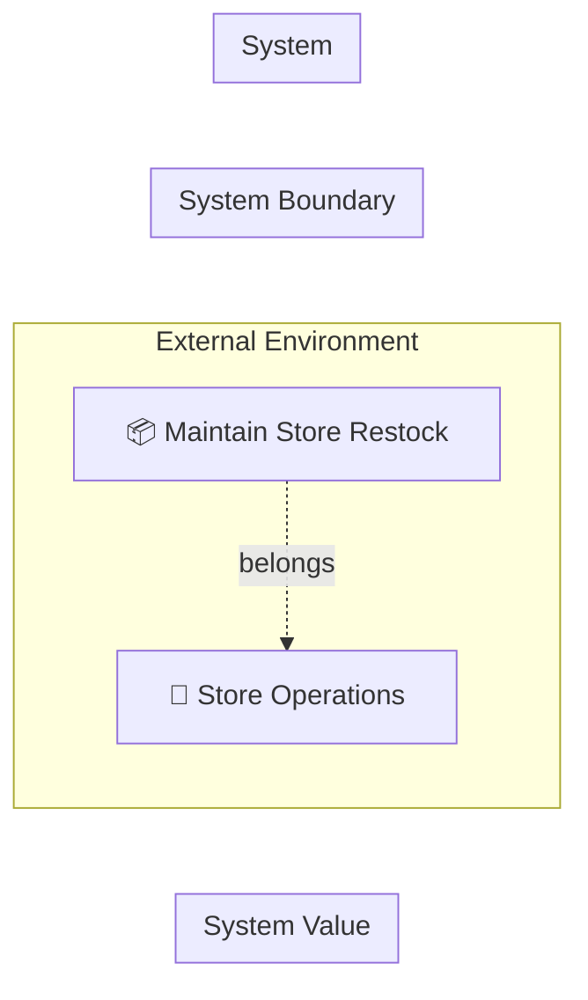

# 店舗補充管理 設計 Step 0: Scope Sketch

<!-- constrained-by ../../../docs/incremental-modeling.md#stage-0-scope-sketch -->
<!-- derived-from ./requirements-analysis.md -->

この文書は Step 0 時点の RDRA DSL 設計サンプルです。clinic-ops の設計書と同じく、レビューに必要な生成物は本文へ埋め込みます。

## 1. 設計目的

業務領域と BUC 名だけを固定する。

## 2. モデル構成

| 分類 | 対象 | 役割 |
|---|---|---|
| 業務領域 | `StoreOperations` | 店舗運営業務 |
| BUC | `BucStoreRestock` | 店舗補充情報を維持する業務単位 |
| 対象外 | `-` | 発注実行、在庫引当、配送計画、外部倉庫連携 |

## 3. 設計判断

| 判断 | 理由 |
|---|---|
| business と buc のみ定義する | actor/usecase/entity を先に置くと、業務境界が固まる前に詳細化してしまうため |
| shared/biz.rdra に業務領域を置く | 複数 BUC から参照される可能性がある安定語彙だから |

## 4. 生成成果物

生成コマンド例:

```sh
rdra-ish check samples/incremental-order/step-0-scope/src
rdra-ish diagram samples/incremental-order/step-0-scope/src --kind rdra --format mermaid --buc BucStoreRestock --out samples/incremental-order/step-0-scope/out/object_graph_buc_store_restock
rdra-ish diagram samples/incremental-order/step-0-scope/src --kind sequence --format mermaid --buc BucStoreRestock --out samples/incremental-order/step-0-scope/out/sequence_buc_store_restock
rdra-ish csv samples/incremental-order/step-0-scope/src --kind matrix --out samples/incremental-order/step-0-scope/out/usecase_matrix.csv
```

### 4.1 RDRA Layered Graph 図

生成コマンド:

```sh
rdra-ish diagram samples/incremental-order/step-0-scope/src --kind rdra --format mermaid --buc BucStoreRestock --out samples/incremental-order/step-0-scope/out/object_graph_buc_store_restock
```



## 5. レビュー観点

- StoreOperations が他の業務領域と衝突しない名前か。
- BucStoreRestock の粒度が後続の usecase を束ねる単位として自然か。
- 現段階で追加すべき共有語彙が本当に存在しないか。

## 6. 承認条件

| 観点 | 承認条件 |
|---|---|
| 要求 | requirements-analysis.md の Must 要求を説明できる |
| 設計 | この step で追加した DSL 要素の責務を説明できる |
| 生成物 | 埋め込み成果物が現在の DSL から生成されている |
| 次 step | 次に具体化する情報と、まだ具体化しない情報を区別できる |

## Summary

<!-- derived-from #2-モデル構成 -->
<!-- derived-from #3-設計判断 -->
<!-- derived-from #4-生成成果物 -->

Step 0 の設計は、業務領域と BUC 名だけを固定するための最小 DSL と生成成果物を提示する。
