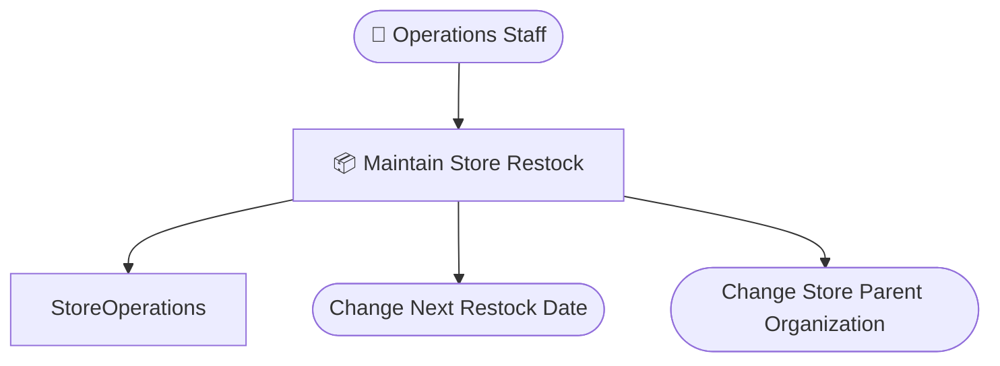

# 店舗補充管理 設計 Step 1: BUC Skeleton

<!-- constrained-by ../../../docs/incremental-modeling.md#stage-1-buc-skeleton -->
<!-- derived-from ./requirements-analysis.md -->

この文書は Step 1 時点の RDRA DSL 設計サンプルです。clinic-ops の設計書と同じく、レビューに必要な生成物は本文へ埋め込みます。

## 1. 設計目的

actor と user-visible usecase を追加する。

## 2. モデル構成

| 分類 | 対象 | 役割 |
|---|---|---|
| Actor | `OpsStaff` | 店舗補充予定と担当組織を維持する |
| UseCase | `ChangeNextRestockDate` | 店舗の次回補充予定日を変更する |
| UseCase | `ChangeStoreParentOrganization` | 店舗の担当組織を変更する |

## 3. 設計判断

| 判断 | 理由 |
|---|---|
| performs(OpsStaff, BucStoreRestock) | 担当者が BUC 全体を担うことを示す |
| contains(...) | BUC 内の業務操作を usecase として束ねる |
| entity をまだ置かない | データ接点の議論を次 step に分離する |

## 4. 生成成果物

生成コマンド例:

```sh
rdra-ish check samples/incremental-order/step-1-buc-skeleton/src
rdra-ish diagram samples/incremental-order/step-1-buc-skeleton/src --kind rdra --format mermaid --buc BucStoreRestock --out samples/incremental-order/step-1-buc-skeleton/out/rdra_buc_store_restock
rdra-ish diagram samples/incremental-order/step-1-buc-skeleton/src --kind sequence --format mermaid --buc BucStoreRestock --out samples/incremental-order/step-1-buc-skeleton/out/sequence_buc_store_restock
rdra-ish csv samples/incremental-order/step-1-buc-skeleton/src --kind matrix --out samples/incremental-order/step-1-buc-skeleton/out/usecase_matrix.csv
```

### 4.1 RDRA 図



## 5. レビュー観点

- 2 つの usecase が業務担当者にとって別作業として認識されるか。
- 補充停止や店舗閉鎖など、別 usecase 候補をこの段階で入れるべきか。
- actor を店舗運営担当者だけにしてよいか。

## 6. 承認条件

| 観点 | 承認条件 |
|---|---|
| 要求 | requirements-analysis.md の Must 要求を説明できる |
| 設計 | この step で追加した DSL 要素の責務を説明できる |
| 生成物 | 埋め込み成果物が現在の DSL から生成されている |
| 次 step | 次に具体化する情報と、まだ具体化しない情報を区別できる |

## Summary

<!-- derived-from #2-モデル構成 -->
<!-- derived-from #3-設計判断 -->
<!-- derived-from #4-生成成果物 -->

Step 1 の設計は、actor と user-visible usecase を追加するための最小 DSL と生成成果物を提示する。
