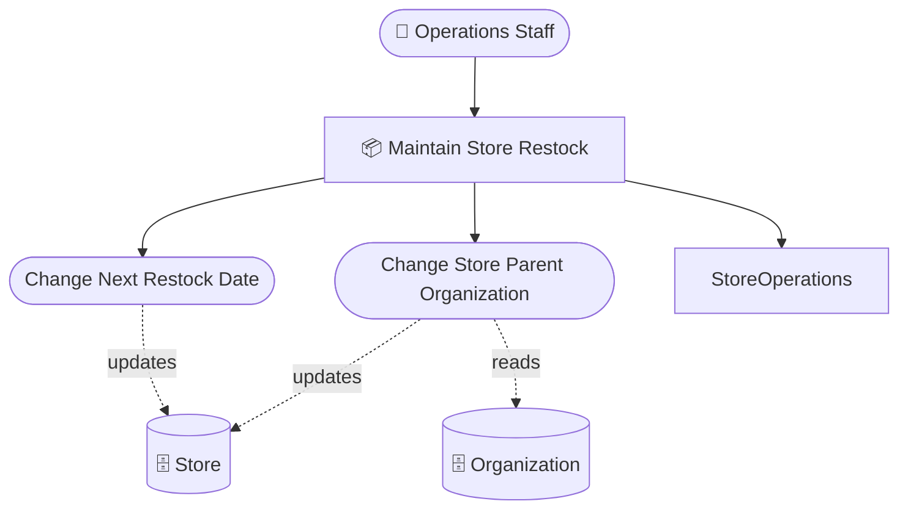
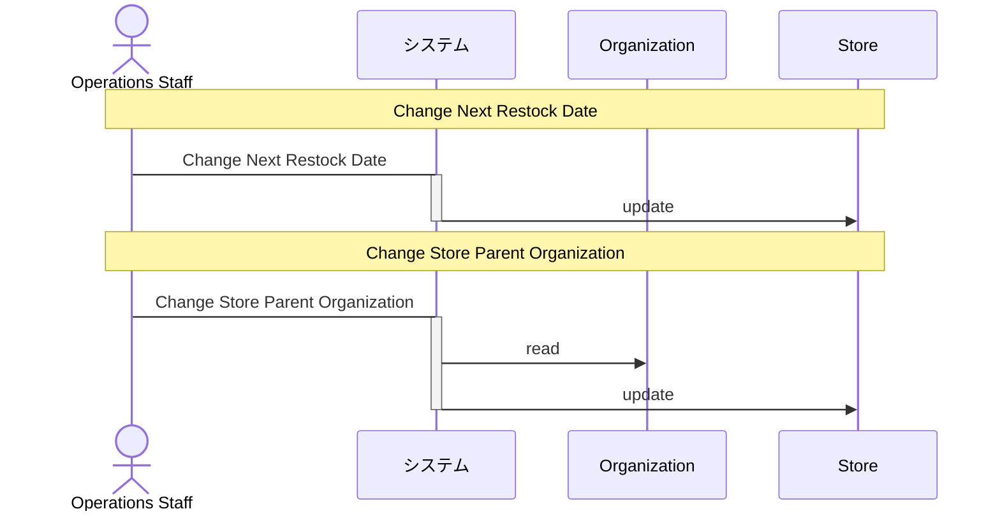
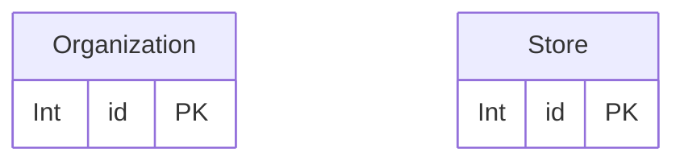

# 店舗補充管理 設計 Step 2: Data Touchpoints

<!-- constrained-by ../../../docs/incremental-modeling.md#stage-2-data-touchpoints -->
<!-- derived-from ./requirements-analysis.md -->

この文書は Step 2 時点の RDRA DSL 設計サンプルです。clinic-ops の設計書と同じく、レビューに必要な生成物は本文へ埋め込みます。

## 1. 設計目的

粗い entity と direct CRUD を追加する。

## 2. モデル構成

| 分類 | 対象 | 役割 |
|---|---|---|
| Entity | `Store` | 補充予定を持つ店舗 |
| Entity | `Organization` | 店舗の担当組織候補 |
| CRUD | `ChangeNextRestockDate -> Store` | 店舗単体の更新 |
| CRUD | `ChangeStoreParentOrganization -> Organization/Store` | 組織参照と店舗更新 |

## 3. 設計判断

| 判断 | 理由 |
|---|---|
| entity は id のみで開始する | 項目定義よりも業務操作とデータ接点の妥当性を先に確認するため |
| direct CRUD を採用する | API 境界やトランザクション責務がまだ未確定のため |
| Organization は Read のみ | 担当組織そのものを変更する業務ではないため |

## 4. 生成成果物

生成コマンド例:

```sh
rdra-ish check samples/incremental-order/step-2-data-touchpoints/src
rdra-ish diagram samples/incremental-order/step-2-data-touchpoints/src --kind rdra --format mermaid --buc BucStoreRestock --out samples/incremental-order/step-2-data-touchpoints/out/rdra_buc_store_restock
rdra-ish diagram samples/incremental-order/step-2-data-touchpoints/src --kind sequence --format mermaid --buc BucStoreRestock --out samples/incremental-order/step-2-data-touchpoints/out/sequence_buc_store_restock
rdra-ish csv samples/incremental-order/step-2-data-touchpoints/src --kind matrix --out samples/incremental-order/step-2-data-touchpoints/out/usecase_matrix.csv
```

### 4.1 RDRA 図

生成コマンド:

```sh
rdra-ish diagram samples/incremental-order/step-2-data-touchpoints/src --kind rdra --format mermaid --buc BucStoreRestock --out samples/incremental-order/step-2-data-touchpoints/out/rdra_buc_store_restock
```



### 4.2 Sequence 図

生成コマンド:

```sh
rdra-ish diagram samples/incremental-order/step-2-data-touchpoints/src --kind sequence --format mermaid --buc BucStoreRestock --out samples/incremental-order/step-2-data-touchpoints/out/sequence_buc_store_restock
```



### 4.3 ER 図

生成コマンド:

```sh
rdra-ish diagram samples/incremental-order/step-2-data-touchpoints/src --kind er --format mermaid --out samples/incremental-order/step-2-data-touchpoints/out/er
```



### 4.5 Usecase CRUD matrix

```csv
UseCase,Organization,Store
ChangeNextRestockDate,,U
ChangeStoreParentOrganization,R,U
```

### 4.7 Store 状態到達表

```text
Entity: Store (Store)
  (no state axes)
  reachable: 1 / bound: 1
```

## 5. レビュー観点

- Store と Organization 以外に、この段階で必要な業務データがあるか。
- 担当組織変更で Organization を更新しない判断が正しいか。
- direct CRUD のまま次 step に進んでも論点が失われないか。

## 6. 承認条件

| 観点 | 承認条件 |
|---|---|
| 要求 | requirements-analysis.md の Must 要求を説明できる |
| 設計 | この step で追加した DSL 要素の責務を説明できる |
| 生成物 | 埋め込み成果物が現在の DSL から生成されている |
| 次 step | 次に具体化する情報と、まだ具体化しない情報を区別できる |

## Summary

<!-- derived-from #2-モデル構成 -->
<!-- derived-from #3-設計判断 -->
<!-- derived-from #4-生成成果物 -->

Step 2 の設計は、粗い entity と direct CRUD を追加するための最小 DSL と生成成果物を提示する。
