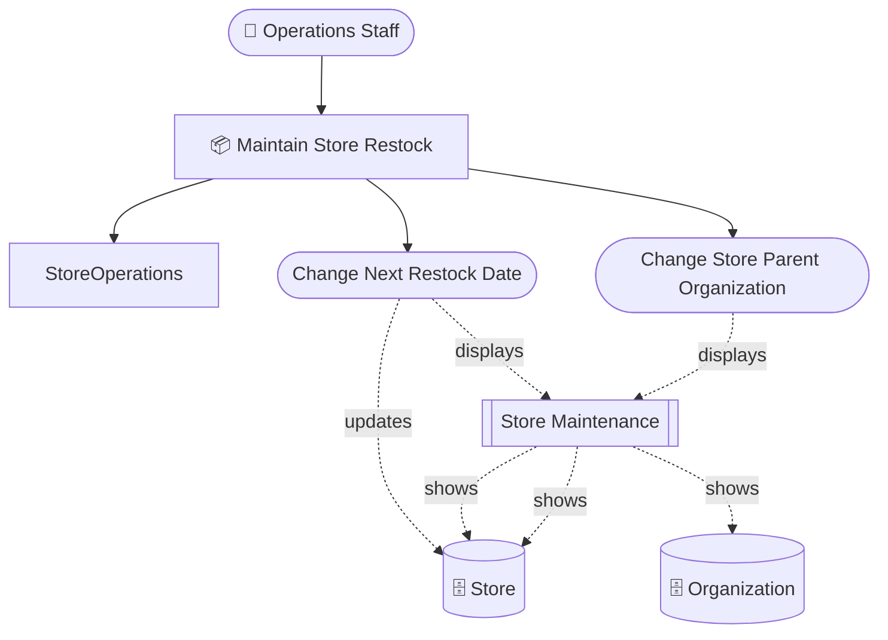
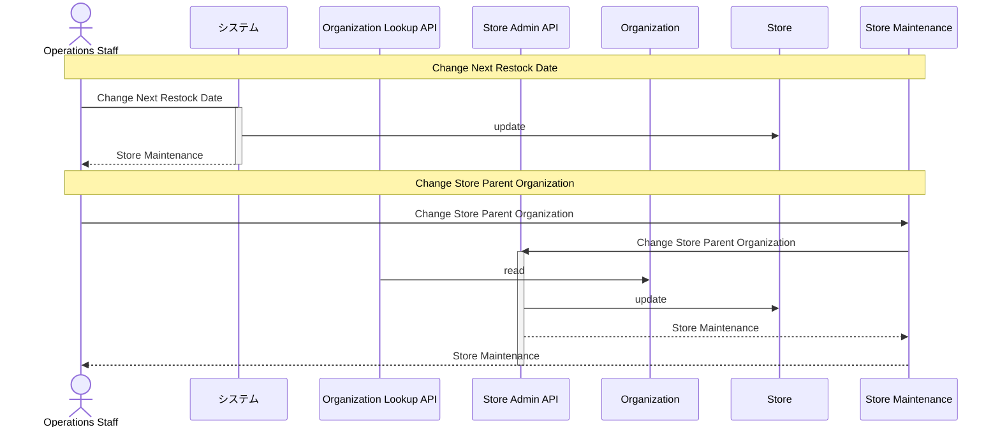
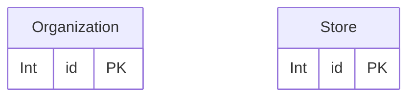

# 店舗補充管理 設計 Step 3: Interaction Boundary

<!-- constrained-by ../../../docs/incremental-modeling.md#stage-3-interaction-boundary -->
<!-- derived-from ./requirements-analysis.md -->

この文書は Step 3 時点の RDRA DSL 設計サンプルです。clinic-ops の設計書と同じく、レビューに必要な生成物は本文へ埋め込みます。

## 1. 設計目的

画面、API、System 境界を追加する。

## 2. モデル構成

| 分類 | 対象 | 役割 |
|---|---|---|
| Screen | `StoreMaintenanceScreen` | 店舗情報、補充予定、担当組織候補を確認しながら更新する |
| API | `StoreAdminApi` | 店舗情報の更新境界 |
| API | `OrganizationLookupApi` | 組織マスタの参照境界 |
| System | `StoreAdminSystem / OrganizationSystem` | 店舗情報と組織マスタの仮の所有境界 |

## 3. 設計判断

| 判断 | 理由 |
|---|---|
| ChangeNextRestockDate は direct CRUD のまま残す | 店舗単体更新であり、独立 API を導入するほどの整合性境界がまだない |
| ChangeStoreParentOrganization は invokes を使う | 組織参照と店舗更新が関わり、後続で system 境界診断の対象になるため |
| read-only API を API matrix で確認する | sequence と matrix の両方で境界をレビューするため |

## 4. 生成成果物

生成コマンド例:

```sh
rdra-ish check samples/incremental-order/step-3-interaction-boundary/src
rdra-ish diagram samples/incremental-order/step-3-interaction-boundary/src --kind rdra --format mermaid --buc BucStoreRestock --out samples/incremental-order/step-3-interaction-boundary/out/rdra_buc_store_restock
rdra-ish diagram samples/incremental-order/step-3-interaction-boundary/src --kind sequence --format mermaid --buc BucStoreRestock --out samples/incremental-order/step-3-interaction-boundary/out/sequence_buc_store_restock
rdra-ish csv samples/incremental-order/step-3-interaction-boundary/src --kind matrix --out samples/incremental-order/step-3-interaction-boundary/out/usecase_matrix.csv
```

### 4.1 RDRA 図



### 4.2 Sequence 図



### 4.3 ER 図



### 4.5 Usecase CRUD matrix

```csv
UseCase,Organization,Store
ChangeNextRestockDate,,U
ChangeStoreParentOrganization,,
```

### 4.6 API CRUD matrix

```csv
Api,Organization,Store
OrganizationLookupApi,R,
StoreAdminApi,,U
```

### 4.7 Store 状態到達表

```text
Entity: Store (Store)
  (no state axes)
  reachable: 1 / bound: 1
```

## 5. レビュー観点

- direct CRUD と API CRUD の混在が、この段階の分析として説明できるか。
- StoreAdminApi と OrganizationLookupApi を同じ System に入れるべきではないか。
- 次 step で relate(Store, Organization, "N:1") を置いたとき、coordination が必要になるか。

## 6. 承認条件

| 観点 | 承認条件 |
|---|---|
| 要求 | requirements-analysis.md の Must 要求を説明できる |
| 設計 | この step で追加した DSL 要素の責務を説明できる |
| 生成物 | 埋め込み成果物が現在の DSL から生成されている |
| 次 step | 次に具体化する情報と、まだ具体化しない情報を区別できる |

## Summary

<!-- derived-from #2-モデル構成 -->
<!-- derived-from #3-設計判断 -->
<!-- derived-from #4-生成成果物 -->

Step 3 の設計は、画面、API、System 境界を追加するための最小 DSL と生成成果物を提示する。
