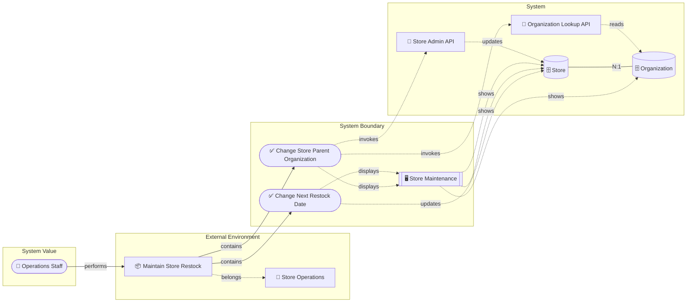
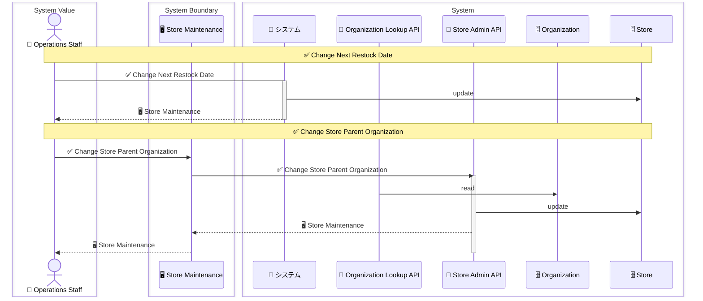
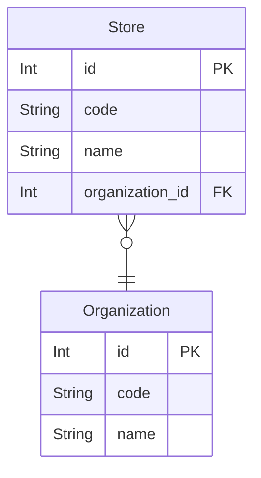

# 店舗補充管理 設計 Step 4: Entity Structure

<!-- constrained-by ../../../docs/incremental-modeling.md#stage-4-entity-structure -->
<!-- derived-from ./requirements-analysis.md -->

この文書は Step 4 時点の RDRA DSL 設計サンプルです。clinic-ops の設計書と同じく、レビューに必要な生成物は本文へ埋め込みます。

## 1. 設計目的

columns、ER、境界越え coordination を追加する。

## 2. モデル構成

| 分類 | 対象 | 役割 |
|---|---|---|
| Entity | `Store` | id, code, name, organization_id |
| Entity | `Organization` | id, code, name |
| Relation | `Store -> Organization` | 店舗は 1 つの担当組織に属する |
| Coordination | `ChangeStoreParentOrganization` | 境界越え関係の整合性を調整する |

## 3. 設計判断

| 判断 | 理由 |
|---|---|
| code を @unique にする | 業務レビューでは ID よりコードで店舗・組織を識別するため |
| 変更履歴 entity は追加しない | 監査・履歴保持が未確定のため |
| coordinates を追加する | System 境界をまたぐ ER 関係を説明するため |

## 4. 生成成果物

生成コマンド例:

```sh
rdra-ish check samples/incremental-order/step-4-entity-structure/src
rdra-ish diagram samples/incremental-order/step-4-entity-structure/src --kind object-graph --format mermaid --buc BucStoreRestock --out samples/incremental-order/step-4-entity-structure/out/object_graph_buc_store_restock
rdra-ish diagram samples/incremental-order/step-4-entity-structure/src --kind sequence --format mermaid --buc BucStoreRestock --out samples/incremental-order/step-4-entity-structure/out/sequence_buc_store_restock
rdra-ish csv samples/incremental-order/step-4-entity-structure/src --kind matrix --out samples/incremental-order/step-4-entity-structure/out/usecase_matrix.csv
```

### 4.1 Layered Object Graph 図

生成コマンド:

```sh
rdra-ish diagram samples/incremental-order/step-4-entity-structure/src --kind object-graph --format mermaid --buc BucStoreRestock --out samples/incremental-order/step-4-entity-structure/out/object_graph_buc_store_restock
```



### 4.2 Sequence 図

生成コマンド:

```sh
rdra-ish diagram samples/incremental-order/step-4-entity-structure/src --kind sequence --format mermaid --buc BucStoreRestock --out samples/incremental-order/step-4-entity-structure/out/sequence_buc_store_restock
```



### 4.3 ER 図

生成コマンド:

```sh
rdra-ish diagram samples/incremental-order/step-4-entity-structure/src --kind er --format mermaid --out samples/incremental-order/step-4-entity-structure/out/er
```



### 4.5 Usecase CRUD matrix

```csv
UseCase,Organization,Store
ChangeNextRestockDate,,U
ChangeStoreParentOrganization,,
```

### 4.6 API CRUD matrix

```csv
Api,Organization,Store
OrganizationLookupApi,R,
StoreAdminApi,,U
```

### 4.7 Store 状態到達表

```text
Entity: Store (Store)
  (no state axes)
  reachable: 1 / bound: 1
```

## 5. レビュー観点

- Store と Organization の関係が N:1 でよいか。
- coordinates の責務を ChangeStoreParentOrganization に置くことが自然か。
- 店舗コードと組織コードだけでレビューに十分か。

## 6. 承認条件

| 観点 | 承認条件 |
|---|---|
| 要求 | requirements-analysis.md の Must 要求を説明できる |
| 設計 | この step で追加した DSL 要素の責務を説明できる |
| 生成物 | 埋め込み成果物が現在の DSL から生成されている |
| 次 step | 次に具体化する情報と、まだ具体化しない情報を区別できる |

## Summary

<!-- derived-from #2-モデル構成 -->
<!-- derived-from #3-設計判断 -->
<!-- derived-from #4-生成成果物 -->

Step 4 の設計は、columns、ER、境界越え coordination を追加するための最小 DSL と生成成果物を提示する。
