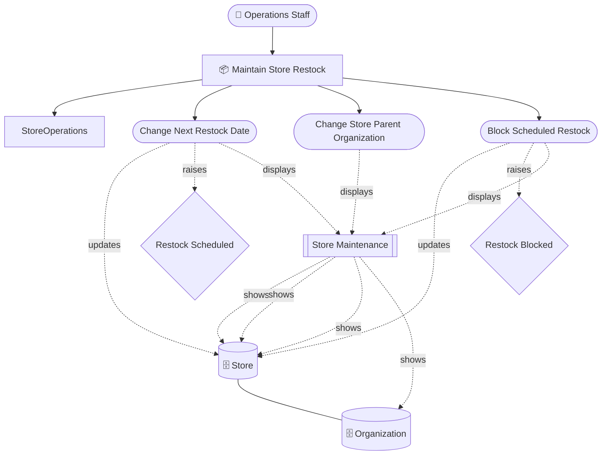
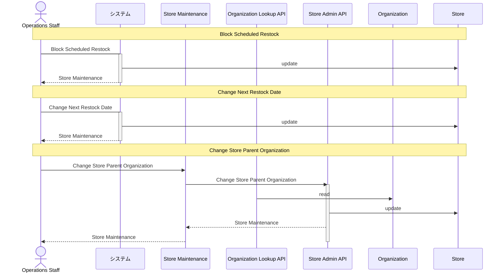
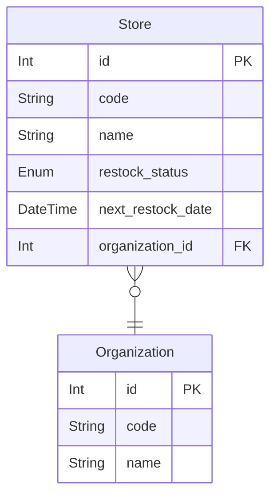
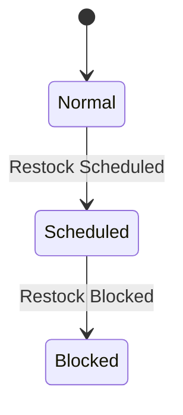

# 店舗補充管理 設計 Step 6: Business Rules

<!-- constrained-by ../../../docs/incremental-modeling.md#stage-6-business-rules -->
<!-- derived-from ./requirements-analysis.md -->

この文書は Step 6 時点の RDRA DSL 設計サンプルです。clinic-ops の設計書と同じく、レビューに必要な生成物は本文へ埋め込みます。

## 1. 設計目的

forbidden と invariant で状態制約を追加する。

## 2. モデル構成

| 分類 | 対象 | 役割 |
|---|---|---|
| Rule | `BR-001` | scheduled の店舗には next_restock_date が必要 |
| Rule | `BR-002` | blocked の店舗に next_restock_date を残してはいけない |
| DSL | `invariant` | scheduled -> present |
| DSL | `forbidden` | blocked + present を禁止 |

## 3. 設計判断

| 判断 | 理由 |
|---|---|
| blocked + present は forbidden で表す | 特定の組み合わせを禁止するルールだから |
| scheduled -> present は invariant で表す | 条件が成立したときの必須値を表すルールだから |
| normal + present はまだ禁止しない | 将来の予定日事前入力要求を妨げないため |

## 4. 生成成果物

生成コマンド例:

```sh
rdra-ish check samples/incremental-order/step-6-business-rules/src
rdra-ish diagram samples/incremental-order/step-6-business-rules/src --kind rdra --format mermaid --buc BucStoreRestock --out samples/incremental-order/step-6-business-rules/out/rdra_buc_store_restock
rdra-ish diagram samples/incremental-order/step-6-business-rules/src --kind sequence --format mermaid --buc BucStoreRestock --out samples/incremental-order/step-6-business-rules/out/sequence_buc_store_restock
rdra-ish csv samples/incremental-order/step-6-business-rules/src --kind matrix --out samples/incremental-order/step-6-business-rules/out/usecase_matrix.csv
```

### 4.1 RDRA 図



### 4.2 Sequence 図



### 4.3 ER 図



### 4.4 State 図



### 4.5 Usecase CRUD matrix

```csv
UseCase,Organization,Store
BlockScheduledRestock,,U
ChangeNextRestockDate,,U
ChangeStoreParentOrganization,,
```

### 4.6 API CRUD matrix

```csv
Api,Organization,Store
OrganizationLookupApi,R,
StoreAdminApi,,U
```

### 4.7 Store 状態到達表

```text
Entity: Store (Store)
  axes: restock_status[normal|scheduled|blocked], next_restock_date[null|present:timestamptz]

  RESTOCK_STATUS  NEXT_RESTOCK_DATE    INITIAL  TERMINAL  VIA
  ──────────────  ───────────────────  ───────  ────────  ───────────────────────────────────────────────────────────────────────────────────────────────────────────────────────────
  normal          null                 yes      no        BucStoreRestock/ChangeStoreParentOrganization
  scheduled       present:timestamptz  no       no        BucStoreRestock/ChangeNextRestockDate, BucStoreRestock/ChangeStoreParentOrganization
  blocked         null                 no       yes       BucStoreRestock/BlockScheduledRestock, BucStoreRestock/ChangeNextRestockDate, BucStoreRestock/ChangeStoreParentOrganization

  reachable: 3 / bound: 6
  diagnostics:
    [info] no creates(...) found; seeded from column defaults
```

## 5. レビュー観点

- BR-001, BR-002 が DSL 上の制約として表現されているか。
- 状態到達表で違反パターンが出ていないことを確認できるか。
- normal + present を禁止しない判断が業務上許容できるか。

## 6. 承認条件

| 観点 | 承認条件 |
|---|---|
| 要求 | requirements-analysis.md の Must 要求を説明できる |
| 設計 | この step で追加した DSL 要素の責務を説明できる |
| 生成物 | 埋め込み成果物が現在の DSL から生成されている |
| 次 step | 次に具体化する情報と、まだ具体化しない情報を区別できる |

## Summary

<!-- derived-from #2-モデル構成 -->
<!-- derived-from #3-設計判断 -->
<!-- derived-from #4-生成成果物 -->

Step 6 の設計は、forbidden と invariant で状態制約を追加するための最小 DSL と生成成果物を提示する。
